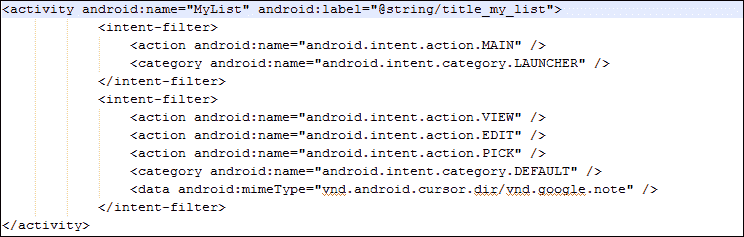
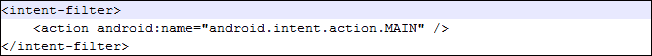
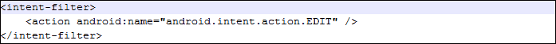
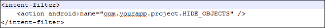
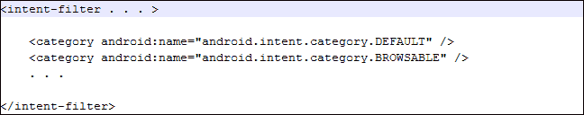
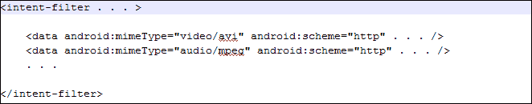
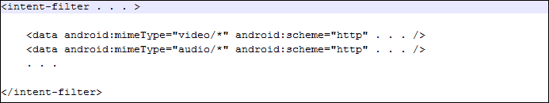

# 七、意图过滤器

意图过滤器是了解安卓意图的次要重要细节的高级步骤。在本章中，我们将了解意图过滤器的基础知识，以及如何在安卓应用中有效使用它们。这一章还讨论了各种各样的测试，一个意图在交付给期望的组件之前应该通过这些测试。

### 注

意图过滤器可以在`AndroidManifest.xml`文件中的`activity`标签下找到。

在本章中，我们将涵盖以下主题:

*   意图对象及其分类
*   了解什么是意图过滤器
*   理解什么是意图测试
*   为特定任务实现意图过滤器

# 意图对象及其分类

意图对象带有大量的信息。这组信息将帮助组件从中提取知识。例如，应该对意图对象附带的数据采取什么样的操作；同样，还有关于安卓系统的信息。当系统不知道将处理即将到来的意图的组件时，需要关于安卓系统的这些信息。

为了更好地理解上一段提到的例子，考虑一个场景，在这个场景中，为了开始一部电影，转移了意图。在这种情况下，操作系统必须知道执行此操作需要哪些软件。

安卓意图对象中包含的类别将在以下章节中讨论。

## 组件名称

意图对象包含关于将要处理数据的组件名称的信息。通常，这个组件由完整的类名组成。例如`com.app.demoactivity.MyActivity`或`com.example.demoactivity.MainActivity`。关于组件的这些信息对于意图对象是可选的。如果意图对象知道，安卓将把数据处理转移到该特定组件；如果未知，Android 将确定处理此事件的最佳组件。

### 注

组件名称的包部分不一定与`AndroidManifest.xml`文件中的项目名称相同。

组件名由安卓应用编程接口提供的`setComponent()`或`setClassName()`方法设置。

### 意图决议

安卓意图分为两部分(如[第三章](03.html "Chapter 3. Intent and Its Categorization")、*意图及其分类*)、**隐含意图**和**明确意图**。对于显式意图，不为其分配组件名称不会导致任何问题，因为组件必须包含在意图对象中，然后安卓会自动将显式意图指向所描述的组件。

另一方面，在隐式意图中，如果组件名称没有被赋予安卓系统，它将自动将其指向所有可能处理该传入意图的应用。这个动作只有在意图有意图过滤器的情况下才会发生，否则安卓不会指挥它。这个术语叫做 **安卓意图解析**；当您不需要为隐式意图定义组件时，它将自动显示可以接收该意图的所有可能应用的列表。

## 动作

动作是一个字符串，描述了在一个意图上要采取的动作。例如`ACTION_CALL`、`ACTION_BATTERY_LOW`、`ACTION_SCREEN_ON`。你可以在[http://developer . Android . com/reference/Android/content/Intension . html](http://developer.android.com/reference/android/content/Intent.html)找到其他各种动作常量。也可以让成为自己的意图动作，但一定要在前面加上项目名称，例如`com.example.myproject.SHOW_CONTACT`。当开发人员想要制作一个以前没有添加到安卓软件开发工具包中的事件时，需要自定义操作。当开发人员想要触发/检查仅与该应用密切相关的操作时，也可能出现这种需求。因此，它不存在于安卓软件开发工具包中。

### 注

`com.example.XXX`是 Java 和 Android 应用开发不鼓励的包名。它确保了这个包的使用主要是由于理解了这个例子中它的目的。

正常行动告诉你你的意图是如何构成的，尤其是数据和额外的东西。这就像一种方法现象，其中有参数，它返回值。一个好的做法是总是尽可能具体地使用你的动作名称，并且将它们与意图紧密地结合起来。意图动作可以用安卓 API 的方法`setAction()`设置，也可以用`getAction()` 方法获取。

下表给出了意图操作的一些预定义常数:

<colgroup><col style="text-align: left"> <col style="text-align: left"> <col style="text-align: left"></colgroup> 
| 

常数

 | 

成分关系

 | 

行动

 |
| --- | --- | --- |
| `ACTION_CALL` | 活动 | 打电话 |
| `ACTION_EDIT` | 活动 | 显示用户要编辑的数据 |
| `ACTION_MAIN` | 活动 | 作为初始活动启动，没有数据输入，也没有返回输出 |
| `ACTION_SYNC` | 活动 | 服务器上的数据与移动设备上的数据同步 |
| `ACTION_BATTERY_LOW` | 广播收音机 | 电池电量不足的警告 |
| `ACTION_HEADSET_PLUG` | 广播收音机 | 耳机插入设备 |
| `ACTION_SCREEN_ON` | 广播收音机 | 屏幕已经打开 |

## 数据

在安卓意图中，根据提供的不同类型的数据采取不同类型的动作。数据是安卓意图的基础部分之一，尤其是在隐含类别中。让我们看一些例子，以便更好地理解如何在安卓意图中使用数据及其相关动作。

### 在动作 _ 编辑中使用数据

举一个`ACTION_EDIT`的例子。每当我们将这个动作称为意图时，很明显，编辑功能将在某种文档中实现。该文档路径将以 URI 的形式给出，然后由安卓意图处理。这个 URI 基本上是我们放在意图对象中的数据的一部分。

`ACTION_EDIT`可以用于开发者想要打开默认安卓的**添加新联系人**屏幕的场景，开发者期望用户在其中进行编辑。在这种情况下，打开**添加新联系人**屏幕的意图应该定义了`ACTION_EDIT`动作。

### 动作 _ 呼叫中数据的使用

再举一个`ACTION_CALL`的例子。当我们需要通过意图执行呼叫功能时，会使用此操作。因此，为了完成任务，我们需要使用`tel://` URI 通过引用提供一个电话号码。这是数据集的部分，提供该部分的目的是让安卓知道它需要什么数据来执行拨号功能。

### 在 ACTION_VIEW 中使用数据

走向我们的第三个例子，那就是`ACTION_VIEW`。在大多数情况下，当这个动作被调用时，有一个网站通过 URI 链接到它。这有助于安卓理解要对其执行查看操作的数据。正常情况下，配合`ACTION_VIEW`动作，附加一个`http://` URI，这样安卓就可以处理查看任何网页的功能。

## 类别

它是提供给意图的附加信息，以便了解执行特定意图所需的最佳组件类型。例如，如果有一个网页，我们想使用`ACTION_VIEW`动作查看，我们可以将其类别指定为`CATEGORY_BROWSABLE`，以便让安卓知道与意图相关联的数据是安全的，可以使用安卓浏览器轻松执行。

下表列出了可以在任何安卓程序中轻松使用的一些类别常量:

<colgroup><col style="text-align: left"> <col style="text-align: left"></colgroup> 
| 

常数

 | 

说明

 |
| --- | --- |
| `CATEGORY_BROWSABLE` | 使用与意图相关的数据在安卓浏览器上执行活动是安全的。 |
| `CATEGORY_GADGET` | 该活动与任何安卓小工具托管的另一个活动相关联。 |
| `CATEGORY_HOME` | 活动显示主屏幕，或者是用户按下**主**按钮时看到的第一个屏幕。 |
| `CATEGORY_LAUNCHER` | 特定活动的类别是启动器，这意味着它将是堆栈活动的顶部。 |
| `CATEGORY_PREFERENCE` | 目标活动来自首选项面板。 |

## 临时演员

在前面的章节中，我们已经很好地了解了额外功能，以及我们如何有目的地使用它。就像数据一样，一些额外的东西被绑定在即将推出的意图上。例如`ACTION_HEADSET_PLUG`动作有额外的“状态”来指示你的耳机是否连接到手机。

这些方法与束对象的方法类似。因此，可以使用`putExtras()`和`getExtras()`方法将附加组件作为一个包进行安装和读取。

# 意图过滤器

此时此刻，我们对安卓的意图及其实现有了一个完美的理解。安卓意图负责告诉安卓某个事件已经发生，它还用于给出应该采取某个动作的附加数据。但是安卓如何知道哪个组件可以促进任何意图的执行呢？为此，引入了意图过滤器的概念。意图过滤器识别哪个组件可以响应对活动、服务或广播意图的特定调用。

通常，意图过滤器通过由动作、数据和类别测试组成的`AndroidManifest.xml`文件提供给活动或服务。在广播接收器的情况下，意图过滤器也可以通过代码动态定义。

对于一个隐含的意图，它必须通过所有三个测试，以便将其传递给特定的组件。现在，基于这些情况可以有两个条件:一个是当意图没有通过任何一个测试时，意图不会被传递给组件。另一种情况是，当它的测试通过后，它将直接被移交给相应的组件。在第一种情况下，有一个例外，如果它没有通过测试，它可以被移交给同一活动的下一个意图过滤器。这样，就有可能按照预期执行。

### 类型

我们可以在`AndroidManifest.xml`文件的一个活动中有多个意图过滤器。

具有意图过滤器的活动的普通 XML 标记如下所示:


正如您在代码中看到的，它由一个活动标签组成，其中包含了所有内容。此活动仅由一个意图过滤器组成，其中包含两个主要组件:**动作**和**类别**。在执行该意图时要采取的动作是`android.intent.action.MAIN`，通过调用该动作，对该活动的任何先前引用被移除，并且该活动以新的开始被执行。据此，类别设置为`android.intent.category.LAUNCHER`；这表明写在`AndroidManifest`文件中的活动是启动器的`activity`标签。这意味着，它是应用执行后启动的第一个活动。如果在`AndroidManifest.xml`文件中有两个或多个活动被描述为启动器，安卓操作系统会询问用户从哪个活动开始。

### 注

`<intent-filter>` 是`AndroidManifest.xml`文件的一部分，而不是 Java 代码的一部分，因为它包含的信息是在项目应用启动之前需要的。例如，类别将在项目应用开始之前确定它是否是启动器活动。由于`AndroidManifest.xml`文件是在项目应用开始之前执行的，以便提取关于项目的信息，因此意图过滤器是该文件的一部分。唯一的例外是广播意图的情况，其中信息可以从 Java 代码中动态修改，而不是从`AndroidManifest.xml`文件中修改。

# 处理多个意图过滤器

任何安卓活动都可能只有一个意图过滤器，这并不是一种强迫。一个活动可以包含各种意图过滤器，这些过滤器占据许多子组件，例如类别、数据和动作。请看下面的截图，它显示了两个带有不同类型参数的意图过滤器:



对前面截图中提到的代码的解释将在本章接下来的主题中介绍。目前，了解活动中各种意图过滤器的实现非常重要。

# 测试意图过滤器的组件

过滤器是意图对象的动作、数据和类别字段的代表。每当调用隐式意图时，都会针对这些过滤器进行测试，以便执行。如果该意图不满足任何一个测试组件，它将不会被执行，或者更确切地说，它将被定向到同一活动的单独的意图过滤器(如果存在的话)。

现在，为了正确理解意图过滤器，我们需要逐步评估与意图过滤器相关的每个测试组件。存在三个测试组件:

*   动作测试
*   dota 测试
*   类别测试

## 动作测试

动作描述了即将到来的意图要执行什么样的动作。`AndroidManifest.xml`文件确定了传入意图要满足的要求。如果任何意图与`AndroidManifest.xml`文件中指定的动作不匹配，将不会执行。

动作测试基本上是由项目清单文件中给出的信息执行的测试。所有动作组件都在`<intent-filter>`标签中定义，然后匹配以执行意图。在下面的截图中，您可以看到`intent-filter`标签在进行动作测试时的外观:


在上一个截图中给出的代码中，`intent-filter`标签中列出了三个动作。如果传入的意图是能够做这些动作，这些动作测试将由安卓操作系统决定。在前面的代码中列出了三个测试，它们的描述可以在*动作*部分给出的表格中看到。应遵循以下两个条件:

如果`intent-filter`标签内没有写动作，安卓操作系统会拒绝处理意图，因为没有匹配的可用内容。

如果`intent-filter`标签包含多个动作，但传入的意图中没有列出任何动作，则该意图将毫无问题地完成。

### 为<行动>写约定

安卓在定义动作时遵循某些惯例。应该记住，对于默认动作，我们必须使用安卓应用编程接口中给出的预定义常量。在安卓库中，每一个动作串都以`ACTION_`开头是一个约定，之后写真实的动作名。例如`ACTION_MAIN`、`ACTION_TIME_ZONE_CHANGED`、`ACTION_WEB_SEARCH`。

同样，当提到要求在`AndroidManifest.xml`文件中提到这个字符串的约定时，安卓遵循`android.intent.action.STRING`模式。在本陈述中，单词 *STRING* 被要匹配的特定动作代替，但没有单词 *ACTION* 。为了理解给定的陈述，以`ACTION_MAIN`常数为例。如果我们想在`AndroidManifest.xml`文件中提到它，我们不会写`ACTION_`，相反我们会这样写:



`ACTION_EDIT`的情况也是如此，这使得安卓可以编辑任何在URI 给出参考的文档。我们将编写如下截图所示的代码，使其在`AndroidManifest.xml`文件中可以理解:



当涉及到自定义操作时，操作是由用户定义的，而不是由 Android API 定义的。有一个最佳实践，在编写它之前，总是以您的包名开始，以保持它的唯一性。例如，如果你想做一个名为`HIDE_OBJECTS`的动作，你必须在你的 XML 文件中编写代码，如下图所示:



## 类别测试

为了通过类别测试，传入意图类别必须与`AndroidManifest.xml`中`<category>`标签内提到的至少一个类别相匹配。如果一个意图对象是在没有任何类别知识的情况下创建的，它应该总是通过，不管清单文件中定义了什么类别。

请记住，如果我们想使用`startActivity()`方法在一个活动到另一个活动之间移动，那么愿意接收隐含意图的活动必须有一个在`AndroidManifest.xml`文件中提到的默认类别，即`CATEGORY_DEFAULT`(如 Android API 中所述)。

### 类型

和写动作惯例一样，类别要写成`android.intent.category.DEFAULT`，不要提到`AndroidManifest.xml`里的`CATEGORY_`弦。

虽然，有发射器类别的并非如此；这是个例外。我们在启动器活动标签中提到`android.intent.category.LAUNCHER`。类别测试的表示如下图所示:



在前面截图给出的代码中，提到了两个类别。第一类是`android.intent.category.DEFAULT`，这是因为这个特定的活动都被设置为接收隐含的意图。清单文件中提到的另一个类别是`android.intent.category.BROWSABLE`，它使该活动能够通过手机中的本机安卓浏览器或任何其他用于浏览网站的应用进行浏览。

### 设置启动器活动

设置启动器活动主要是类别的一部分。在这种情况下，我们需要确保我们完全理解关于意图的启动器活动的异常。由于知道启动器活动是在应用第一次启动后立即启动的，我们现在可以在类别中推进其概念。如果知道活动将接收到一些隐含的意图，则使用`DEFAULT`类别，但另一方面，`LAUNCHER`活动是任何应用中第一次启动的活动。

从这个意义上说，没有一个启动器活动可以同时是默认的。结果得出结论:`AndroidManifest.xml`没有活动可以同时有`android.intent.category.DEFAULT`和`android.intent.category.LAUNCHER`。清单中显示的启动器活动看起来像下面屏幕截图中显示的代码:

```java
<activity android:name="com.example.android.application.MyList"
  android:label="@string/title_my_list">
  <intent-filter>
    <action android:name="android.intent.action.MAIN" />
    <category android:name="android.intent.category.LAUNCHER"/>
  </intent-filter>
</activity>
```

在前面截图给出的代码中，活动`com.example.android.application.MyList`是启动器活动，它将在应用开始时产生一个列表。由于这是应用的主要入口点，我们提供 `ACTION_MAIN`作为清单中的动作。您可以看到第二个标签，提供的类别被命名为`android.intent.category.LAUNCHER`。

## 数据测试

提到数据标签是为了便于对执行的活动采取行动。这就是为什么一个`<activity>`标签内可以有多个数据标签的原因。`<data>`标签由特定 URI 或 MIME 媒体类型的信息组成。例如，一个活动可能包含数据标签，如下图所示:



在前面截图中给出的代码中，意图过滤器包含两个数据标签。在其中的每一个中，在 `android:mimeType`属性下给出的 MIME 媒体类型是指定特定动作的活动所支持的数据格式的媒体类型。`video/avi`值描述了活动支持的`.avi`文件的视频格式。同样，如果需要提到音频文件类型，我们可以使用`audio/mpeg`。

我们也可以在视频或音频 MIME 类型后面加一个星号。例如，请参见下面的屏幕截图:



除了`video/*`和`audio/*` MIME 类型外，这段代码与前一段相同。星号表示该活动支持它们的所有可能的子类型。

现在，我们需要确保以下几点:

*   如果且仅当在`AndroidManifest.xml`文件中没有提供数据信息时，不包含关于 URI 的任何特定信息的意图对象将仅通过 `intent-filter`标签
*   仅包含 URI 但不包含数据 MIME 类型的意图对象只有在与过滤器中指定的 URI 匹配并且没有为数据类型指定过滤器的情况下才会被传递
*   仅包含 MIME 类型但不包含 URI 的意图对象，只有在与过滤器中指定的 MIME 类型匹配并且没有为 URI 指定过滤器的情况下才会被传递
*   在意图对象包含 URI 和 MIME 类型的情况下，只有当它们与`AndroidManifest.xml`中指定的意图过滤器的相应值匹配时，才会通过

### 数据>标签的典型表示

`<data>`标签包含许多属性，以使其信息完整。以下语法包含可在`<data>`标签中定义的所有属性，这将在处理意图时增加对活动的了解:


在前面截图中给出的代码中，有各种各样的属性都是可选的，但是它们更相互依赖。可选属性列表如下所示:

*   `scheme`
*   `host`
*   `port`
*   `path`
*   `pathPrefix`
*   `pathPattern`

现在，让我们来谈谈它们之间的相互依赖关系。如果数据标签中没有提到该方案，则此后没有 URI 保持有效。同样，如果未定义主体元素，所有路径标记和主体标记值都将失效。

# 总结

在本章中，我们详细介绍了意图过滤器和意图对象。我们看到了意图对象的基本构造块，其中我们定义了 Java 代码中的元素，另一方面还有意图过滤器，它为安卓操作系统提供了关于应用内部活动的知识。我们学习了`intent-filters`标签如何通过匹配传入的意图对象及其属性来完成工作。然后，他们决定是否应该执行意图。

我们还研究了动作、数据和类别，以及它们是如何工作的。不同的数据、类别和操作如何在不同的意图过滤器中合并到单个活动中，以及如果有各种可用的过滤器选择，主要机制是什么。我们还查看了一些编写约定，在安卓清单中编写启动器活动的典型方式，以及当数据对一种格式的不同子类型有效时，有多少 MIME 类型被合并。在下一章中，我们将看到意图如何与广播接收器一起使用，它们的实际例子，以及可能因为它们而出现的问题。