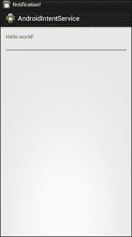
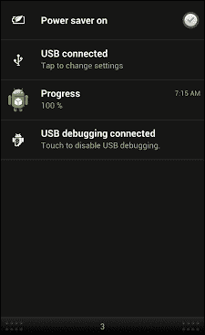

# 第九章。意向服务和待定意向

从这本书一开始，我们就一直在研究不同的任务，一个意图可以做些什么来促进安卓及其类型。我们已经看到意图可以帮助在活动之间导航。它们也用于在它们之间传输数据。我们看到了如何放置过滤器来验证传入的意图是否能够通过组件测试，最后，我们了解了意图在广播接收器中的作用。在本章中，我们将深入了解如何使用意向服务和待定意向来使用意向做一些方便的事情。

在本章中，我们将了解以下主题:

*   什么是意向服务？
*   意向服务的使用和实施
*   什么是待定意图？
*   待定意图的使用和实施
*   摘要

# 意向服务

意图服务是一种简单的服务，用于处理与主线程无关的异步工作。如果客户端通过`startService(Intent intent)`方法发送请求，可以做到这一点。这个新任务将由工作线程处理，当它用完工作时停止。

### 注

意图服务由安卓应用编程接口中的`Service`类继承

意图服务用于卸载工作线程，因此它不会成为瓶颈。作为主应用线程，它有助于使事情分开进行。需要注意的是，尽管它独立于主线程工作，但在给定时间只能处理一个请求。

意图服务是将工作从应用的用户界面线程转移到工作队列中的最佳方式。不需要做异步任务，每次处理都要管理。相反，您定义了一个意图服务，使它能够处理您想要发送用于处理的适当数据，并简单地启动该服务。最后，您可以将数据发送回应用，方法是在一个意图对象中广播它，并从广播接收器中捕获它以在应用中使用它。

## 四大基本面对比

本节展示了安卓开发的四个最重要的元素(服务、线程、意图服务和异步任务)之间的基本区别，包括意图服务。

### 最佳使用案例

下表给出了服务、线程、意图服务和异步任务的最佳案例方案:

<colgroup><col style="text-align: left"> <col style="text-align: left"></colgroup> 
|   | 

最佳案例场景

 |
| --- | --- |
| 服务 | 当任务为不太长且与主线无关时 |
| 螺纹 | 当有一个长的任务要执行并且多个任务必须并行完成时 |
| 意向服务 | 当有长任务而没有主线程的任何干预，并且需要回调时 |
| 异步任务 | 当存在需要与主线程通信的长任务，并且需要进行并行工作时 |

### 注

如果需要意图服务与主线程通信，我们需要使用处理程序或广播意图。

### 触发器

下表讨论了服务、线程、意图服务和异步任务的触发器之间的区别:

<colgroup><col style="text-align: left"> <col style="text-align: left"> <col style="text-align: left"> <col style="text-align: left"> <col style="text-align: left"></colgroup> 
|   | 

服务

 | 

线

 | 

意向服务

 | 

异步任务

 |
| --- | --- | --- | --- | --- |
| 扳机 | 通过使用`onStartService()`方法 | 通过使用`start()`方法 | 意图 | 通过使用`execute()`方法 |
| 触发原因 | 可以从任何线程调用 | 可以由任何其他线程调用和运行 | 只能从主线程调用 | 只能从主线程调用 |
| 继续运行 | 可以从主线程调用 | 它自己的线 | 独立工作线程 | 独立的工作线程，尽管主线程的方法可以在两者之间运行 |
| 限制 | 在某些情况下会阻塞主线程 | 必须手动处理，代码可能不容易理解 | 无法同时处理多个任务，并且所有任务都在同一个工作线程上工作 | 一个任务只能有一个实例，并且不能在循环中运行 |

# 意向服务的使用和实施

从本章前面的部分，我们清楚地看到了意图服务的定义，以及它与线程、异步任务和服务的根本区别。现在是时候开始实施和使用意向服务了。为此，我们将从示例开始，该示例将帮助我们了解如何从意向服务生成虚假通知。

## 从意向服务生成虚假通知

在本例中，我们将学习使用意图服务在通知栏上生成通知。该示例还将解释`onHandleIntent()`方法的使用，该方法用于实现意图服务的所有功能，包括向通知栏发送广播和通知。

此外，在本节的最后，您将了解它和 Thread 之间的区别，或者任何其他前面提到的安卓定义的方法。完成此代码后，开始活动，您将看到以下屏幕:



活动开始将显示你好世界屏幕

### 类型

注意:请记住，在本例中，我们不会浏览项目中使用的完整文件集。由于这是本书的最后一章，我们假设您已经掌握了安卓开发的基本知识，包括 XML 文件、资源和布局



显示进度通知的“通知”面板

### 扫一眼代码

示例是指在需要向通知栏发送关于任何特定事件的进展或信号的消息的场景中使用意图服务。

```java
package com.app.intentservice;

import android.app.IntentService;
import android.app.Notification;
import android.app.NotificationManager;
import android.content.Context;
import android.content.Intent;
import android.support.v4.app.NotificationCompat;

public class CustomIntentService extends IntentService {

  private static final int NOTIFICATION_ID=1;
  NotificationManager notificationManager;
  Notification notification;

  public static final String ACTION_CUSTOM_INTENT_SERVICE = "com.app.intentservice.RESPONSE";
  public static final String ACTION_MY_UPDATE ="com.app.intentservice.UPDATE";
  public static final String EXTRA_KEY_IN = "EXTRA_IN";
  public static final String EXTRA_KEY_OUT = "EXTRA_OUT";
  public static final String EXTRA_KEY_UPDATE = "EXTRA_UPDATE";
  String activityMessage;

  String extraOut;

  public CustomIntentService() {
    super("com.app.intentservice.CustomIntentService");
  }

  @Override
  protected void onHandleIntent(Intent intent) {

    //get input
    activityMessage = intent.getStringExtra(EXTRA_KEY_IN);
    extraOut = "Hello: " +  activityMessage;

    for(int i = 0; i <=10; i++){
      try {
        Thread.sleep(1000);
      } catch (InterruptedException e) {
    // TODO Auto-generated catch block
        e.printStackTrace();
      }

      //send update 
      Intent intentUpdate = new Intent();
      intentUpdate.setAction(ACTION_MY_UPDATE);
      intentUpdate.addCategory(Intent.CATEGORY_DEFAULT);
      intentUpdate.putExtra(EXTRA_KEY_UPDATE, i);
      sendBroadcast(intentUpdate);

      //generate notification
      String notificationText = String.valueOf((int)(100 * i / 10)) + " %";
      notification = new NotificationCompat.Builder(getApplicationContext())
      .setContentTitle("Progress")
      .setContentText(notificationText)
      .setTicker("Notification!")
      .setWhen(System.currentTimeMillis())
      .setDefaults(Notification.DEFAULT_SOUND)
      .setAutoCancel(true)
      .setSmallIcon(R.drawable.ic_launcher)
      .build();

      notificationManager.notify(NOTIFICATION_ID, notification);
    }

    //return result
    Intent intentResponse = new Intent();
    intentResponse.setAction(ACTION_CUSTOM_INTENT_SERVICE);
    intentResponse.addCategory(Intent.CATEGORY_DEFAULT);
    intentResponse.putExtra(EXTRA_KEY_OUT, extraOut);
    sendBroadcast(intentResponse);
  }

  @Override
  public void onCreate() {
    // TODO Auto-generated method stub
    super.onCreate();
    notificationManager = (NotificationManager)getSystemService(Context.NOTIFICATION_SERVICE);
  }
}
```

### 深入理解

新建项目，打开`src`文件夹。创建一个名为`CustomIntentService.java`的新类文件，它是`IntentService`的子类。扩展`IntentService`类并覆盖方法`onHandleIntent(Intent intent)`。

此时，您已经准备好实现自己的意图服务，该服务负责向通知栏发送消息，并以进度条格式更新消息。现在，让我们通过以下步骤开始理解代码:

1.  第一步是声明变量`notificationManager`和`notification`，以便在`onHandleIntent()`方法中使用它们。还有一些我们将在这个项目中使用的其他静态最终变量。分别是`NOTIFICATION_ID`、`ACTION_CustomIntentService`、`ACTION_MyUpdate`、`EXTRA_KEY_IN`、`EXTRA_KEY_OUT`、`EXTRA_KEY_UPDATE`。为了处理通知字符串，还需要两个新的字符串变量，表示为`activityMessage`和`extraOut`。
2.  这个`IntentService`的主要实现将发生在`onHandleIntent()`方法中，在该方法中，我们将定义包括消息到通知栏和消息广播的工作。
3.  在这个`onHandleIntent()`开始的时候，额外的内容通过`intent.getStringExtra()`方法获得，并保存在`msgFromActivity`变量中，该变量将在以后发送到广播。
4.  我们的主要目标是发送一个通知，显示 0 到 100 %的进度(一个假的计数器)，并在通知栏中更新。为此，我们正在初始化一个从 0 到 10 的`for`循环。在这个开始的时候，我们会调用`Thread.sleep(1000)`，这会让线程休眠，1000 毫秒内不会工作。
5.  Once the thread has slept for a certain time, the first counter of our fake progress update is done. Our next step is to send a broadcast whose main purpose is to give the update. In order to see this, we use the following lines of code:

    ```java
    //send update 
    Intent intentUpdate = new Intent();
    intentUpdate.setAction(ACTION_MyUpdate);
    intentUpdate.addCategory(Intent.CATEGORY_DEFAULT);
    intentUpdate.putExtra(EXTRA_KEY_UPDATE, i);
    sendBroadcast(intentUpdate);
    ```

    我们如何发送广播的快速概述:制作一个新的意图对象，并给它一个`intentUpdate`的名称和动作；既然是自定义动作，就给它起一个`ACTION_MyUpdate`的名字，可以在代码中看到；定义其类别，该类别也是自定义类别；放入计数器信息(显示循环当前计数器的变量)并为此目的发送广播。

6.  The next step is to send the notification to the notification bar. The following lines of code can be seen inside the previous example:

    ```java
    //generate notification
    String notificationText = String.valueOf((int)(100 * i / 10)) + " %";
    myNotification = new NotificationCompat.Builder(getApplicationContext())
    .setContentTitle("Progress")
    .setContentText(notificationText)
    .setTicker("Notification!")
    .setWhen(System.currentTimeMillis())
    .setDefaults(Notification.DEFAULT_SOUND)
    .setAutoCancel(true)
    .setSmallIcon(R.drawable.ic_launcher)
    .build();

    notificationManager.notify(MY_NOTIFICATION_ID, myNotification);
    ```

    该代码将`notificationText`的值设置为循环的当前计数器，并将其转换为百分比；通过调用`NotificationCompat.Builder()`(基本上是 Android SDK 中描述的构建器模式)做出新的通知，并给它应用上下文，设置它的标题内容、文本、滚动条、何时出现以及一些其他属性。最后，您必须呼叫`notificationManager.notify()`才能在通知栏中显示。

7.  最后一步是发送另一个广播作为确认，其流程与前一个广播相同，如下面的代码所示:

    ```java
    //return result
    Intent intentResponse = new Intent();
    intentResponse.setAction(ACTION_MyIntentService);
    intentResponse.addCategory(Intent.CATEGORY_DEFAULT);
    intentResponse.putExtra(EXTRA_KEY_OUT, extraOut);
    sendBroadcast(intentResponse);
    ```

8.  代码中显示的最后一步是覆盖`onCreate()`方法。您一定注意到了，我们没有为通知管理器创建一个新对象，这肯定会出错。所以，为了制作一个新的对象，我们将使用通知管理器`getSystemService (Context.NOTIFICATION_SERVICE)`获得安卓的系统服务。

### 注

这个例子也需要一个广播接收器。如果你还不知道，可以参考前面几章。

## 再举一个例子

前面的例子主要是处理安卓通知栏中通知的实现。它涵盖了意向服务的实施，但不包括广播接收器的制作及其注册。在本例中，我们将学习如何使用意图服务，并将所有输入数据转换为大写，并将其广播回广播接收器。广播接收机的实现也是这个例子的一部分。

从示例开始，使用以下代码在您的开发环境中实现它:

```java
public class IntentServiceExampleTwo extends IntentService {
  private static final String TAG =IntentServiceExampleTwo.class.getSimpleName();

  public static final String INPUT_TEXT_STRING="INPUT_TEXT_STRING";
  public static final String OUTPUT_TEXT="OUTPUT_TEXT";

  /**
   *  initiate service in background thread with service name
   */
  public IntentServiceExampleTwo() {
    super(IntentServiceExampleTwo.class.getSimpleName());
  }

  @Override
  protected void onHandleIntent(Intent intent) {
    Log.i(TAG,"onHandleIntent()");

    String data =intent.getStringExtra(INPUT_TEXT_STRING);
    Log.d(TAG,data);

    data=data.toUpperCase();

    SystemClock.sleep(4*1000);

    Intent stringBroadCastIntent =new Intent();

    stringBroadCastIntent.setAction(TextCapitalizeResultReceiver.ACTION_TEXT_CAPITALIZED);

    stringBroadCastIntent.addCategory(Intent.CATEGORY_DEFAULT);

    stringBroadCastIntent.putExtra(OUTPUT_TEXT, data);

    sendBroadcast(stringBroadCastIntent);
  }

}
```

这几乎与第一个示例中的实现相同。在本例中，显示了`onHandleIntent()`方法的工作，其中正在进行以下步骤:

1.  在`onHandleIntent()`方法中，您可以看到的第一步是从即将到来的意图中获取数据，并将其保存到变量中。变量`data`包含我们将转换成大写的输入数据。
2.  第二步是将数据登录到 LogCat 中，使用`Log.d(String, String)`方法获取。第一个参数是`TAG`，它通常是在全局级别声明的类名，因此任何方法都可以使用它。这个类名对于区分你的信息和其他信息很重要(便于阅读)。第二个参数是消息字符串，用于显示流程中的任何数据，以便开发人员在运行时可以看到它的值。
3.  第三步是将这些数据转换成大写。这将有助于反映广播意图的变化。将此保存回数据变量中。
4.  其余的步骤与前面的例子相同，在这个例子中，意图对象被制作，类别和动作被定义，数据被作为额外的数据放入，并被发送到接收器进行广播。

下一步，设置将从`sendBroadcast()`方法接收的接收器。为此，请看下面的代码:

```java
public class UpperCaseReceiver extends BroadcastReceiver {

  @Override
  public void onReceive(Context context, Intent intent) {
    TextView textViewResult = (TextView)findViewById(R.id.receiving_text_view);
    String result =intent.getStringExtra(ExampleIntentService.OUTPUT_TEXT);
    textViewResult.setText(result);
  }

};
```

前面的代码是示例中编写如何制作广播接收器的部分，它将接收广播并设置`textView`。您可以在代码中看到`onReceive()`方法在类扩展广播接收器时被覆盖。在`onReceive()`方法中，字符串通过`intent.getStringExtra()`方法获得，并保存在结果字符串中。该字符串将用于设置`textView`的文本，以便您可以看到这些变化在`textView`中的反映。

接下来，下一步是向意向性服务注册这个接收者。这将在接收者链接到意图过滤器的活动中完成，这样它就能发挥作用。这显示在下面的代码中:

```java
private void registerReceiver() {

  IntentFilter intentFilter =new IntentFilter(UpperCaseResultReceiver.ACTION_TEXT_CAPITALIZED);

  intentFilter.addCategory(Intent.CATEGORY_DEFAULT);

  capitalCaseReceiver=new UpperCaseResultReceiver();

  registerReceiver(capitalCaseReceiver, intentFilter);
}
```

方法 `registerReceiver()`在您的活动中声明，将从`onCreate()`或`onResume()`方法调用，以便它可以在开始或恢复活动时注册广播接收器。

*   意图过滤器用名为`intentFilter`的对象声明和初始化。
*   `intentFilter`对象被设置为默认。
*   通过调用`registerReceiver(Receiver, IntentFilter)`方法，广播接收器的对象被启动并注册到意图过滤器。

向意图过滤器注册接收者后，下一步是在您的活动中使用它。为此，请看下面的代码。该代码可以在任何事件中:

```java
Intent textUpperCaseIntent = new Intent(MainActivity.this, ExampleIntentService.class);

textUpperCaseIntent.putExtra(ExampleIntentService.INPUT_TEXT, inputText);

startService(textUpperCaseIntent);
```

以传统方式初始化一个意图，给它一个你刚刚创建的`IntentService`类，并把你想要转换的输入文本放在大写。这个意图的额外数据由`Intent.putExtra(String, String)`方法完成。最后一步是以此目的启动服务。我们将使用`startService()`方法而不是典型的`startActivity()`方法，因为我们使用`startActivity`在安卓中通过意图开始活动。

# 待定意向

待定意图是向其他应用提供令牌的意图，或者您可以将其称为外部应用，该应用可以访问您的意图权限来运行预定义的代码。这样，许多其他应用(如报警管理器和日历)可能会使用您的应用来执行它们的任务。

待定意图不会立即运行；相反，它们是在其他活动希望它运行时运行的。待定意图是一个由系统维护的引用，以便在稍后阶段使用。这意味着，即使包含待定意图的应用结束，另一个应用仍然可以使用该上下文，直到在该意图上调用`cancel()`。

### 注

要通过待定意图执行广播，请通过`PendingIntent.getBroadcast()`使用待定意图。

待定意向可以通过`getActivity(Context context, int requestCode, Intent intent, int flags)`、`getBroadcast(Context context, int requestCode, Intent intent, int flags)`和`getService(Context context, int requestCode, Intent intent, int flags)`三种方式启动。为了了解待定意图以及它是如何在安卓应用中制作和使用的，您可以进入下一节，讨论实现。

## 如何让待定意向生效？

本节讨论的实现，并解释待定意图如何工作。为了更好地理解这一点，我们建议您阅读前面提到的定义，以便更好地理解它。

在本例中，我们将向您展示如何制作一个应用，在该应用中，用户可以将时间(以秒为单位)输入`editText`字段(以秒为单位)，之后警报将会响起，安卓的警报管理器将会发出警报，并相应地播放。

要了解更多信息，请查看以下代码:

```java
EditText text = (EditText) findViewById(R.id.editText1);

int i = Integer.parseInt(text.getText().toString());

Intent intent = new Intent(MainActivity.this, MyBroadcastReceiver.class);

PendingIntent pendingIntent = PendingIntent.getBroadcast( MainActivity.this, 234324243, intent, 0);

AlarmManager alarmManager = (AlarmManager) getSystemService(ALARM_SERVICE);

alarmManager.set(AlarmManager.RTC_WAKEUP, System.currentTimeMillis() + (i * 1000), pendingIntent);

Toast.makeText(MainActivity.this, "Alarm set in " + i + " seconds",

Toast.LENGTH_SHORT).show();
```

先前编写的代码可以插入到任何事件中，该事件可以是获取`EditText`字段中输入值的按钮，并使用待定意图对其进行处理。理解前面代码所需的步骤如下:

1.  从布局文件中获取编辑文本，并创建一个对象名`text`，该对象名保存该小部件的当前状态。
2.  整数变量`i`将保存编辑文本中的输入值，编辑文本将由`text.getText().toString()`获得。
3.  用一个`BroadcastReceiver`类作为意图的目标类来创建一个显式意图(我们将在完成此操作后创建)。
4.  为了启动待定意图，我们使用`PendingIntent.getBroadcast(Context context, int requestCode, Intent intent, int flags, int, Intent, int)`。关于这个方法的更多描述可以在[上找到。](http://developer.android.com/reference/android/app/PendingIntent.html)
5.  通过将`ALARM_SERVICE`放入`getSystemService()`方法中获得报警的系统服务，并将其指向一个`AlarmManager`对象。
6.  根据`i`中存储的值设置报警管理器的值，并给出帮助其启动的待定意图(因为报警管理器是安卓的一项服务)。
7.  `alarmManager.set()`方法由参数`int`类型、`long triggerMilliSec`(其中您采用当前系统时间并通过将其转换为毫秒来添加您的变量`i`)和待定意图组成。
8.  祝酒词，以示警报管理的成功完成。

下一步是制作您选择的广播接收器，并实现该接收器。为此，制作一个广播接收器并覆盖方法 `onReceive()`。看看下面的代码:

```java
@Override
public void onReceive(Context context, Intent intent) {
  Toast.makeText(context, "Alarm is ringing...",
  Toast.LENGTH_LONG).show();

  Vibrator vibrator = (Vibrator)context.getSystemService(Context.VIBRATOR_SERVICE);
  vibrator.vibrate(2000);
}
```

这个接收器有一个祝酒词将表明它的报警状态。接下来就是声明一个振动器类的对象，可以通过调用`context.getSystemService(Context.VIBRATOR_SERVICE)`方法来启动。这种方法负责返回将直接影响手机物理振动器的物体。最后一步是调用`vibrator.vibrate(int)`方法开始振动。

### 注

要播放振动器，您需要在清单文件中添加权限。您可以通过使用以下代码来实现:

```java
<uses-permission android:name="android.permission.VIBRATE" />
```

最后，我们必须在`AndroidManifest.xml`文件中声明这个接收者，我们可以简单地通过使用下面的代码来做到这一点:

```java
<receiver android:name="MyBroadcastReceiver" >
</receiver>
```

前面的例子描述了一起使用待定意图和广播接收器。

# 总结

本书最后一章的总结可以认为是本书的结论。在本章中，我们学习了如何实现`intentService`和`PendingIntents`以及它们的最佳案例场景。`IntentService`功能及其与三个最常用的安卓功能的比较，如线程、服务和异步任务。此外，在本章中，通过对每个步骤的解释来实现待定意图的示例。这一章可以被认为是一个高级版本，或者你可以说，可以在安卓系统中预先使用意图。请记住，不太可能使用这些功能，但是在某些情况下，您必须让它们工作，因为没有其他解决方案。