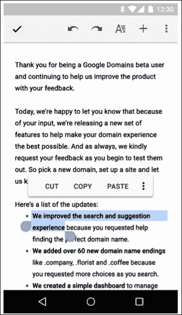
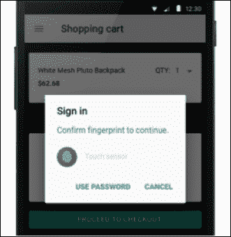
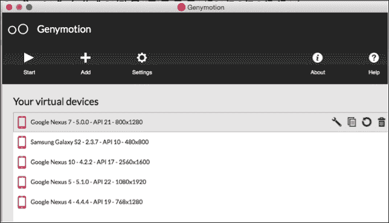

# 第一章。入门指南

我们将从材料设计和安卓 6 棉花糖的概述开始这本书。谷歌的新材料设计理念是应用外观和感觉方式的一场革命。

在这本书的过程中，我们将构建一个名为`MasteringAndroidApp`的应用。在本章中，我们将解释该应用是关于什么的。在这个应用中，我们将把每章解释的所有概念和理论付诸实践。在这本书的最后，我们应该有一个丰富的应用，功能齐全，可以很容易地修改，以创建自己的版本，并上传到谷歌 Play 商店。

我们将确保我们拥有所有必要的工具，下载最新版本的安卓，并推出本书强烈推荐的安卓最快模拟器**genymion**。

*   材料设计
*   安卓 6 棉花糖要点
*   应用概述
*   准备好工具
    *   Android Studio
    *   软件开发工具包管理器
*   精灵尘！精灵尘！精灵尘！精灵尘！精灵尘！精灵尘！精灵尘！精灵尘！精灵尘！精灵尘！精灵尘！精灵尘！精灵尘！精灵尘！精灵尘！精灵尘

# 介绍材料设计

如前所述，材质设计是应用外观和感觉方式的一场革命。你可能以前听说过这个概念，但它到底是什么？

材料设计是谷歌创造的一种新的视觉语言，用于所有基于材料、有意义的过渡、动画和响应性交互的平台、网站和移动设备。

材料是一种可以在表面看到的元素的隐喻；它由不同高度和宽度的层组成，但它们的厚度总是一个单位，就像纸张一样。我们可以将材质放置在彼此之上，这为视图引入了一个深度元素，一个 *Z* 坐标。同样，我们可以将一张纸叠在另一张纸上，投射阴影并定义视觉优先级。

内容显示在材料上，但不会增加厚度。内容可以以任何形状和颜色显示；它可以是普通的背景色、文本、视频和许多其他东西。它被限制在材料的范围内。

素材可以扩展，内容也可以随之扩展，但内容永远不能扩展超过素材。我们不能在同一个 *Z* 位置有两种材料。其中一个总是在另一个的下面或上面。如果我们与材料交互，我们总是在顶层交互。例如，触摸事件将在顶层执行，不会到达下面的层。你可以改变材料的大小和形状，这两种材料可以合并成一种，但它们不能弯曲或折叠。

这是一个使用材质设计风格的应用示例；我们可以看到带有阴影、不同内容的卡片，以及带有导航抽屉的应用栏。所有这些组件将在本书的课程中解释，我们将致力于使用相同的风格构建一个应用。

材质设计也附带了重要的 UI 元素，比如`RecyclerView`。这个视图将取代安卓早期的`ListView`，创建任何种类的可滚动元素列表。我们将在[第 5 章](05.html "Chapter 5. Lists and Grids")、*列表和网格*中处理这些组件，从`ListView`的基本版本开始，对其进行演化，以了解`RecyclerView`是如何诞生的，并以一个实例结束。

`CardView`是引入的另一个主要用户界面元素。我们可以在前面的图像中看到一个；它是一个带有背景和阴影的组件，可以定制以适合我们想要的所有内容。我们将在[第 6 章](06.html "Chapter 6. CardView and Material Design")、*卡片视图和材料设计*中使用它，在这里我们还将介绍下一个组件——设计支持库。

设计支持库是一个*必须有包含动画、 **FAB** ( **浮动动作按钮**)和导航抽屉的*库。您可能已经在其他应用中看到过左侧的滑动菜单。设计支持库在以前的安卓版本中为这些组件提供支持，允许我们在旧版本中使用材料设计功能。

以上都是从 UI 和编程角度出发的功能，但是 Material design 也为我们的手机引入了不同的功能，比如一个新的不同优先级的通知管理系统。例如，我们可以说哪些通知是重要的，并建立一个我们不想被打扰的时间框架。

另一个我们不能错过的是这个版本的电池消耗提升，相比之前的安卓版本可以节省高达 90 分钟的电池，这要归功于一个新的安卓运行时，叫做 ART，用非技术的方式来解释，它把应用翻译成了安卓在安装应用时可以更快理解的语言。之前的运行时**达尔维克**，必须在执行我们的应用时进行翻译，而不是在安装时只进行一次翻译。这有助于该应用消耗更少的电池，运行更快。

# 推出安卓 6 棉花糖

这个版本的主要变化之一与应用的权限有关。在安卓 M 之前，我们习惯于在即将下载的时候接受一个应用的权限；play store 向我们展示了一个应用拥有的权限列表，我们需要接受它们才能下载和安装它。

## 运行时权限

随着运行时权限的引入，发生了变化。这里的想法是只有在你需要的时候才接受许可。例如，在您拨打电话或留言之前，WhatsApp 可能不需要使用您的麦克风。

这是我们开发应用时需要考虑的事情；这对于开发者来说是一个改变现在需要控制如果用户不接受权限该做什么。以前，我们不需要做任何控制，因为在安装时这是一个全有或全无的选择；现在，我们必须考虑用户在运行时的决定。

### 类型

**下载示例代码**

您可以从您在[http://www.packtpub.com](http://www.packtpub.com)的账户下载您购买的所有 Packt Publishing 书籍的示例代码文件。如果您在其他地方购买了这本书，您可以访问[http://www.packtpub.com/support](http://www.packtpub.com/support)并注册，以便将文件直接通过电子邮件发送给您。

## 节能优化

自棒棒糖以来，我们手机的电池寿命又有了新的提高；这一次，谷歌推出了两个新状态:**瞌睡模式**和 **app 待机**。

打盹模式提高空闲设备的睡眠效率。如果我们关闭屏幕并且没有使用手机，我们就进入了空闲状态。以前，应用可以进行网络操作并继续在后台工作；现在，随着瞌睡模式的引入，系统定期允许我们的应用在后台工作，并在短时间内执行其他待定操作。同样，这在开发时带来了一些考虑；例如，在这种模式下，我们的应用无法访问网络。

App 待机是一个暂时没有使用，后台没有任何进程运行的 app 的诱导空闲模式。如果应用不显示任何通知，并且用户没有明确要求它免于优化，则使用它。这种空闲模式会阻止应用访问网络和执行挂起的作业。连接电源线后，所有处于待机状态的应用都会被释放，空闲限制也会被取消。

## 文本选择

在以前的版本中，当用户选择文本时，动作栏上会出现一组动作，如复制、剪切和粘贴。在这个版本中，我们可以在选项上方的浮动栏中显示这些操作以及更多内容:

## 指纹认证

在安卓的这个版本中，我们可以认证我们指纹的使用。认证可以在设备级别解锁手机，而不仅仅是解锁特定的应用；因此，我们可以根据用户最近解锁设备的时间来验证用户在我们的应用中的身份。

我们有一个新的可用对象，`FingerprintManager`，它将负责身份验证，并允许我们显示一个请求指纹的对话框。我们需要一个带有指纹传感器的设备来使用这个功能。

## 直接分享

直接分享是简化内容分享流程的新增内容。以前，如果我们在图库中，想和 WhatsApp 中的联系人分享图片，我们必须点击**分享**，在应用列表中找到 WhatsApp，然后在 WhatsApp 中找到一个联系人分享这些内容。此过程将会简化，显示一个联系人列表，您可以直接与他们共享信息:

这些是安卓 6 棉花糖已经发布的主要新功能；完整的名单可以在[http://developer.android.com/preview/index.html](http://developer.android.com/preview/index.html)看到。

# 创建主应用

现在我们已经看到了最新安卓版本的主要功能，我们可以介绍一下我们将在本书期间开发的应用。这款应用将包括大部分这些功能，但我们也将花时间在以前安卓版本中广泛使用的组件上。

要掌握安卓，就要做好理解遗留代码的准备；例如，我们可能必须开发一个仍然使用`ListView`而不是`RecyclerView`的应用，这是新的。我们不会总是用最新的组件从头开始创建应用，尤其是如果我们是专业的安卓开发者。此外，查看以前的组件将有助于我们了解这些组件的自然演变，从而更好地了解它们现在的情况。

我们将完全从零开始创建这个应用，从最初的设计开始，看看安卓中最常用的设计和导航模式，比如顶部的选项卡、左侧的滑动菜单等等。

我们将要开发的应用 `MasteringAndroidApp`，是一个服务器端交互的应用。这个应用将显示存储在云中的信息，我们将创建云组件，使我们的应用能够与之通信。我们为该应用选择的主题是工作列表板，我们将在服务器端创建工作邀请，该应用的用户可以阅读这些邀请并接收通知。

您可以轻松自定义主题；这将是一个例子，你可以改变信息，创建自己的应用，具有相同的结构。其实你自己想一想比较好，因为我们会讨论如何在 Play Store 发布 app，如何货币化；我们将添加广告，当用户点击广告时会产生收入。所以，如果你用你的想法应用你所学的东西，当你完成这本书的时候，你将有一个准备分发的应用。

我们将开发应用，解释安卓系统中最常用的编程模式，以及并发技术和连接到 rest 应用接口或服务器的不同方法。

我们不仅会关注后端，还会关注用户界面；通过以高效的方式显示信息，使用列表和网格，从互联网下载图像，以及使用最新的材料设计功能自定义字体和视图。

我们将学习调试应用、管理日志的机制，并在学习如何识别和防止内存泄漏的同时考虑内存使用情况。

我们的应用将有一个基于数据库的离线模式，在那里我们将存储来自云的内容。因此，如果手机失去连接，我们仍然可以显示上次在线时的可用信息。

为了完成我们的应用，我们将添加额外的功能，如推送通知、崩溃报告和分析。

最后，我们将看看安卓构建系统是如何工作的，导出不同版本的应用，并混淆代码以保护它并防止反编译。

我们压缩了海量的信息，有助于你在书的最后掌握安卓；然而，在开始使用我们的应用之前，让我们准备好工具。

# 准备好工具

我们在本书中需要的工具是最新版本的安卓工作室，一个更新到安卓 M 或更高版本的安卓软件开发工具包。还建议您使用模拟器 **Genymotion** 来测试该应用。

### 注

首先，我们需要下载并安装安卓工作室，这是在安卓系统中开发的官方工具。可以从[http://developer.android.com/sdk/index.html](http://developer.android.com/sdk/index.html)下载。

根据您的操作系统版本，网站顶部会有一个下载链接。

一旦安装完成，我们需要下载一个安卓 M SDK，它将提供为特定安卓版本开发应用所需的所有类和资源。这是通过 SDK 管理器完成的，这是一个包含在安卓工作室中的工具。

我们可以点击**工具** | **安卓** | **SDK 管理器**或者在安卓工作室最上方的栏找到一个快捷方式。

打开 SDK 管理器后，我们将看到可用的 SDK 平台和 SDK 工具的列表。我们需要确保安装了可用的最新版本。

有了这个，我们就有了开发应用所需的一切。为了测试它，最好有 Genymotion，这是一个安卓模拟器，可以帮助我们在不同的设备上测试我们的应用。

我们使用这个模拟器而不是安卓默认模拟器的原因主要是速度。在 Genymotion 中部署应用甚至比使用物理设备更快。除此之外，我们还受益于其他功能，例如可调整大小的窗口、从计算机中复制和粘贴，以及其他使用默认模拟器耗时的较小细节。可以从[https://www.genymotion.com](https://www.genymotion.com)下载。

我们只需要安装它，一旦打开，我们就可以添加与现有设备包含的相同功能的仿真器。

# 总结

在这一章中，我们经历了安卓最新版本的重要变化，重点介绍了安卓棉花糖和材质设计。

我们解释了我们将在本书过程中构建的应用中做什么，以及创建它所需的工具。

在下一章中，我们将看看安卓中现有的设计模式，并开始设计我们的应用。