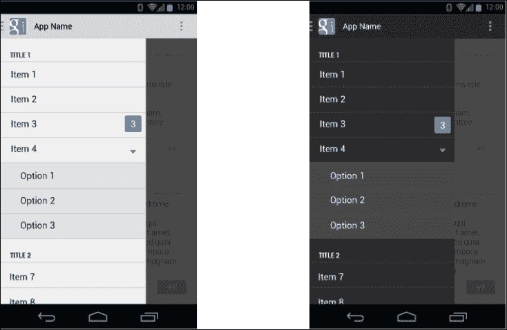
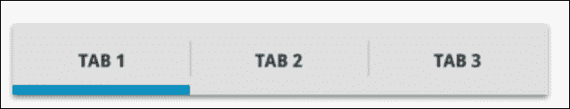
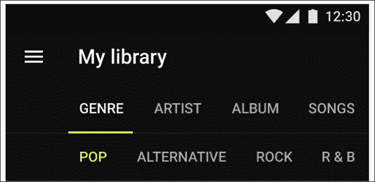
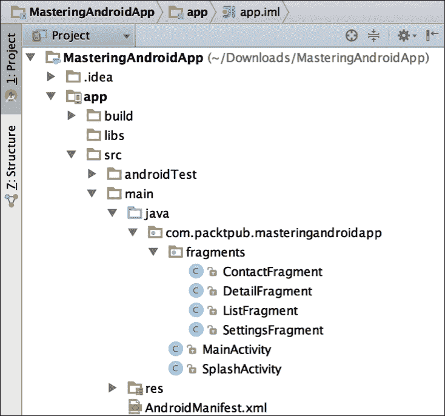
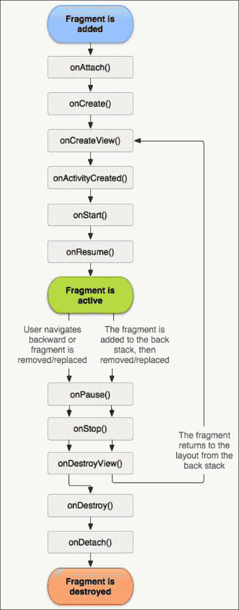

# 第二章。设计我们的应用

在这一章中，我们将为一个应用想到一个想法，并将这个想法转化为一个真实的应用，创建一个基本的结构显示在屏幕上，并选择一个合适的导航模式在它们之间移动。

在了解了最常用的导航模式之后，我们将继续实现由片段和`ViewPager`组成的标签模式。

在此期间，我们将复习我们的碎片知识，以便能够解释高级概念。我们还将讨论`FragmentManager`的重要性和碎片回叠。

最后，我们将为屏幕过渡添加一些好看的动画。因此，我们将在本章中讨论以下主题:

*   选择应用导航模式
*   掌握片段
*   实现选项卡和视图寻呼机
*   屏幕之间的动画过渡

# 选择应用导航模式

让我们想象一下有一天你醒来感觉受到了启发；你对一个你认为可以比 WhatsApp 更受欢迎的应用有了一个想法。在不失时机的情况下，你会想把这个应用的想法变成现实！这就是为什么学习如何设计应用并选择最合适的导航模式对你来说很重要。听起来并不令人沮丧，但是你会发现你 99%的想法已经在谷歌 Play 商店了。这只是一个事实，有成千上万的应用可用，而且数量一直在增加！所以，你可以决定在现有的基础上进行改进，或者继续头脑风暴，直到你有了新的东西。

为了让应用成为现实，第一步是在脑海中可视化应用；为此，我们需要确定基本组件。我们需要简化屏幕上的想法，我们需要在屏幕之间移动。

请记住，您正在为安卓用户创建这个应用。这些用户习惯于使用滑动面板等导航模式，这种模式用于 Gmail、脸书和 Spotify 等应用。

我们将看看三种不同且常用的导航模式，它们保证用户不会在我们的应用中迷失方向，并且会即时了解应用结构。

## 基本结构

为了画出我们的画面(注意，我还不是指活动或者片段；我所说的屏幕是指用户在执行我们的应用期间的任何时候在屏幕上可以看到的东西)，我们需要确定我们想法的关键点。我们需要建立用例，用软件开发术语来说。

让我们从塑造我们将在本书中构建的应用开始:**masteringandrodapp**。一开始很难在你的脑海中可视化所有的细节，所以我们将从识别我们知道我们肯定需要的组件开始，然后填补空白(如果有的话)。

从上一章我们知道，我们有一个演示屏幕，它会在几秒钟内显示应用的徽标，同时在需要时从互联网下载数据。

在这个应用中，我们还将有一个屏幕，其中包含来自互联网的信息列表，以及用户可以点击以获取更多详细信息的单个项目。

作为主要选项，我们将显示一个联系人屏幕，其中`MapView`显示我的位置和联系人数据。

最后，我们需要一个**首选项**或**设置**屏幕，在这里我们可以打开和关闭通知，停用广告或购买额外服务。

现在，我们准备创建一个模型。请看下图:


在顶部，我们有我们的应用的入口点，这是闪屏。这里的导航很简单；我们可以直线导航到下一个屏幕，没有按钮或任何其他可能的流程。

在下一层，我们有一个包含项目列表的屏幕(这是一个包含联系信息的屏幕)、一个地图视图和一个设置屏幕。这三个屏幕在我们的应用中处于同一水平，因此它们具有相同的重要性。

最后，我们还有第三级导航，这是列表中某个项目的详细视图。

我们打开这个屏幕的唯一方法是点击列表中的一个元素；所以，这个屏幕的入口点是列表屏幕。

现在我们已经创建了一个基本的结构和流程，我们将浏览不同的广泛使用的导航模式，以决定哪一个最适合我们的应用。

### 注

关于 app 结构的更多信息和材料设计的类似信息，请参考以下链接:

[https://developer . Android . com/design/patterns/app-structure . html](https://developer.android.com/design/patterns/app-structure.html)

[http://www . Google . com/design/spec/patterns/app-structure . html #](http://www.google.com/design/spec/patterns/app-structure.html#)

## 仪表盘图案

仪表盘模式是安卓最早使用的模式之一。它由一组以图标矩阵形式显示在主屏幕上的元素组成。在下图中，我们可以在左侧和右侧看到脸书应用的第一个版本，这是来自 Motor Trend 的定制模式:


这个视图非常适合那些旨在清晰显示非常有限的选项的应用；每行不超过两个元素，屏幕上的行数合适。

这些图标清楚地显示了主要功能的符号，所有选项处于同一级别。这是拥有大量目标受众的应用的理想模式；它简单明了，不言自明，所以任何人都可以浏览它。

即使这种设计看起来很老，考虑到它在安卓的最初版本中被广泛使用，并且现在使用较少，它的使用取决于您的需求，所以不要让这种情况影响您。上图中显示的汽车趋势应用对这种模式有非常独到的实现。

如果元素不适合屏幕，我们需要滚动才能发现它们，我们需要重新考虑模式。同样的事情也适用于我们元素太少的时候；对于这些情况，有更好的选择。在我们的特定示例中，我们有三个主要元素，因此我们将不使用这种模式。

## 滑动面板

这种模式因 Gmail 和脸书等应用而广为人知。它在用户界面的顶层呈现一个布局；当我们执行滑动手势或点击左上角或右上角的按钮时，屏幕会从左边或右边出来，这通常是一个显示有三条水平线的图标——也称为汉堡图标。

如果我们的 app 中有大量同级别的选项，这个模式是完美的，它可以和其他模式结合，比如**选项卡模式**。

这个面板的实现可以通过`DrawerLayout`类来完成，这个类由两个子视图组成:一个包含内容的`FrameLayout`和一个导航抽屉，它可以是`ListView`或者任何其他包含选项的自定义布局。

为此，请执行以下代码:

```java
<android.support.v4.widget.DrawerLayout xmlns:android="http://schemas.android.com/apk/res/android"   
   android:id="@+id/drawer_layout"   
   android:layout_width="match_parent"   
   android:layout_height="match_parent" >   

   <FrameLayout   
    android:id="@+id/frame_container"   
    android:layout_width="match_parent"   
    android:layout_height="match_parent" />   

   <ListView   
    android:id="@+id/drawer_list"   
    android:layout_width="240dp" 
    android:background="#fff"  
    android:layout_height="match_parent"   
    android:layout_gravity="start" />   

  </android.support.v4.widget.DrawerLayout>
```

一旦我们在这个侧面板中选择了一个元素，屏幕中间就会出现一个子元素；这个子菜单可以帮助您导航到一个子菜单，但不能导航到主菜单的某个元素。可以使用操作栏中的后退按钮或向上导航来管理子导航和子导航。

我们可以通过点击一个项目来关闭面板，通过设置抽屉监听器`ActionBarDrawerToggle`来知道面板是关闭还是打开，抽屉监听器包含`onDrawerClosed(View drawerView)`和`onDrawerOpened(View drawerView)`方法。

确保您从`android.support.v7.app`开始使用`ActionBarDrawerToggle`；v4 中包含的不推荐使用。

这种模式的另一个很大的优点是，它允许通过菜单上的一个主项目进行分组导航，这个主项目可以扩展成子项目。如您在以下示例中所见，项目 4 在下拉菜单中有三个选项:



抽屉布局示例

这不适合我们的应用，因为我们没有足够的选项来充分利用这种模式。同样，由于这个模式可以与标签模式相结合，从教育的角度来看，用这个模式开发我们的例子更有意义。

## 标签

选项卡模式是您可能以前见过并使用过的模式。

它显示一个固定菜单，其组件处于同一级别。请注意，当我们有选项卡时，菜单总是可见的，这在滑动和仪表板模式中不会发生。这看起来非常类似于一个 web 界面，并且考虑到用户可能已经知道这个模式，所以非常用户友好。

以下模式有两种变体:固定和滑动标签。如果我们只有少量的菜单项可以放在屏幕上，第一个变体将是最合适的，因为它一次向用户显示所有的项目。



滑动标签通常在所有项目都不适合屏幕时使用，或者当它们适合屏幕时使用，但是我们知道将来会添加更多的项目，并且不会适合屏幕。

两种变体的实现略有不同，因此我们在决定变体时需要考虑未来的变化。在这里，我们可以看到一个滑动变体的实现:


### 类型

请记住，为了平台的一致性，我们必须将选项卡放在屏幕的顶部；否则，人们会认为你是 iOS 开发者！

以下是材料设计指南中的一些特性和格式规范，供您遵循:

*   将选项卡显示为单行。如果需要，将制表符标签换行到第二行，然后截断。
*   不要在选项卡中包含一组选项卡式内容。
*   突出显示与可见内容对应的选项卡。
*   将选项卡按层次分组在一起。将一组选项卡与其内容连接起来。
*   保持标签与其内容相邻。这有助于保持两者之间的关系，减少歧义。

在下图中，我们可以看到一个带有子菜单的滚动/滑动标签的例子:



### 注

设计标签时的图形规格以及关于标签规格的更多信息可以在[http://www.google.com/design/spec/components/tabs.html#](http://www.google.com/design/spec/components/tabs.html#)找到。

既然我们已经了解了应用导航的基础，我们就可以探索实现这些模式所需的组件。正如您所知，主要组件是活动和片段。我们将实现一个带有三个片段的滑动标签的例子。

# 碎片

在本节中，我们将简要回顾片段的关键概念，以解释高级特性和组件，例如片段管理器和片段堆栈。

在我们的示例中，我们将创建一个名为`MainActivity`的活动和四个片段:`ListFragment`、`ContactFragment`、`SettingsFragment`和`DetailsFragment`。为此，您可以创建一个`fragments`包，双击该包进入**新建** | **片段** | **空白片段**。看看下面的对话框:


现在，您可以在没有片段工厂方法和接口回调的情况下创建它们。我们将在本章后面讨论这些。

在**项目**视图中，我们到目前为止的项目应该是这样的:



## 理解片段的重要性

片段表示活动中的行为或用户界面的一部分。您可以在单个活动中组合多个片段来构建多面板用户界面，并在多个活动中重用一个片段。您可以将片段视为活动的模块化部分，它有自己的生命周期并接收自己的输入事件，您可以在活动运行时添加或删除这些事件(有点像*子活动*，您可以在不同的活动中重用它)。



片段生命周期与活动生命周期略有不同。我们注意到的第一个区别是使用了`OnAttach()`和`OnDetach()`方法，它们将片段与活动联系起来。

使用`onCreate()`，我们可以在`OnCreateView()`中创建视图；在此之后，我们可以在我们的片段中调用`getView()`，它不会为空。

`onActivityCreated()`方法告诉片段它的活动已经自行完成`Activity.onCreate()`。

显示片段有两种方式:

第一种方法是在布局 XML 中包含片段。当包含它的视图膨胀时，这将创建我们的片段。执行以下代码:

```java
<LinearLayout xmlns:android="http://schemas.android.com/apk/res/android"
    android:orientation="horizontal"
    android:layout_width="fill_parent"
    android:layout_height="fill_parent">

    <fragment android:name="com.example.android.MyFragment"
              android:id="@+id/headlines_fragment"
android:layout_width="match_parent"
              android:layout_height="match_parent" />
</LinearLayout>
```

第二种方法是以编程方式创建我们的片段，并告诉片段管理器在容器中显示它。为此，您可以使用以下代码:

```java
<LinearLayout xmlns:android="http://schemas.android.com/apk/res/android"
    android:orientation="horizontal"
    android:layout_width="fill_parent"
    android:layout_height="fill_parent">

    <Framelayout android:id="@+id/fragment_container"
android:layout_width="match_parent"
             android:layout_height="match_parent" />

</LinearLayout>
```

之后，使用下面几行代码对将要插入片段的`FrameLayout`容器进行充气:

```java
Myfragment fragment = MyFragment.newInstance();
getSupportFragmentManager().beginTransaction()
                    .add(R.id.fragment_container, fragment).commit();
```

最后，解释一下为什么安卓示例使用`MyFragment.newInstance(params)`工厂方法而不是默认的新`MyFragment(params)`构造函数来创建片段是很重要的。看看下面的代码:

```java
public class MyFragment extends Fragment {

 // Static factory method that returns a new fragment
 // receiving a   parameter and initializing the fragment's arguments

    public static MyFragment newInstance(int param) {
        MyFragment fragment = new MyFragment();
        Bundle args = new Bundle();
        args.putInt("param", param);
        fragment.setArguments(args);
        return fragment;
    }
}
```

这种模式背后的原因是安卓只使用默认构造函数重新创建碎片；因此，如果我们有一个带参数的构造函数，它将被忽略，参数将丢失。

### 类型

请注意，我们将参数作为参数打包发送，允许片段在必须重新创建参数时检索参数(由于设备方向改变，我们使用反向导航)。

## 片段管理器

片段管理器是一个用于与活动中的片段进行交互的界面。这意味着任何操作，如添加、替换、移除或查找片段，都必须通过它来完成。

要获得片段管理器，我们的`Activity`需要从`FragmentActivity`扩展，这将允许我们调用`getFragmentManager()`或`getSupportFragmentManager()`，最好使用包含在`Android.support.v4`中的片段管理器保持向后兼容性。

如果要使用嵌套片段，可以用`getChildFragmentManager()`来管理。当布局包含`<fragment>`时，您不能将该布局膨胀为片段。只有动态添加到片段时，才支持嵌套片段。

现在，我们将讨论一些我们在处理片段时迟早会面临的场景。假设我们有一个活动，有两个片段，A 和 b。

一个典型的场景是，我们在一个片段中，我们想要执行活动中的一个方法。在这种情况下，我们有两种选择；一种是在`MyActivity`中实现一个`public`方法，比如`doSomething()`，这样我们就可以将`getActivity`投射到我们的活动中，并调用`((MyActivity)getActivity).doSomething();`方法。

第二种方法是让我们的活动实现一个在我们的片段中定义的接口，并在`onAttach(Activity)`方法期间让活动的实例成为我们片段中这个接口的监听器。我们将在[第 4 章](04.html "Chapter 4. Concurrency and Software Design Patterns")、*并发和软件设计模式*中解释这个软件模式。反过来，要让一个 activity 与一个片段通信(如果我们的 Activity 中没有在变量中实例化片段 A)，我们可以在管理器中找到该片段。使用容器的标识或我们将在下一节中看到的标签可以找到一个片段:

```java
FragmentManager fm = getSupportFragmentManger();
FragmentA fragmentA = fm.findFragmentById(R.id.fragment_container);
fragmentA.doSomething(params);
```

最后一个场景是在片段甲和片段乙说话；为此，我们只需要从活动中检索管理器并找到片段。运行以下代码:

```java
FragmentManager fm = getActivity().getSupportFragmentManger();
FragmentA fragmentA = fm.findFragmentById(R.id.fragment_container);
fragmentA.doSomething(params);
```

## 碎片堆积

我们一直在谈论在片段管理器中找到一个片段，这是可能的，这要归功于片段管理器的片段堆栈，我们可以在事务中添加或删除片段。

当我们想要动态显示一个片段时，我们可以决定是否将该片段添加到堆栈中。将片段放在堆栈上可以让我们导航回前一个片段。

这对我们的例子很重要；如果用户在第一个标签上并点击列表中的一个项目，我们希望他/她看到详细信息屏幕，`DetailsFragment`。现在，如果用户在`DetailsFragment`上点击后退按钮，我们不希望他/她离开 App 我们希望应用导航回片段堆栈。这就是为什么当我们添加`DetailsFragment`时，我们必须包含`addToBackStack(String tag)`选项。标签可以是空的，也可以是`String`类型的，这样我们就可以通过标签找到这个新的片段。它看起来类似于以下内容:

```java
FragmentTransaction ft = getFragmentManager().beginTransaction();
ft.replace(R.id.simple_fragment, newFragment);
ft.addToBackStack(null);
ft.commit();
```

为了进一步澄清，如果我们想在三个片段之间导航， *A 到 B 到 C* ，然后导航回来，有一个堆栈将允许我们去 *C 到 B 到 A* 。但是，如果我们不将片段添加到后堆栈中，或者如果我们在同一个容器中添加或替换它们， *A 到 B 到 C* ，这将使我们只剩下 C 片段，而没有后导航。

现在，为了在`DetailsFragment`中实现后退导航，我们必须让活动知道，当我点击后退时，我想在退出应用之前首先在片段中后退导航，默认情况下是这样的。这可以通过覆盖`onKeyDown`并处理片段导航(如果在后栈中有多个片段)来完成。运行以下命令:

```java
@Override
public boolean onKeyDown(int keyCode, KeyEvent event) {
if (keyCode == KeyEvent.KEYCODE_BACK && getSupportFragmentManager.getBackStackEntryCount > 1) {
getSupportFragment.popBackStack();
return true;
}
return super.onKeyDown(keyCode, event);
}
```

# 查看器

继续我们的示例，我们有两种方式在`MainActivity`上的片段之间导航:通过点击标签或在片段之间滑动。为了实现这一点，我们将使用`ViewPager`，包括其中的滑动标签，这是一个非常优雅的解决方案，代码最少，并且包括滑动和标签之间的同步。

`ViewPager`可以用来滑动任何一种视图。我们可以用`ViewPager`创建一个图片画廊；在一些应用的第一次运行中，很常见的是看到一些教程，在这些教程中，你可以滑动屏幕，指导应用如何工作，这是通过`ViewPager`实现的。要将`ViewPager`添加到`MainActivity`，我们可以简单地复制并粘贴以下代码:

```java
<?xml version="1.0" encoding="utf-8"?>
<android.support.v4.view.ViewPager
xmlns:android="http://schemas.android.com/apk/res/android"
android:id="@+id/pager"
android:layout_width="match_parent"
android:layout_height="match_parent" />
```

在*视图页面*部分的最后，我们将看到如何使用不同的第三方库来改善标签的体验，以及如何手动创建这些标签，以防我们想要定制解决方案。

## 适配器

`ViewPager`使用适配器工作；适配器是负责创建我们刷过的每个*页面*的元素。在刷碎片的特殊情况下，我们可以使用名为`FragmentPagerAdapter`和`FragmentStatePagerAdapter`的`Adapter`类的扩展:

*   `FragmentStatePagerAdapter`保存页面的状态，当页面没有出现在屏幕上时将其销毁，必要时重新创建，类似于`ListView`对其行所做的操作。
*   `FragmentPagerAdapter`将所有页面保存在内存中；因此，它没有与在刷卡时保存和恢复状态相关的计算成本。我们能有多少页取决于内存。

根据元素的数量，我们可以选择其中之一。如果我们正在创建一个阅读新闻的应用，在那里你可以在许多带有图像和不同内容的新闻文章之间滑动，我们就不会试图把它们都保存在内存中。

我们有三个固定标签，所以我们会选择`FragmentPagerAdapter`。我们将创建一个包适配器，并创建一个扩展`FragmentPagerAdapter`的`MyPagerAdapter`类。在扩展它时，我们被要求覆盖`getCount()`和`getItem(int i)`方法，这两个方法返回项目的计数并返回给定位置的项目。

创建构造函数并完成方法后，我们的类将类似于下面的代码:

```java
public class MyPagerAdapter extends FragmentPagerAdapter {

    public MyPagerAdapter(FragmentManager fm) {
        super(fm);
    }

    @Override
    public Fragment getItem(int i) {
        switch (i) {
            case 0 :
                return new ListFragment();
            case 1 :
                return new ContactFragment();
            case 2 :
                return new SettingsFragment();
            default:
                return null;
        }
    }

    @Override
    public int getCount() {
        return 3;
    }
}
```

要完成，我们需要在`MainActivity`中设置寻呼机的适配器。执行以下代码:

```java
public class MainActivity extends FragmentActivity {

    @Override
    protected void onCreate(Bundle savedInstanceState) {
        super.onCreate(savedInstanceState);
        setContentView(R.layout.activity_main);

        MyPagerAdapter adapter = new MyPagerAdapter(getSupportFragmentManager());
        ViewPager viewPager = (ViewPager) findViewById(R.id.pager);
        viewPager.setAdapter(adapter);

    }

}
```

## 滑动标签

在我们的例子中，我们可以在片段之间滑动。现在，我们将使用`PagerTabStrip`或`PagerTitleStrip`添加选项卡。

有一个非常优雅的方法可以实现这一点，那就是在`ViewPager`的 XML 标签中包含`PageTabStrip`。执行以下代码:

```java
<?xml version="1.0" encoding="utf-8"?>
<android.support.v4.view.ViewPager
xmlns:android="http://schemas.android.com/apk/res/android"
android:id="@+id/pager"
android:layout_width="match_parent"
android:layout_height="wrap_content">

    <android.support.v4.view.PagerTabStrip
        android:id="@+id/pager_title_strip"
        android:layout_width="match_parent"
        android:layout_height="wrap_content"
        android:layout_gravity="top"
        android:background="#33b5e5"
        android:textColor="#fff"
        android:textSize="20dp"
        android:paddingTop="10dp"
        android:paddingBottom="10dp" />

</android.support.v4.view.ViewPager>
```

在这里，`PagerTabStrip`会找到页面的平铺，对于每个页面，都会显示一个标签。我们需要在`MyPagerAdapter`中添加 `getPageTitle`方法，每一页都会返回一个字符串。在我们的例子中，这将是部分的名称:列表、联系人和设置。为此，您可以使用以下代码:

```java
@Override
public CharSequence getPageTitle(int position) {
  switch (position) {
    case 0 :
    return "LIST";
    case 1 :
    return "CONTACT";
    case 2 :
    return "SETTINGS";
    default:
    return null;
  }
}
```

运行应用，瞧！我们有一个流畅的标签和滑动导航，支持非常容易实现的安卓 1.6 (API 4):


## 自定义选项卡

安卓标签背后有一个很长的故事；最初，标签是用`TabActivity`实现的，但这在 API 13 中被否决，并演变成了`FragmentTabHost`。

所以，我很高兴地按照安卓文档开发了一个带有`TabHost`的应用，我意识到这必须改变。起初，我祈祷这种贬低不会影响我的应用，直到一些用户抱怨崩溃。然后，不可避免地，我不得不删除我不推荐的`TabHost`并找到一个新的方法。

起初，`FragmentTabHost`似乎是一个固定标签的好方法，但它不允许标签上有图标。有了这个问题，在[【http://stackoverflow.com/】](http://stackoverflow.com/)(一个我们可以在安卓和其他话题上提问和寻找答案的网站)的 Stack 溢出中找到了其他有同样问题的人，我决定另辟蹊径。

在 API 11 中出现了`ActionBar.Tab`的概念，这是一个允许我们给动作栏添加标签的类。最后，我找到了一种方法，在我的应用中有标签，这导致了快乐的用户！但这种喜悦并没有持续多久；`ActionBar.Tab`又被否决了！！

这将结束任何开发人员的耐心；这让我在`LinearLayout`中创建了自己的选项卡作为按钮。在按钮上设置点击监听器，当点击标签时，我将`ViewPager`滑动到右侧页面，反之，当检测到`ViewPager`上的页面滑动时，我将选择右侧标签。这种努力是值得的，因为它让我在标签设计上拥有了所有我想要的自由，更重要的是给了我这种永远有效的满足感(除非有一天他们反对`LinearLayout`或`Button`！).

您总是可以将自己的实现作为最后的选择。如今，如果你不喜欢滑动标签设计，你可以从第三方库中选择其他选项，如`ViewPagerIndicator`和`PagerSlidingTabStrip`。

### 注

要了解更多信息，您可以查看以下链接:

[https://github . com/jakoewharton/viewpagerintor](https://github.com/JakeWharton/ViewPagerIndicator)

[https://github . com/astuez/pagersl idingtabtrip](https://github.com/astuetz/PagerSlidingTabStrip)

# 过渡

像这样的小细节通过屏幕过渡来创建我们自己的动画，将会完善我们的应用，并真正使它看起来更加专业。

我们的示例非常适合讨论过渡，因为我们有两种类型的屏幕过渡:

*   第一个是活动之间的过渡，从`SplashActivity`到`MainActivity`
*   第二个(还没有实现)是片段之间的过渡，其中`ListFragment`被`DetailsFragment`代替

对于活动之间的过渡，我们需要在开始新活动之前调用`overridePendingTransition`。该方法接收两个动画作为参数，这些动画可以在我们创建的 XML 文件中，也可以从安卓系统中已经创建的动画中选择。运行以下命令:

```java
overridePendingTransition(android.R.anim.fade_in, android.R.anim.fade_out);
```

在我们的例子中，我们不允许返回导航到`SplashActivity`；然而，如果我们处于活动之间的转换中，当我们单击后退时，我们希望有相同的转换，我们将不得不覆盖后退键并在那里设置我们的转换。为此，您可以运行以下命令:

```java
@Override public void onBackPressed() {
   super.onBackPressed();        overridePendingTransition(android.R.anim.fade_in,  android.R.anim.fade_out); 
}
```

在片段的情况下，我们需要在`FragmentTransaction`对象中指定过渡。使用对象动画师，我们可以在两个文件中定义它:`enter.xml`和`exit.xml`。执行以下代码:

```java
FragmentTransaction transaction = getFragmentManager().beginTransaction();
transaction.setCustomAnimations(R.animator.enter, R.animator.exit);
transaction.replace(R.id.container, new DetailsFragment());
transaction.commit();

enter.xml

<?xml version="1.0" encoding="utf-8"?>
<set>
     <objectAnimator
         xmlns:android="http://schemas.android.com/apk/res/android"
         android:duration="1000"
         android:propertyName="y"
         android:valueFrom="2000"
         android:valueTo="0"
         android:valueType="floatType" />
</set>

exit.xml 
<?xml version="1.0" encoding="utf-8"?>
<set>
    <objectAnimator
        xmlns:android="http://schemas.android.com/apk/res/android"
        android:duration="1000"
        android:propertyName="y"
        android:valueFrom="0"
        android:valueTo="-2000"
        android:valueType="floatType" />
</set>
```

对于安卓棒棒糖和的更高版本，可以直接设置过渡到碎片。使用以下代码片段:

```java
Fragment f = new MyFragment();
f.setEnterTransition(new Slide(Gravity.RIGHT));
f.setExitTransition(new Slide(Gravity.LEFT));
```

# 总结

在这一章的最后，你应该对基本的导航模式有所了解，并且能够将你脑海中的应用想法转化为安卓应用的真实结构。碎片是安卓开发中的一个关键概念，我们在这一章花了足够多的时间来掌握它们，回顾了碎片管理器和碎片堆栈，并学习了如何面对它们之间的通信等常见问题。我们考虑了一个`ViewPager`的工作示例，其中`PagerTabStrip`将页面的平铺显示为选项卡，如果需要，您现在知道如何进行自定义。我们有一个应用的框架；此项目可以在此阶段保存，并用作您未来开发的模板。我们准备继续发展我们的应用。

在下一章中，我们将看到如何创建和访问将填充我们的片段和`ViewPager`的内容，以将我们的应用带入生活。