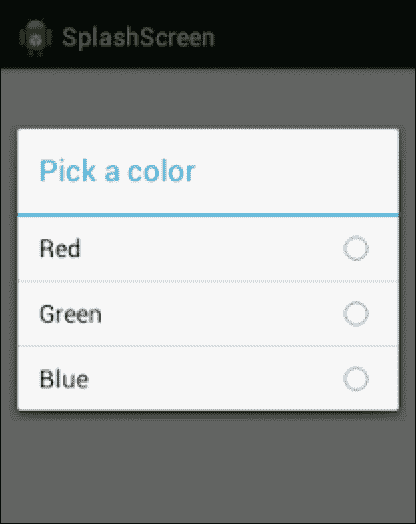
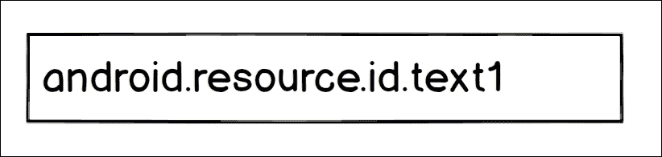
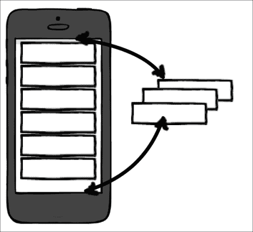
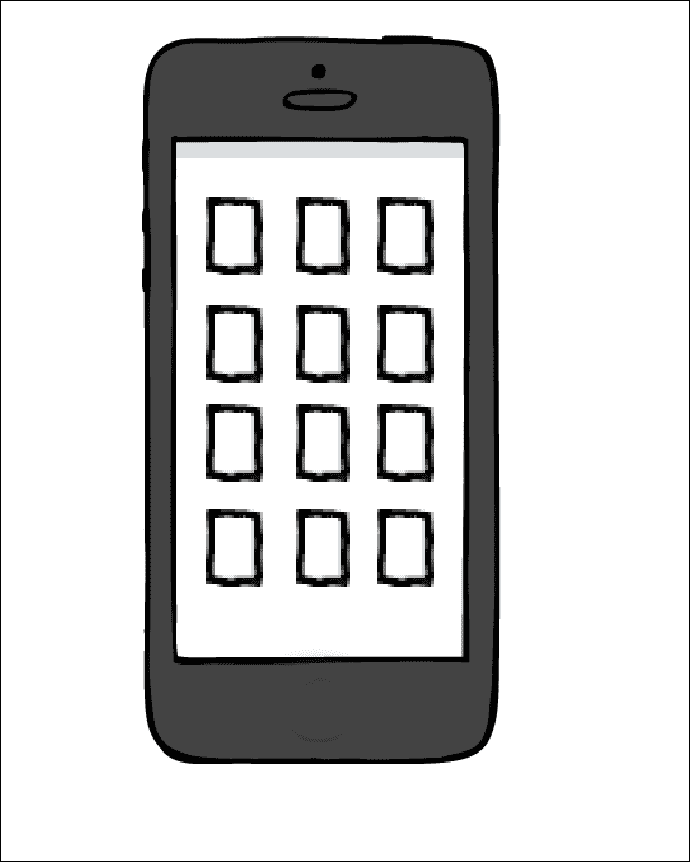
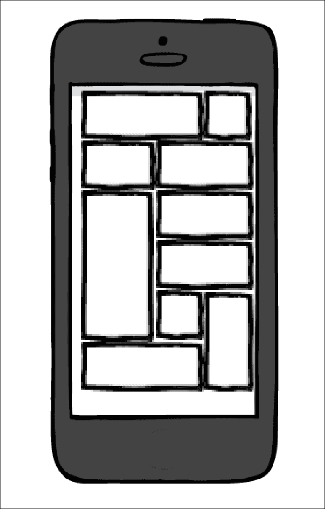
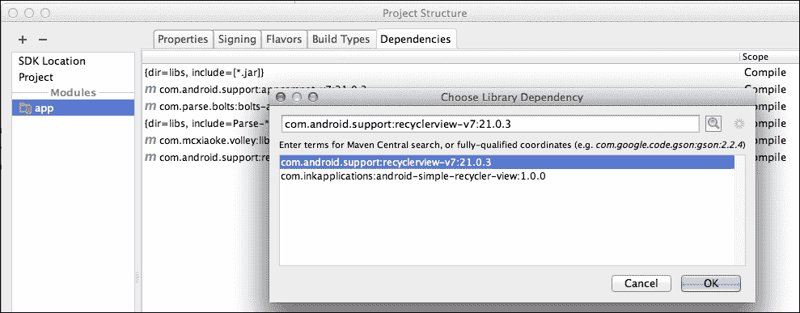
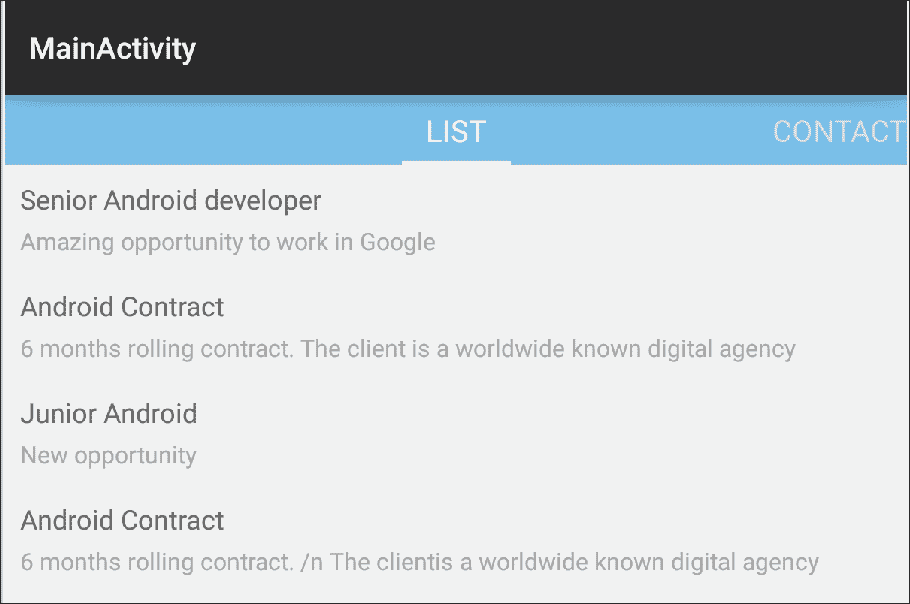

# 第五章。列表和网格

在本章中，我们将使用列表和网格。几乎在市场上的每个应用中都可以找到元素列表或矩阵。知道如何在安卓上显示元素列表是你在基础水平上学习的东西；然而，还有很多需要扩展和理解的地方。

重要的是要知道我们可以在这里使用哪些模式，如何回收视图，以及如何在同一个列表中用不同的视图显示不同种类的元素。

考虑到这一点，我们将能够理解为什么`RecyclerView`是`ListView`的继承者，我们将学习如何用这个组件实现一个列表。因此，我们将在本章中介绍以下内容:

*   从列表开始
    *   列表视图
    *   自定义适配器
    *   回收视图
    *   使用视图保持器模式
*   引入回收视图
    *   列表、网格或堆栈
    *   履行
*   奥尼麦克里克

# 从列表开始

如果你有听说过`RecyclerView`，你可能会想为什么我们要经历`ListView`。`RecyclerView`小部件是新的；它与安卓棒棒糖一起问世，在显示物品列表时是一场革命；它可以做垂直和水平，作为一个列表或一个网格，或与其他改进漂亮的动画。

回答问题，即使`RecyclerView`在某些场景下更加高效灵活，也需要额外编码才能达到同样的效果，所以还是有理由使用`ListView`。比如`RecyclerView`中没有`onItemClickListener()`进行项目选择，点击某个项目时没有视觉反馈。如果我们不需要定制和动画，例如一个简单的数据选择器弹出窗口，这可能是一个对话框，我们只需要选择一个国家。在这种情况下，使用`ListView`而不是`RecyclerView`是完全可以的。

从`ListView`开始的另一个原因是`RecyclerView`解决了与`ListViews`合作时出现的大部分问题。因此，从`ListView`开始，解决这些问题，我们就能充分理解`RecyclerView`是如何运作的，为什么会这样实施。因此，我们将单独解释用于对组件有全局概念的模式。

这里有一个以选择项目为目的的基本`AlertDialog`的例子；在这里，`ListView`的使用非常有意义:



## 使用内置视图的列表视图

当你第一次执行`ListView`的时候，可能看起来很琐碎很容易；然而，当你花更多的时间在安卓上时，你会意识到它会变得多么复杂。只要有一个很大的元素列表，每行都有一个图像，就可以很容易地发现性能和内存问题。如果您试图实现复杂的用户界面，可能很难自定义列表；例如，让同一个列表显示不同的项目，用不同的视图创建不同的行，甚至在显示部分标题的同时试图对一些项目进行分组，都是一件令人头疼的事情。

让我们从实现列表的最短方法开始，使用安卓内置的项目布局，如前所述，它被创建用于简单的列表。为了显示列表，我们将它包含在`AlertDialog`中，当我们点击设置片段中的一个按钮时，将显示该列表。我会将按钮的文本设置为`Lists Example`。

第一步是在`settings_fragment.xml`中创建按钮；创建后，我们可以将 click listener 设置为按钮。现在，我们对软件模式有了更多的了解，而不是按照以下方式设置 click listener:

```java
view.findViewById(R.id.settingsButtonListExample).setOnClickListener(new View.OnClickListener() {
  @Override
  public void onClick(View view) {
    //Show the dialog here
  }
});
```

我们将以更结构化的方式来做，尤其是因为我们知道在设置屏幕中，会有很多按钮，我们希望在同一个地方处理所有的点击。我们将`onClickListener`设置为`this`，而不是在方法调用中创建`onClickListener`，而是使`Fragment` 实现`OnClikListener` 。`this`关键字在这里指的是整个片段，所以片段会监听`onClick`方法中的点击，一旦`Fragment`执行`View.OnClickListener`则强制执行。

`OnClick()`方法接收一个视图，即点击的视图。如果我们将该视图的 ID 与按钮的 ID 进行比较，我们将知道按钮或我们设置`clickListener`的其他视图是否已被点击。

定义类时只需键入`implements View.OnClickListener`，系统会要求您实现强制方法:

```java
/**
* Settings Fragment
*/
public class SettingsFragment extends Fragment implements View.OnClickListener {

  @Override
  public View onCreateView(LayoutInflater inflater, ViewGroup container,
  Bundle savedInstanceState) {
    // Inflate the layout for this fragment
    View view = inflater.inflate(R.layout.fragment_settings, container, false);

    view.findViewById(R.id.settingsButtonListExample).setOnClickListener(this);

    view.findViewById(R.id.ViewX).setOnClickListener(this);

    view.findViewById(R.id.imageY).setOnClickListener(this);

    return view;
  }

  @Override
  public void onClick(View view) {
    switch (view.getId()){
      case (R.id.settingsButtonListExample) :
      showDialog();
      break;
      case (R.id.viewX) :
      //Example
      break;
      case (R.id.imageY) :
      //Example
      break;

      //...
    }
  }

  public void showListDialog(){
    //Show Dialog here
  }
}
```

您会注意到，我们还将显示列表对话框的逻辑移动到了一个外部方法，使结构在`onClick();`中易于阅读。

继续对话框，我们可以显示一个具有`setAdapter()`属性的`AlertDialog`，它会自动将项目与内部的`ListView`绑定。或者，我们可以创建一个带有`ListView`的对话框视图，然后将适配器设置为`ListView`:

```java
/**
*  Show a dialog with different options to choose from
*/
public void showListDialog(){

  AlertDialog.Builder builder = new AlertDialog.Builder(getActivity());

  final ArrayAdapter<String> arrayAdapter = new ArrayAdapter<String>(
  getActivity(),
  android.R.layout.select_dialog_singlechoice);
  arrayAdapter.add("Option 0");
  arrayAdapter.add("Option 1");
  arrayAdapter.add("Option 2");

  builder.setTitle("Choose an option");

  builder.setAdapter(arrayAdapter,
  new DialogInterface.OnClickListener() {
    @Override
    public void onClick(DialogInterface dialogInterface, int i) {
      Toast.makeText(getActivity(),"Option choosen "+i, Toast.LENGTH_SHORT).show();
      dialogInterface.dismiss();
    }
  });

  builder.show();
}
```

该对话框将显示一条消息，指示所单击的选项。我们使用`android.R.layout.select_dialog_singlechoice`作为我们的行的视图。

这是几个不同的列表内置布局的例子，这将取决于我们的应用的主题。该对话框在 4.4 KitKat 和 5.0 棒棒糖中看起来不像，例如在`android.R.layout.simple_list_item_1`中，它看起来是这样的:



下面是两行的`android.R.layout.simple_list_item_2`看起来类似于:


这是`android.R.layout.simpleListItemChecked`的一个例子，我们可以将模式的选择改为多种或单一:


这里是 `android.R.layout.activityListItem`，我们有一个图标和文字:


我们可以访问这些内置布局组件，以便在创建布局时更好地调整视图。这些组件被命名为`android.resource.id.Text1`、`android.resource.id.Text2`、`android.resource.id.Icon`等等。

现在，我们有了一个想法，如何创建功能和视图准备使用的列表。是时候创建我们自己的适配器并手动实现功能和视图了。

## 创建自定义适配器

当你找工作的时候，除了看招聘信息，你还会把你的简历交给不同的软件公司或信息技术招聘公司，这些公司会为你找到一家公司。

在我们的联系片段中，我们将创建一个按国家排序的列表，显示这些公司的联系方式。将有两个不同的行:一个用于国家标题，另一个用于公司详细信息。

我们可以在我们的 Parse 数据库中创建另一个名为`JobContact`的表，包含以下字段:


我们将从服务器请求工作联系人，并建立一个将发送到适配器的项目列表，以建立列表。在列表中，我们将发送两个不同的元素:公司和国家。我们可以做的是生成一个项目列表，并将这两个项目添加为对象。我们的两个类看起来类似于以下内容:

```java
@ParseClassName("JobContact")
public class JobContact extends ParseObject {

  public JobContact() {
    // A default constructor is required.
  }

  public String getName() {
    return getString("name");
  }

  public String getDescription() {
    return getString("description");
  }

  public String getCountry() {
    return getString("country");
  }

  public String getEmail() {
    return getString("email");
  }

}

public class Country {

  String countryCode;

  public Country(String countryCode) {
    this.countryCode = countryCode;
  }

}
```

一旦我们从[http://www.parse.com](http://www.parse.com)下载了按国家排序的信息，我们就可以构建我们的物品列表，遍历解析列表，并在检测到不同国家时添加一个国家标题。执行以下代码:

```java
public void retrieveJobContacts(){
  ParseQuery<JobContact> query = ParseQuery.getQuery("JobContact");
  query.orderByAscending("country");
  query.findInBackground(new FindCallback<JobContact>() {
    @Override
    public void done(List<JobContact> jobContactsList, ParseException e) {
      mListItems = new ArrayList<Object>();
      String currentCountry = "";
      for (JobContact jobContact: jobContactsList) {
        if (!currentCountry.equals(jobContact.getCountry())){
          currentCountry = jobContact.getCountry();
          mListItems.add(new Country(currentCountry));
        }
        mListItems.add(jobContact);
      }
    }
  });
}
```

现在我们已经有了包含标题的列表，我们准备基于这个列表创建`Adapter`，它将作为构造函数中的参数发送。定制`Adapter`的最好方法是创建一个扩展`BaseAdapter`的子类。一旦我们这样做了，我们将被要求实现以下方法:

```java
public class JobContactsAdapter extends BaseAdapter {
  @Override
  public int getCount() {
    return 0;
  }

  @Override
  public Object getItem(int i) {
    return null;
  }

  @Override
  public long getItemId(int i) {
    return 0;
  }

  @Override
  public View getView(int i, View view, ViewGroup viewGroup) {
    return null;
  }
}
```

这些方法必须根据我们想要显示的数据来实现；对于实例，`getCount()`将不得不返回列表的大小。我们需要实现一个接收两个参数的构造函数:列表和上下文。在`getView()`方法中，扩展列表需要上下文。这是适配器在不实现`getView()`的情况下的外观:

```java
public class JobContactsAdapter extends BaseAdapter {

  private List<Object> mItemsList;
  private Context mContext;

  public JobContactsAdapter(List<Object> list, Context context){
    mItemsList = list;
    mContext = context;
  }

  @Override
  public int getCount() {
    return mItemsList.size();
  }

  @Override
  public Object getItem(int i) {
    return mItemsList.get(i);
  }

  @Override
  public long getItemId(int i) {
    //Not needed
    return 0;
  }

  @Override
  public View getView(int i, View view, ViewGroup viewGroup) {
    return null;
  }
}
```

在我们的例子中，我们可以创建两种不同的视图；因此，除了强制方法之外，我们还需要实现两个额外的方法:

```java
@Override
public int getItemViewType(int position) {
  return mItemsList.get(position) instanceof Country ? 0 : 1;
}

@Override
public int getViewTypeCount() {
  return 2;
}
```

如果元素是国家，则`getItemViewType`方法将返回`0`，如果元素是公司，则返回`1`。借助这个方法，我们可以实现`getView()`。万一是国家，我们就给`row_job_country.xml`充气，里面有`ImageView`和`TextView`；万一是公司，我们就膨胀`row_job_contact.xml`，里面包含三个文本视图:

```java
@Override
public View getView(int i, View view, ViewGroup viewGroup) {

  View rowView = null;
  switch (getItemViewType(i)){

    case (0) :
    rowView = View.inflate(mContext, R.layout.row_job_country,null);
    Country country = (Country) mItemsList.get(i);
    ((TextView) rowView.findViewById(R.id.rowJobCountryTitle)).setText(country.getName());
    ((ImageView) rowView.findViewById(R.id.rowJobCountryImage)).setImageResource(country.getImageRes(mContext));
    break;

    case (1) :
    rowView = View.inflate(mContext, R.layout.row_job_contact,null);
    JobContact company = (JobContact) mItemsList.get(i);
    ((TextView) rowView.findViewById(R.id.rowJobContactName)).setText(company.getName());
    ((TextView) rowView.findViewById(R.id.rowJobContactEmail)).setText(company.getEmail());
    ((TextView) rowView.findViewById(R.id.rowJobContactDesc)).setText(company.getDescription());
  }

  return rowView;
}
```

完成后，我们可以在`contact_fragment.xml`中创建`ListView`，并将适配器设置到这个列表中。但是，我们会走捷径，用`android.support.v4.ListFragment`；这是一个片段，它已经用`ListView` 扩展了一个视图，并包含了`setListAdapter()`方法，该方法将适配器设置为内置的`ListView`。从这个片段扩展，我们的`ContactFragment`类看起来类似于下面的代码:

```java
public class ContactFragment extends android.support.v4.app.ListFragment {

  List<Object> mListItems;

  public ContactFragment() {
    // Required empty public constructor
  }

  @Override
  public void onViewCreated(View view, Bundle bundle) {
    super.onViewCreated(view,bundle);
    retrieveJobContacts();
  }

  public void retrieveJobContacts(){
    ParseQuery<JobContact> query = ParseQuery.getQuery("JobContact");
    query.orderByAscending("country");
    query.findInBackground(new FindCallback<JobContact>() {
      @Override
      public void done(List<JobContact> jobContactsList, ParseException e) {
        mListItems = new ArrayList<Object>();
        String currentCountry = "";
        for (JobContact jobContact: jobContactsList) {
          if (!currentCountry.equals(jobContact.getCountry())){
            currentCountry = jobContact.getCountry();
            mListItems.add(new Country(currentCountry));
          }
          mListItems.add(jobContact);
        }
        setListAdapter(new JobContactsAdapter(mListItems,getActivity()));
      }
    });
  }
}
```

创建视图后调用`retrieveJobContacts()`方法，我们会得到以下结果:


我们显示的标志是`drawable`文件夹中的图像，其名称与国家代码*相匹配，可绘制/“国家代码”。巴布亚新几内亚*。我们可以通过将资源标识符设置为`ImageView`并在`Country`类中使用以下方法检索来显示它们:

```java
public int getImageRes(Context ctx){
  return ctx.getResources().getIdentifier(countryCode, "drawable", ctx.getPackageName());
}
```

这是`ListView`的基本版本，有两种不同类型的行。这个版本离完美还很远；它缺乏性能。它不回收视图，每次我们创建一行时，它都会找到小部件的标识。我们将在下一节解释和解决这个问题。

## 回收视图

在使用`ListView`时，我们需要记住行数是一个变量，我们总是希望列表感觉流畅，即使我们尽可能快地滚动。希望安卓能在这个任务上给我们很多帮助。

当我们滚动到`ListView`时，屏幕一侧不再可见的视图被重复使用，并在另一侧再次显示。这样，安卓省去了视图膨胀；当它膨胀时，视图必须通过 xml 节点，实例化每个组件。这种额外的计算可能是一个流畅的列表和惊人的列表之间的区别。



`getView()`方法接收要回收的视图之一作为参数，如果没有要回收的视图，则为空。

为了利用视图回收，我们需要停止每次创建视图，并重用作为参数出现的视图。我们仍然需要更改循环视图中行内的文本视图和小部件的值，因为它具有与其先前位置相对应的初始值。在我们的例子中，我们有一个额外的复杂性；我们不能回收一个国家视图用于公司视图，所以我们只能回收相同视图类型的视图。然而，安卓再次使用我们实现的`getItemViewType`方法为我们进行内部检查:

```java
@Override
public View getView(int i, View view, ViewGroup viewGroup) {

  switch (getItemViewType(i)){

    case (0) :
    if (view == null){
      view = View.inflate(mContext, R.layout.row_job_country,null);
    }
    Country country = (Country) mItemsList.get(i);
    ((TextView) view.findViewById(R.id.rowJobCountryTitle)).setText(country.getName());
    ((ImageView) view.findViewById(R.id.rowJobCountryImage)).setImageResource(country.getImageRes(mContext));
    break;

    case (1) :
    if (view == null){
      view = View.inflate(mContext, R.layout.row_job_contact,null);
    }
    JobContact company = (JobContact) mItemsList.get(i);
    ((TextView) view.findViewById(R.id.rowJobContactName)).setText(company.getName());
    ((TextView) view.findViewById(R.id.rowJobContactEmail)).setText(company.getEmail());
    ((TextView) view.findViewById(R.id.rowJobContactDesc)).setText(company.getDescription());
  }

  return view;
}
```

## 应用视图保持器模式

注意在`getView()`中，每次我们想给`TextView`设置一个文本，我们就用`findViewById()`方法在行视图中搜索这个`TextView`；即使该行被回收，我们仍然会再次找到`TextView`来设置新值。

我们可以创建一个名为`ViewHolder`的类，通过在行内保存小部件搜索的计算来保存对小部件的引用。这个`ViewHolder`类将只包含对小部件的引用，我们可以通过`setTag()`方法在一行和它的`ViewHolder`类之间保留一个引用。一个`View`对象允许我们将一个对象设置为标签，并在以后检索它；我们可以通过为这个标签指定一个键来添加任意多的标签:`setTag(key)`或`getTag(key)`。如果没有指定密钥，我们可以保存和检索默认标签。

第一次创建视图时遵循这个模式，我们将创建`ViewHolder`类，并将其设置为视图的标签。如果视图已经创建，并且我们正在回收它，我们将简单地取回支架。执行以下代码:

```java
@Override
public View getView(int i, View view, ViewGroup viewGroup) {

  switch (getItemViewType(i)){

    case (0) :
    CountryViewHolder holderC;
    if (view == null){
      view = View.inflate(mContext, R.layout.row_job_country,null);
      holderC = new CountryViewHolder();
      holderC.name = (TextView) view.findViewById(R.id.rowJobCountryTitle);
      holderC.flag = (ImageView) view.findViewById(R.id.rowJobCountryImage);
      view.setTag(view);
    } else {
      holderC = (CountryViewHolder) view.getTag();
    }
    Country country = (Country) mItemsList.get(i);
    holderC.name.setText(country.getName());
    holderC.flag.setImageResource(country.getImageRes(mContext));
    break;
    case (1) :
    CompanyViewHolder holder;
    if (view == null){
      view = View.inflate(mContext, R.layout.row_job_contact,null);
      holder = new CompanyViewHolder();
      holder.name = (TextView) view.findViewById(R.id.rowJobContactName);
      holder.email = (TextView) view.findViewById(R.id.rowJobContactEmail);
      holder.desc = (TextView) view.findViewById(R.id.rowJobOfferDesc);
      view.setTag(holder);
    } else {
      holder = (CompanyViewHolder) view.getTag();
    }
    JobContact company = (JobContact) mItemsList.get(i);
    holder.name.setText(company.getName());
    holder.email.setText(company.getEmail());
    holder.desc.setText(company.getDescription());
  }

  return view;
}

private class CountryViewHolder{

  public TextView name;
  public ImageView flag;

}

private class CompanyViewHolder{

  public TextView name;
  public TextView email;
  public TextView desc;

}
```

为了简化这个代码，我们可以在每个支架内部创建一个名为`bindView()`的方法；它将获得一个国家或公司对象并填充小部件:

```java
CountryViewHolder holderC;
if (view == null){
  view = View.inflate(mContext, R.layout.row_job_country,null);
  holderC = new CountryViewHolder(view);
  view.setTag(view);
} else {
  holderC = (CountryViewHolder) view.getTag();
}
holderC.bindView((Country)mItemsList.get(i));
break;

private class CountryViewHolder{

  public TextView name;
  public ImageView flag;

  public CountryViewHolder(View view) {
    this.name = (TextView) view.findViewById(R.id.rowJobCountryTitle);
    this.flag = (ImageView) view.findViewById(R.id.rowJobCountryImage);
  }

  public void bindView(Country country){
    this.name.setText(country.getName());
    this.flag.setImageResource(country.getImageRes(mContext));
  }

}
```

我们现在将完成性能改进列表。如果有图片或者长时间的操作加载一个视图，我们需要在`getView()`里面创建`AsyncTask`方法，避免滚动的时候操作繁重。对于实例，如果我们想在每一行显示从互联网下载的图像，我们会有一个`LoadImageAsyncTask`方法，我们将使用持有者和下载图像的网址来执行该方法。当`Asynctask`方法结束时，它将具有对持有者的参考，因此将能够显示图像:

```java
public View getView(int position, View convertView,
ViewGroup parent) {

  ...

  new LoadImageAsyncTask(list.get(position).getImageUrl, holder)
  .executeOnExecutor(AsyncTask.THREAD_POOL_EXECUTOR, null);

  return convertView;
}
```

现在我们已经知道了提高一个`ListView`性能的所有不同技术，我们准备引入`RecyclerView`。通过在实现中应用大多数这些技术，我们将能够很容易地识别它。

# 引入回收视图

`RecyclerView`是在安卓 5.0 棒棒糖中推出的，被谷歌定义为`ListView`更灵活更高级的版本。它基于一个类似于`ListView`的`Adapter`类，但是它强制使用一个`ViewHolder`类来提高性能和模块性，正如我们在前面章节中看到的。当我们将项目表示从组件中分离出来，并允许动画、项目装饰和布局管理器来完成这项工作时，灵活性就来了。

`RecyclerView`使用`RecyclerView.ItemAnimator`处理动画的添加和移除，我们可以子类化来定制动画。如果您显示来自某个来源的数据，或者数据发生变化，例如通过添加或删除项目，您可以调用`notifyItemInserted()`或`notifyItemRemoved()`来触发动画。

要添加分隔符、分组项目或突出显示项目，我们可以使用`RecyclerView.ItemDecoration`。

利用`ListView`的主要差异之一是使用布局管理器来定位项目。有了`ListView`，我们知道我们的物品会一直垂直显示，如果想要有格子，可以用`GridView`。布局管理器使我们的列表更加灵活，因为我们可以根据需要显示元素，甚至可以创建自己的布局管理器。

## 使用列表、网格或堆栈

默认情况下，我们有三个内置布局管理器:`LinearLayoutManager`、`GridLayoutManager`和`StaggeredLayoutManager`。

`LinearLayoutManager`显示列表中对齐的项目，其中我们可以指定方向——垂直或水平。


`GridLayoutManager`将项目显示为矩阵，我们可以在其中指定列和行:



`StaggereGriddLayoutManager`交错显示项目；这些项目可以有不同的宽度或高度，我们可以通过`setGapStrategy()`控制它们的显示方式。



## 实施回收视图

继续到`MasteringAndroidApp`，我们将再次执行工作邀请列表，删除`ParseQueryAdapter`，改用`RecyclerView`。我们仍然会从 Parse 中查询数据，但这一次，我们要做的是将项目列表保存在一个变量中，并使用它来构建`RecyclerView.Adapter`，该变量将由`RecyclerView`使用。

`RecyclerView`包含在 v7 支持库中；将它包含在我们的项目中的最好方法是打开项目结构，点击依赖项选项卡，搜索`RecyclerView`。将显示结果列表，如下图所示:



这相当于在`build.gradle`依赖项中添加了以下一行:

```java
dependencies {
  compile fileTree(dir: 'libs', include: ['*.jar'])
  compile 'com.android.support:appcompat-v7:21.0.3'
  compile 'com.parse.bolts:bolts-android:1.+'
  compile fileTree(dir: 'libs', include: 'Parse-*.jar')
  compile 'com.mcxiaoke.volley:library-aar:1.0.1'
  compile 'com.android.support:recyclerview-v7:21.0.3'
}
```

一旦添加了这一行，我们将点击**用项目文件同步梯度**来更新依赖项，并准备在我们的 XML 中使用`RecyclerView`。

打开`fragment_list.xml`，用`RecyclerView`替换现有的`ListView`，如下:

```java
<android.support.v7.widget.RecyclerView
  android:id="@+id/my_recycler_view"
  android:scrollbars="vertical"
  android:layout_width="match_parent"
  android:layout_height="match_parent"/>
```

如果添加后没有出现任何错误，说明依赖项添加正确。

下一步是创建适配器。此适配器与我们为职务联系人创建的适配器略有不同；而不是扩展`BaseAdapter`，我们将扩展`RecyclerView.Adapter <RecyclerView.MyViewHolder>`，这是一个在创建`JobOfferAdapter`适配器类之后实现`ViewHolder`模式的适配器。但是在扩展之前，我们还要创建一个内部的`MyViewHolder`类扩展`RecylcerView.ViewHolder`。到目前为止，我们有以下代码:

```java
public class JobOffersAdapter  {

  public class MyViewHolder extends RecyclerView.ViewHolder{

    public TextView textViewName;
    public TextView textViewDescription;

    public  MyViewHolder(View v){
      super(v);
      textViewName = (TextView)v.findViewById(R.id.rowJobOfferTitle);
      textViewDescription = (TextView)v.findViewById(R.id.rowJobOfferDesc);
    }
  }
}
```

现在是我们从`RecyclerView.Adapter<JobsOfferAdapter.MyViewHolder>`延长`JobOffersAdapter`级的时候了。我们将被要求实施以下方法:

```java
@Override
public MyViewHolder onCreateViewHolder(ViewGroup parent, int viewType) {
  return null;
}

@Override
public void onBindViewHolder(MyViewHolder holder, int position) {

}

@Override
public int getItemCount() {
  return 0;
}
```

遵循与`JobsContactsAdapter`中相同的方法，我们通过接收工作邀请列表来创建构造函数，并基于该列表实现适配器方法。

`OnBindViewHolder`接收带有位置的支架；我们所需要做的就是获得列表中那个职位的工作机会，并用这些值更新持有者文本视图。`OnCreateViewHolder`会膨胀视图；在这种情况下，我们只有一个类型，所以我们忽略了`ViewType`参数。我们将在这里展示一种扩展视图的替代方法:使用父视图的上下文，它作为参数出现。

最后，`getItemCount`将返回工作邀请的数量。当您完成以上所有任务时，我们新的适配器将使用以下代码创建:

```java
public class JobOffersAdapter extends RecyclerView.Adapter<JobOffersAdapter.MyViewHolder>  {

  private  List<JobOffer> mOfferList;

  public JobOffersAdapter(List<JobOffer> offersList) {
    this.mOfferList = offersList;
  }

  @Override
  public MyViewHolder onCreateViewHolder(ViewGroup parent, int viewType) {
    View v = LayoutInflater.from(parent.getContext()).inflate(R.layout.row_job_offer, parent, false);
    return new MyViewHolder(v);
  }

  @Override
  public void onBindViewHolder(MyViewHolder holder, int position) {
    holder.textViewName.setText(mOfferList.get(position).getTitle());
    holder.textViewDescription.setText(mOfferList.get(position).getDescription());
  }

  @Override
  public int getItemCount() {
    return mOfferList.size();
  }

  public class MyViewHolder extends RecyclerView.ViewHolder{

    public TextView textViewName;
    public TextView textViewDescription;

    public  MyViewHolder(View v){
      super(v);
      textViewName = (TextView)v.findViewById(R.id.rowJobOfferTitle);
      textViewDescription = (TextView)v.findViewById(R.id.rowJobOfferDesc);
    }
  }
}
```

这就是我们从适配器方面需要的全部；现在，我们需要初始化`RecyclerView`并和适配器一起设置一个布局管理器。适配器必须使用来自解析的对象列表进行实例化，就像我们在前面的适配器中检索工作联系人一样。首先，在`OnCreateView`中，我们将初始化`RecyclerView`:

```java
public class ListFragment extends android.support.v4.app.Fragment {

  public List<JobOffer> mListItems;
  public RecyclerView mRecyclerView;

  public ListFragment() {
    // Required empty public constructor
  }

  @Override
  public View onCreateView(LayoutInflater inflater, ViewGroup container,
  Bundle savedInstanceState) {
    // Inflate the layout for this fragment
    View view = inflater.inflate(R.layout.fragment_list, container, false);

    mRecyclerView = (RecyclerView) view.findViewById(R.id.my_recycler_view);

    // use this setting to improve performance if you know that changes
    // in content do not change the layout size of the RecyclerView
    mRecyclerView.setHasFixedSize(true);

    // use a linear layout manager
    mRecyclerView.setLayoutManager(new LinearLayoutManager(getActivity()));

    //Retrieve the list of offers
    retrieveJobOffers();

    return view;
  }
```

最后我们就叫`retrieveOffers()`，这是一个`async`操作。只有当从解析中检索到结果时，我们才能创建适配器并将其设置为列表:

```java
public void retrieveJobOffers(){

  ParseQuery<JobOffer> query = ParseQuery.getQuery("JobOffer");
  query.findInBackground(new FindCallback<JobOffer>() {

    @Override
    public void done(List<JobOffer> jobOffersList, ParseException e) {
      mListItems = jobOffersList;
      JobOffersAdapter adapter = new JobOffersAdapter(mListItems);
      mRecyclerView.setAdapter(adapter);
    }

  });
}
```

测试我们设置的所有工作的最好方法是查看控制台中是否有任何错误。如果一切正常，您应该能够看到报价列表，如下图所示:



我们有意添加了一个重复的工作邀请，为了查看`RecyclerView`中默认包含的移除动画，我们将删除该邀请。我们将在一个长点击监听器中实现这个功能。执行点击监听器只是为了在详细视图中打开报价。我们将在下一节看到如何做到这一点。

## 点击回收查看项目

在`ListView`中，很容易检测到对某个项目的点击；我们可以简单地执行长时间点击`ListView.setOnItemClickLister`和`setOnItemLongClickListener`。但是这个实现没有`RecyclerView`那么快；灵活性是有代价的。

实现一个项目有两种方法点击这里:一种是创建一个实现`RecyclerView.OnItemTouchListener`并调用`RecyclerView`方法`addOnItemTouchListener`的类，如下所示:

```java
mrecyclerView.addOnItemTouchListener(new MyRecyclerItemClickListener(getActivity(), recyclerView, new MyRecyclerItemClickListener.OnItemClickListener() {

  @Override
  public void onItemClick(View view, int position){
    // ...
  }

  @Override
  public void onItemLongClick(View view, int position){
    // ...
  }
}));

public class MyRecyclerItemClickListener implements RecyclerView.OnItemTouchListener
{
  public static interface OnItemClickListener
  {
    public void onItemClick(View view, int position);
    public void onItemLongClick(View view, int position);
  }

  private OnItemClickListener mListener;
  private GestureDetector mGestureDetector;

  public MyRecyclerItemClickListener(Context context, final RecyclerView recyclerView, OnItemClickListener listener)
  {
    mListener = listener;

    mGestureDetector = new GestureDetector(context, new GestureDetector.SimpleOnGestureListener()
    {
      @Override
      public boolean onSingleTapUp(MotionEvent e)
      {
        return true;
      }

      @Override
      public void onLongPress(MotionEvent e)
      {
        View child = recyclerView.findChildViewUnder(e.getX(), e.getY());

        if(child != null && mListener != null)
        {
          mListener.onItemLongClick(child, recyclerView.getChildPosition(child));
        }
      }
    });
  }

  @Override
  public boolean onInterceptTouchEvent(RecyclerView view, MotionEvent e)
  {
    View child = view.findChildViewUnder(e.getX(), e.getY());

    if(child != null && mListener != null && mGestureDetector.onTouchEvent(e))
    {
      mListener.onItemClick(child, view.getChildPosition(child));
    }

    return false;
  }

  @Override
  public void onTouchEvent(RecyclerView view, MotionEvent motionEvent){
    //Empty
  }
}
@Override
public void onRequestDisallowInterceptTouchEvent(RecyclerView view){
  //Empty
}
```

这种方法的好处是，我们定义了在每个活动或片段中`onClick`内部要做什么。点击的逻辑不在视图上，一旦我们构建了这个组件，我们就可以在不同的应用中重用它。

第二种方法是设置和管理`ViewHolder`内的点击。如果我们想在应用的不同部分或另一个应用中重用这个`ViewHolder`，我们会遇到问题，因为点击的逻辑在视图内部，我们可能想在不同的片段或活动中使用不同的逻辑。然而，这种方法更容易检测同一行内不同组件的点击。例如，如果我们删除一个小图标，并在行内共享另一个图标，这种方法会更有意义。这样，我们可以在每行中设置作业名称的点击，并在整行中设置长点击监听器:

```java
public class MyViewHolder extends RecyclerView.ViewHolder implements View.OnClickListener, View.OnLongClickListener{

  public TextView textViewName;
  public TextView textViewDescription;

  public  MyViewHolder(View v){
    super(v);
    textViewName = (TextView)v.findViewById(R.id.rowJobOfferTitle);
    textViewDescription = (TextView)v.findViewById(R.id.rowJobOfferDesc);
    textViewName.setOnClickListener(this);
    v.setOnLongClickListener(this);
  }

  @Override
  public void onClick(View view) {
    switch (view.getId()){
      case R.id.rowJobOfferTitle :
      //Click
      break;
    }
  }

  @Override
  public boolean onLongClick(View view) {
    //Delete the element here
    return false;
  }
}
```

您应该能够判断在每种情况下使用哪种实现，并为其辩护。为了能够测试这一点，我们将在长时间点击后删除一个元素(我们应该在这里有一个确认对话框，以避免误删除项目，但我们将跳过这一部分)。该元素将被本地删除，以显示移除动画。请注意，我们没有在解析中从源中删除这个元素；我们所需要做的就是从列表中删除元素并调用`notifyItemRemoved`来触发通知。我们就知道用`getPosition()`方法点击了哪个项目。

```java
@Override
public boolean onLongClick(View view) {
  mOfferList.remove(getPosition());
  notifyItemRemoved(getPosition());
  return true;
}
```

# 总结

在本章的最后，您将知道如何实现适配器，如何处理列表中不同类型的项目，以及我们如何以及为什么应用`ViewHolder`模式。您首先在`ListView`类中学到了这一点，并手动实现了回收视图技术。因此，您将能够完全理解这些特性以及`RecyclerView`如何展示显示项目和实现项目点击监听器的不同方式。

在下一章中，我们将发现安卓 5.0 中与`RecyclerView`一起引入的一个新组件— `CardView`。我们将把这个和`RecyclerView`结合起来，形成一个灵活的、看起来专业的卡片列表。