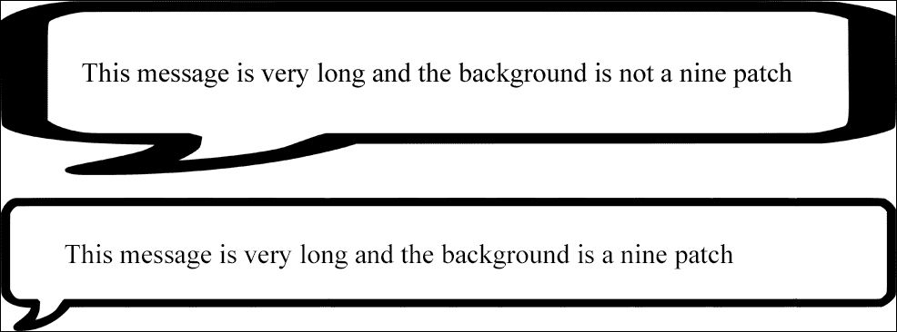
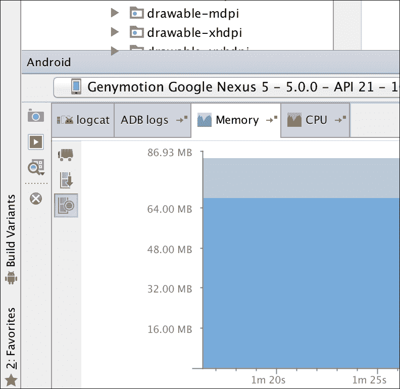

# 第七章。图像处理和内存管理

在本章中，我们将了解如何显示从网址下载的图像。我们将讨论如何使用 Android 原生 SDK 以及常用的第三方库来实现这一点。我们将考虑关键概念和功能，如下载、压缩、缓存系统和内存或磁盘存储。

我们还将讨论什么是九补丁以及如何创建它，我们将通过介绍矢量可绘制来谈论不同大小和密度的可绘制文件夹。

最后一部分将集中在内存管理上。识别我们应用中的内存泄漏是一项关键任务，这通常发生在处理图像时。我们将看看可能导致这些泄漏的常见错误，以及如何防止它们的一般提示。

*   显示来自网络的图像
    *   传统方式
    *   全图像下载程序
    *   毕加索
*   形象
    *   矢量绘图
    *   动画矢量绘图
    *   九补丁
*   内存管理
    *   检测和定位泄漏
*   防止泄漏

# 下载图片

下载一张图像，借助`ImageView`显示，可以一行完成。自从安卓开发开始，这是每个开发者都做过的事情。安卓是一项已经有五年多历史的技术，所以我们可以期待这项技术相当先进，并找到第三方解决方案来促进它。也就是说，如果这本书没有解释在没有任何第三方库的情况下下载图像并显示的过程，就不会被称为*掌握安卓*。

在你的应用中使用最新的库是好的，但是更好的是理解你正在实现的解决方案，更好的是能够自己构建这个库。

在处理图像时，我们需要处理一切，从网络连接到数组字节的下载以及它们到**位图**的转换。在某些情况下，将图像存储在磁盘上是有意义的，这样下次我们打开应用时，这些图像就已经在那里了。

即使我们能够显示一个图像，事情也不会在这里结束；我们应该能够管理列表视图中图像的下载。系统的下载、存储和显示需要同步，这样应用才能正常工作，并且有一个流畅的列表，可以毫无问题地滚动。请记住，当我们滚动列表时，视图会被回收。这意味着，如果我们快速滚动，我们可能会开始下载图像。下载完成时，该视图将不再显示在屏幕上，或者将在另一个视图中回收。

## 传统的图片下载方式

要在不使用任何第三方库的情况下显示图像(互联网上托管的带有网址的图像)，我们需要使用`HttpURLConnection`建立连接。我们需要打开一个输入流并使用信息，这些信息可以用工厂方法`BitmpapFactory.decodeStream(InputStream istream)`转换成位图图像。我们可以把它从一个输入流转换成一个文件，这样图像就可以存储在磁盘上，以后可以访问。目前，让我们先尝试下载它，并将其转换为位图图像，我们将保存在内存中并在`ImageView`中显示。

我们将在`OfferDetailActivity`中为每个报价显示公司的标志。请记住，在 Parse 中，我们创建了一个数据库，并使用它创建了一个名为`imageLink`的字段。你只需要在这个字段中填入该公司标志的网址。


我们需要在`OfferDetailActivity`中有这个形象链接；为此，我们需要在`JobOfferAdapter`中的意图中发送一个额外的参数，用于我们点击卡片的时候。使用以下代码:

```java
@Override
public void onClick(View view) {
  Intent intent = new Intent(view.getContext(), OfferDetailActivity.class);
  JobOffer offer = mOfferList.get(getPosition());
  intent.putExtra("job_title", offer.getTitle());
  intent.putExtra("job_description",offer.getDescription());
  intent.putExtra("job_image",offer.getImageLink());
  view.getContext().startActivity(intent);
}
```

负责图像下载的方法将是一个静态方法，可以从应用的任何地方调用。该方法将被放在名为`utils`的包内的`ImageUtils`类中。我们将首先检查网址是否正确，之后，我们将消费来自`HttpURLConnection`的内容，将输入流转换为位图图像，如前所述:

```java
public static Bitmap getImage(String urlString) {

  URL url = null;

  try {
    url = new URL(urlString);
  } catch (MalformedURLException e) {
    return null;
  }

  HttpURLConnection connection = null;
  try {
    connection = (HttpURLConnection) url.openConnection();
    connection.connect();
    int responseCode = connection.getResponseCode();
    if (responseCode == 200) {
      return BitmapFactory.decodeStream(connection.getInputStream());
    } else
      return null;
  } catch (Exception e) {
    return null;
  } finally {
    if (connection != null) {
      connection.disconnect();
    }
  }
}
```

我们将创建一个名为`displayImageFromUrl()`的方法，它接收`ImageView`和一个带有链接的字符串来完成所有的工作，而不是在`onCreate`中拥有所有这些逻辑。在`onCreate`中，我们只需要检索参数并调用方法:

```java
String imageLink = getIntent().getStringExtra("job_image");
ImageView imageViewLogo = (ImageView) findViewById(R.id.logo);

displayImageFromUrl(imageViewLogo,imageLink);
```

在这个阶段，我们可以尝试调用`ImageUtils.getImage(link)`并将位图设置为`ImageView`。然而，我们错过了一件事；我们不能只调用主活动线程中打开网络连接的方法。我们需要在后台做这件事，否则我们会得到一个例外。一种`AsyncTask`方法很好地解决了这个问题:

```java
String imageLink = getIntent().getStringExtra("job_image");
ImageView imageViewLogo = (ImageView) findViewById(R.id.logo);

displayImageFromUrl(imageViewLogo,imageLink);

public void displayImageFromUrl(ImageView imageView, String link){

  new AsyncTask<Object,Void,Bitmap>(){

    ImageView imageView;
    String link;

    @Override
    protected Bitmap doInBackground(Object... params) {
      imageView = (ImageView) params[0];
      link = (String) params[1];

      return ImageUtils.getImage(link);
    }

    @Override
    protected void onPostExecute(Bitmap bitmap) {
      super.onPostExecute(bitmap);
      imageView.setImageBitmap(bitmap);
    }

  }.execute(imageView, link);
}
```

根据所用图像的形状和背景，使用`ImageView`属性、`scaleType`、使用`centerInside`或`centerCrop`值会更好看。`CenterInside`值将缩小图像，以确保在保持比例的同时适合接收者。`CenterCrop`值将放大图像，直到它填满收件人的最小一面。图像的其余部分将超出`ImageView`的范围。

在这一章的开头我提到，这本来可以只用一行代码就可以完成，但是正如你所看到的，我们自己做要比一行多得多，涉及到不同的概念，比如后台线程、`HttpURLConnection`等等。这只是开始；我们实现了最简单的场景。如果我们在列表视图的行中以相同的方式设置图像，我们会有问题。其中一个问题是在滚动的同时激发无限的`AsyncTask`调用。如果我们有一个最大数量`AsyncTask`的队列和一个取消机制来忽略或取消不在屏幕上的视图请求，这是可以控制的。

当我们启动`AsyncTask`时，我们引用了`ImageView`，在`PostExecute`中，我们将`Bitmap`设置为它。该下载操作可能需要一些时间，以便`ImageView`可以在滚动时回收。这意味着我们正在下载`ImageView`的图像，该图像在列表的不同位置被回收以显示不同的元素。例如，如果我们有一份联系人名单，上面有他们的脸，我们就会看到名字不对的人的脸。为了解决这个问题，我们可以做的是将带有图像链接的字符串设置为`ImageView`作为标签，`myImageView.setTag(link)`。如果视图被回收，它将有一个带有新链接的不同项目；因此，我们可以在`onPostExecute`中，就在显示图像之前，检查我们现在拥有的链接是否与`ImageView`标签中的链接相同。

这是两个常见的问题及其各自的解决方法，但我们还没有讲到这里。如果我们继续沿着这条路走下去，最繁琐的事情就是创建一个缓存系统。根据应用和情况，我们可能希望永久存储下载的图像。例如，如果我们正在创建一个包含您最喜欢的专辑列表的音乐应用，将专辑的封面存储在磁盘中是有意义的。如果你每次打开应用都会看到收藏夹列表，并且我们知道封面不会改变，为什么不永久存储图像，以便下次打开应用时，加载速度更快，并且不会消耗任何数据？对于用户来说，这将意味着看到第一个屏幕总是立即加载，这将是对用户体验的巨大改善。为此，我们需要将图像下载到一个文件上，并有第三种方法在以后从文件中读取图像，包括检查我们是否已经下载了这个图像或者这是我们第一次请求它的逻辑。

另一个例子是新闻阅读器应用。我们知道图像几乎每天都在变化，所以把它们保存在磁盘上是没有意义的。然而，我们可能仍然希望在浏览应用时将它们保存在内存中，而不是在从另一个活动返回到另一个活动时在同一会话中再次下载它们。在这种情况下，我们需要关注内存使用情况。

是时候介绍一些第三方库来帮助我们解决这个话题了。我们可以从凌空开始，与我们为网络请求实现的凌空相同。

## 用凌空下载图片

凌空提供两种请求图像的机制。第一种机制`ImageRequest`，非常类似于我们刚刚用`AsyncTask`使用凌空的请求队列并按需调整图像大小。这是请求的构造函数:

```java
public ImageRequest(String url, Response.Listener<Bitmap> listener, int maxWidth, int maxHeight, Config decodeConfig, Response.ErrorListener errorListener) { … }
```

将使用`maxWidth`和`maxHeight`参数来调整图像的大小；如果我们不想调整大小，我们可以将该值设置为`0`。在我们的示例中，这是一种用于获取图像的方法:

```java
public void displayImageWithVolley(final ImageView imageView, String url){

  ImageRequest request = new ImageRequest(url,
  new Response.Listener<Bitmap>() {
    @Override
    public void onResponse(Bitmap bitmap) {
      imageView.setImageBitmap(bitmap);
    }
  }, 0, 0, null,
  new Response.ErrorListener() {
    public void onErrorResponse(VolleyError error) {

    }
  });

  MAApplication.getInstance().getRequestQueue().add(request);
}
```

第二个机制，真正有趣的是`ImageLoader`。它同时处理多个请求，并且是在列表视图中使用的机制，原因我们在上一节中已经解释过了。我们可以创建我们希望它使用的缓存机制——内存或磁盘。

它使用特殊类型的`ImageView: NetworkImageView`工作。当`ImageLoader`对象准备好了，我们可以简单的下载一张图片一行使用`NetworkImageView`:

```java
myNetworkImageView.setImage(urlString, imageloader);
```

它允许我们执行不同的操作，例如设置默认图像，或者在请求失败时设置图像。使用以下代码:

```java
myNetworkImageView.sesetDefaultImageResId(R.id.default_image);
myNetworkImageView.setErroImageResId(R.id.image_not_found);
```

这里的复杂性，如果有的话，来自于我们实现`ImageLoader`。首先，我们需要以与在`Application`类中使用`RequestQueue`相同的方式创建它，以便可以从我们的应用中的任何位置访问它:

```java
@Override
public void onCreate() {
  super.onCreate();

  sInstance = this;

  mRequestQueue = Volley.newRequestQueue(this);

  mImageLoader = new ImageLoader(mRequestQueue, new myImageCache());
```

构造函数需要一个缓存实现。谷歌就是一个基于内存的缓存的例子，它的大小相当于三个屏幕的图像:

```java
public class LruBitmapCache extends LruCache<String, Bitmap>
implements ImageCache {

  public LruBitmapCache(int maxSize) {
    super(maxSize);
  }

  public LruBitmapCache(Context ctx) {
    this(getCacheSize(ctx));
  }

  @Override
  protected int sizeOf(String key, Bitmap value) {
    return value.getRowBytes() * value.getHeight();
  }

  @Override
  public Bitmap getBitmap(String url) {
    return get(url);
  }

  @Override
  public void putBitmap(String url, Bitmap bitmap) {
    put(url, bitmap);
  }

  // Returns a cache size equal to approximately three screens worth of images.
  public static int getCacheSize(Context ctx) {
    final DisplayMetrics displayMetrics = ctx.getResources().
    getDisplayMetrics();
    final int screenWidth = displayMetrics.widthPixels;
    final int screenHeight = displayMetrics.heightPixels;
    // 4 bytes per pixel
    final int screenBytes = screenWidth * screenHeight * 4;

    return screenBytes * 3;
  }
}
```

我们可以看到，在缓存实现之间进行选择是一个手动过程；我们必须用所需的实现创建类，并在`ImageLoader`的构造函数中设置它。这就是为什么，我们将要看到的下一个图书馆在问世时是一场革命。

## 介绍毕加索

创造`OkHttp`的同一批人把毕加索带到了安卓社区。毕加索允许我们在一行代码中下载和显示图像，而无需创建`ImageLoader`，并且缓存实现可以使用磁盘和内存自动工作。它包括图像转换、`ImageView`回收和请求取消。所有这些都是免费的。广场上的人们给社区带来的东西令人难以置信。

如果这还不够，调试模式会在图像中显示指示器，角落里有一个不同颜色的小三角形，表示我们第一次下载图像的时候(也就是来自网络的时候)，来自内存缓存的时候，以及来自磁盘缓存的时候:


# 掌握图像

在完成关于图像的这一章之前，我们必须在本书中涵盖两个概念。如你所知，根据屏幕的密度，图像可以放在多个文件夹中——从低密度`drawable-ldpi`到高密度`drawable-hdpi`、超超高密度`drawable-xxxhdpi`，未来可能还会有更多。当我们这样做的时候，我们需要考虑我们是想要所有屏幕的最高质量的图像，还是一个轻 APK。复制映像将增加我们安装程序的大小。随着安卓 5.0 中引入以下组件，这个问题将会消失。

## 矢量绘图

这些图纸是基于矢量图形的；矢量图形可以按比例放大和缩小，而不会失去任何质量。有了这个，我们只需要一个单一的可抽拉，无论我们使用什么屏幕，无论是安卓手表还是安卓电视，它都会有出色的质量。

矢量绘图的定义方式与我们在 XML 文件中定义形状的方式相同。这是一个简单的`vectordrawable.xml`文件:

```java
<vector xmlns:android="http://schemas.android.com/apk/res/android" android:height="64dp" android:width="64dp" android:viewportHeight="600" android:viewportWidth="600">
  <group>
    <path android:fillColor="@color/black_primary" android:pathData="M12 36l17-12-17-12v24zm20-24v24h4V12h-4z" />
  </group>
</vector>
```

请注意，矢量标签有高度和宽度；如果我们在`ImageView`中设置这个 drawing able，尺寸比容器小，看起来会像素化。

你可能会问自己，我们从哪里得到`pathData`属性？您可能会有一个`.svg`图像，一种可缩放图形的格式。此图像可以用文本编辑器打开，您应该可以在这里看到类似于路径数据的内容:

```java
<svg  width="48" height="48" viewBox="0 0 48 48">
  <path d="M12 36l17-12-17-12v24zm20-24v24h4V12h-4z"/>
</svg>
```

谷歌提供了一包材质设计图标，这些图标自带一个 SVG 版本；有了这个，你就可以开始给你的应用添加无限可伸缩的图片了。我们显示的路径是这组图标中的一个媒体播放器图标。


Vector drawable 将被添加到设计支持库中，因此它将有可能与安卓的早期版本一起使用，而不仅仅是 5.0。

下一个组件可能不包含在设计支持库中，因此我们必须考虑是否要使用它，这取决于 5.0 和更高版本的广泛程度。无论如何，这是值得解释的，因为它迟早会因其惊人的结果而被更多人看到。

## 使用 AnimatedVectorDrawable 制作动画

顾名思义，`AnimatedVectorDrawable`是一个可以用动画绘制的矢量，是一个重要的特征。这些动画不仅仅是旋转、缩放、alpha 等等，这些都是我们之前在 Android 中看到过的；这些动画还允许我们变换可绘制的`pathData`属性。这意味着我们可以有一个改变形状的图像或一个转换成另一个图像的图像。

这带来了无限多的用户界面可能性。例如，我们可以将一个播放按钮转换为半圆形，作为进度条继续旋转，或者将一个播放按钮转换为暂停按钮。

我们可以定义传统动画，如旋转，如下所示:

```java
<objectAnimator
  xmlns:android="http://schemas.android.com/apk/res/android"
  android:duration="6000"
  android:propertyName="rotation"
  android:valueFrom="0"
  android:valueTo="360" />
```

下面是我们如何定义从三角形到矩形的形状变换:

```java
<set
  xmlns:android="http://schemas.android.com/apk/res/android">
  <objectAnimator
    android:duration="3000"
    android:propertyName="pathData"
    android:valueFrom="M300,70 l 0,-70 70,70 0,0   -70,70z"
      android:valueTo="M300,70 l 0,-70 70,0  0,140 -70,0 z"
    android:valueType="pathType"/>
</set>
```

要将它们组合成一个`AnimatedVectorDrawable`对象，请执行以下代码:

```java
<animated-vector
  xmlns:android="http://schemas.android.com/apk/res/android"
  android:drawable="@drawable/vectordrawable" >
  <target
    android:name="rotationGroup"
    android:animation="@anim/rotation" />
  <target
    android:name="v"
    android:animation="@anim/path_morph" />
</animated-vector>
```

这仅限于具有相同长度和相同命令长度的路径。

## 使用九个补丁

在解释什么是九补丁之前，我会在需要的时候给你看。如果我们正在做一个消息应用，我们必须显示用户在聊天气泡中写的内容，我们可以考虑创建`TextView`并设置一个消息气泡的图像作为背景。如果消息很长，这就是没有和有九补丁背景的情况。



我们可以看到第一张图片被拉长了，看起来很糟糕；然而，我们不想拉长边界。我们想要的是保持边框不变，但根据消息的不同，使文本区域更高或更宽。

九面片图像是一种可以根据其内容调整大小的图像，但它涉及到保留一些区域而不进行任何拉伸。它可以从 PNG 文件中的图像创建。基本上是同一个 PNG 文件，每边多了一个像素，用扩展名`.9.png`保存。当我们把这个放在`drawable`文件夹中，安卓会知道在额外的像素中，有信息知道哪些区域需要拉伸，哪些区域不需要拉伸。

如果您查看图像，您会看到左侧和顶部的额外像素线用于指定哪些内容是可缩放的，而底部和右侧的线用于指定可以填充哪些空间。我们想完全填满盒子，但我们只想向左缩放某个部分。


安卓提供了一个工具来创建这九个补丁图像，你可以在 `tools`下的你的 SDK 文件夹中找到它们。只需打开`draw9patch`并拖动一个图像到其中。


# 内存管理

每个 Java 开发者都听说过**垃圾收集器**(**GC**)；这个是一个自动为我们释放内存中资源的机制。在某些情况下，我们可以阻止垃圾收集器释放一些资源；如果资源持续增长，我们将不可避免地看到`OutOfMemoryError`。

如果发生这种情况，我们需要找到泄漏点，然后进行封堵。在本节中，我们将了解如何找到问题的根源，以及一系列防止这种情况发生的良好做法。

这不是只有在发生错误时才需要调查的事情；我们的应用可能有漏洞，不足以通过快速测试检测到，这可能会导致内存堆较小的设备出错。因此，在发布应用之前，快速检查一下内存水平是有好处的。

## 检测和定位泄漏

安卓工作室提供了一种快速检查内存状态的方法。在底部窗口，你会发现`logcat`和**ADB**T8】日志旁边有一个名为**记忆**的标签。



如果你点击我们称之为垃圾收集器的小卡车图标，你会看到空闲内存是如何增加的。

不要将此作为对空闲内存的引用，因为堆是动态的。这意味着堆一开始可以是 64mb；我们分配了 60 MB，还有 4 MB 的可用空间，但我们分配了 10 MB 以上。堆可以变得更高，我们最终会有一个 128 兆的堆，分配了 70MB，空闲了 58 兆。

为了检测泄漏，我们需要引用分配的内存。不断点击垃圾收集器并在应用中导航，打开和关闭活动，加载图像，滚动列表，并多次执行这些操作。如果分配的内存不断增长，并且从未减少，这意味着我们正在泄漏内存，阻止一些资源被收集。我们可以大致定位泄漏发生在哪个活动或片段中，因为我们将看到总是在同一点增加(假设我们没有一个以上的泄漏)。

为了更精确地定位源，我们需要使用**安卓设备** **监视器**:


选择你的应用进程，点击**更新堆**:


一旦选择了这个，我们就可以看到对象的分配；在位图或线程泄漏的情况下，这将是一个很好的线索:


如果我们仍然不清楚是什么泄漏了内存，我们可以点击 **Dum HPROF** 文件按钮，用 Eclipse 中的内存分析器工具 **MAT** 打开这个文件。我们将不得不为此下载 Eclipse。

当我们导入文件时，我们可以在我们的过程中双击并点击**列表对象**，这将识别发生了什么。例如，我们可以看到一个活动中有多少对象，以及使用了多少堆:


## 防止泄漏

比修复内存泄漏更好的方法是不要把它放在第一个位置。如果在开发过程中，我们牢记泄漏的最常见原因，这将在未来为我们省去问题。

### 活动和上下文参考

活动引用是导致这个问题的主要原因之一。将我们活动的引用发送给下载监听器或发送给事件监听器是非常常见的。如果对我们的活动的引用保存在另一个对象中，这将阻止垃圾收集器释放我们的活动。例如，如果我们改变方向，我们的活动将被默认再次创建，并且具有旧方向的旧活动将被销毁。

记得在我们活动的`onDestroy`方法中取消订阅听众，并留意你发送上下文的对象；这是对我们活动的有力引用。

### 使用弱引用

默认情况下，当我们在 Java 中创建一个对象时，它是用硬引用创建的。具有硬引用的不同于 null 的对象不会被垃圾收集。

仅包含弱引用的对象将在下一个周期被垃圾收集。同一对象可以有多个引用；因此，如果我们需要暂时使用一个对象，我们可以创建一个对它的弱引用，当硬引用被移除时，它将被垃圾收集。

这是一个包含在脸书软件开发工具包源代码中的真实例子。他们创建了一个名为 **工具弹出菜单**的自定义弹出菜单，如下图所示:


该弹出窗口需要一个锚视图，并且该锚视图被弱引用引用:

```java
private final WeakReference<View> mAnchorViewRef;
```

这背后的原因是，当弹出窗口显示时，我们不再需要锚点视图。一旦弹出窗口显示，锚视图可以设置为空或消失，这不会影响我们。因此，有了弱引用，如果原始锚点视图被破坏，失去了硬引用，也会释放`ToolTipPopup`类中的弱引用对象。

# 总结

在本章中，您学习了如何在没有第三方库帮助的情况下下载图像，以便了解它们的用法。对凌空和毕加索的概述让我们准备好以完美的处理实现任何应用。我们还花了一些时间处理添加到我们的应用中的图像，例如矢量绘图和九个补丁图像。为了完成这一章，我们看到了如何在我们的应用中管理内存问题，更重要的是，如何防止它们。

在下一章中，我们将创建一个 SQLite 数据库。我们将通过内容提供商导出该数据库，并通过`CursorLoader`与该内容提供商同步用户界面数据。