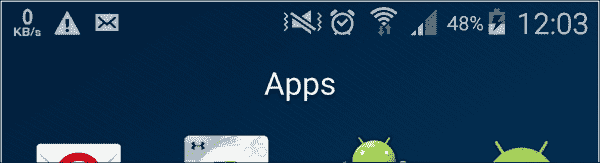
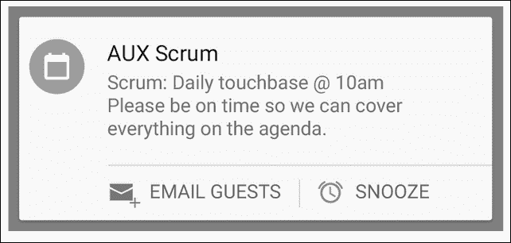
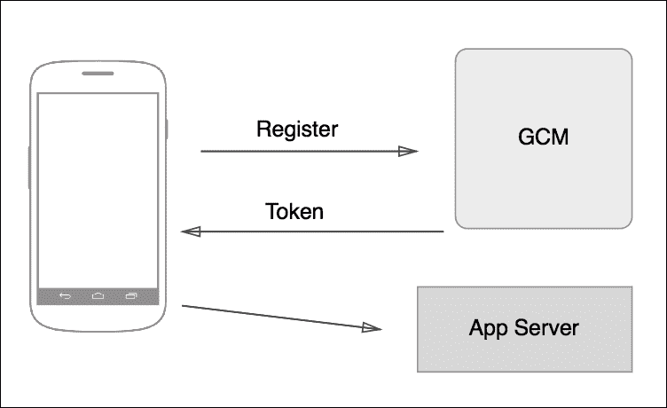
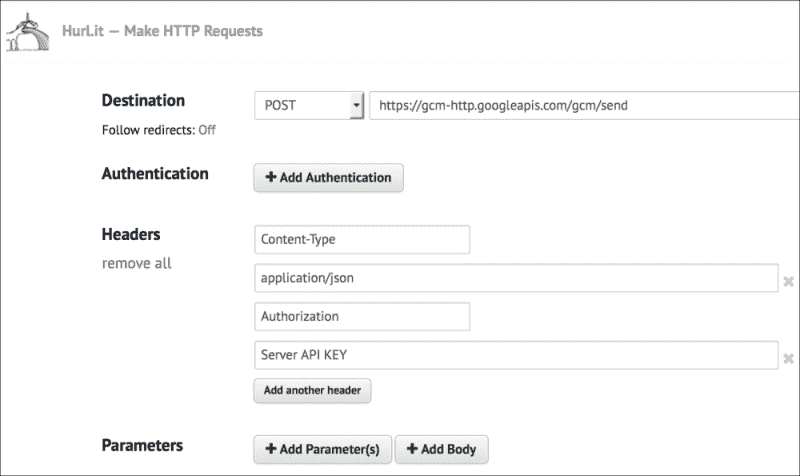
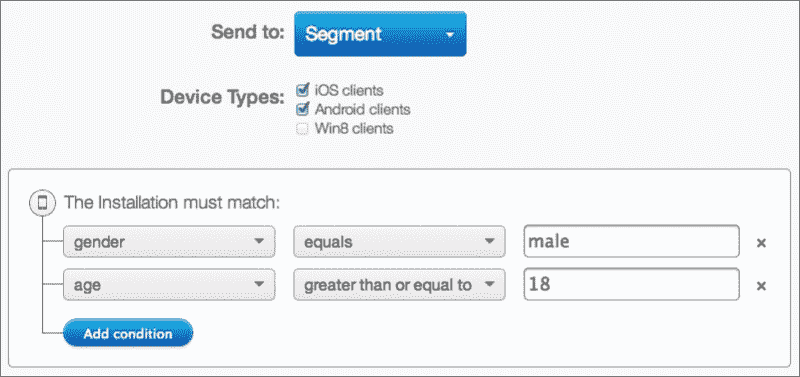
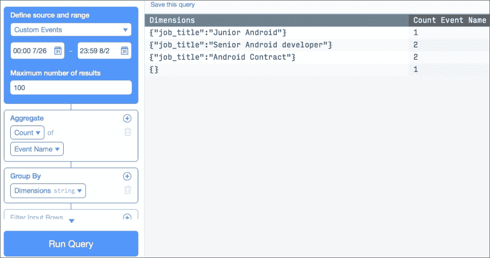
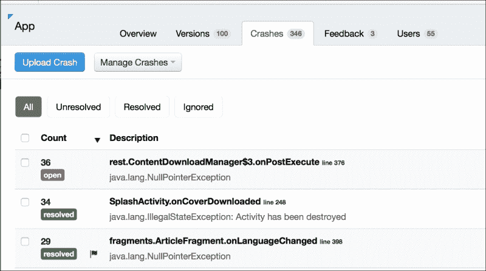

# 第九章。推送通知和分析

我们将从讨论推送通知开始这一章。您将学习如何使用谷歌云消息在服务器端和应用端实现带有通知的定制解决方案。然后，我们将使用 Parse 向我们的示例添加通知。为了结束通知，我们将使用`NotificationCompat`显示我们的自定义通知。

在本章的后半部分，我们将讨论分析。让分析来跟踪用户在我们的应用中做了什么，对于了解用户的行为是至关重要的，这使我们能够识别模式并改善体验。我们将使用 Parse 实现一个示例，并概述市场上最流行的解决方案。

*   推送通知
    *   用 GCM 发送和接收
    *   解析通知
    *   通知兼容性
*   分析学
    *   带有解析的分析
*   错误报告

# 推送通知

推送通知对于吸引用户和提供实时更新非常重要。它们有助于提醒用户有一个操作未完成。比如在 **Qkr！**万事达卡打造的 app，可以在一些餐厅点餐点饮，如果用户在相当长的一段时间内没有付款，他们会发送通知，提醒用户在离开餐厅前需要付款。

当我们需要告诉用户我们有新内容或者其他用户已经向他们发送了消息时，它们也能很好地工作。任何发生在服务器端并需要通知用户的更改都是使用通知的最佳场景。

通知也可以从我们自己的 app 本地发送；例如，我们可以安排一个警报并显示通知。它们不一定要从服务器发送。

它们显示在状态栏屏幕顶部的位置，即通知区。



通知所需的最少信息是图标、标题和详细文本。随着材料设计的到来，我们可以通过不同的方式定制通知；例如，我们可以向它们添加不同的操作:



如果我们从屏幕顶部向下滚动，我们将显示通知抽屉，在那里我们可以看到通知显示的所有信息:


通知不应作为双向渠道沟通的一部分。如果我们的应用需要与服务器持续通信，就像消息应用一样，我们应该考虑使用套接字、XMPP 或任何其他消息协议。理论上来说，通知是不可靠的，我们无法确切控制何时会收到通知。

但是，不要滥用通知；它们是用户卸载你的应用的一个很好的理由。尽量把它们保持在最低限度，只在必要的时候使用。

您可以为通知分配优先级，从安卓棒棒糖开始，您可以根据该优先级过滤您想要接收的通知。

这些是您在处理通知时应该记住的要点和概念。在进入更多理论之前，我们将练习向我们的应用发送通知。

## 使用 GCM 发送和接收通知

市面上有不同的解决方案发送推送通知；其中之一是 Parse，它有一个友好的控制面板，任何人都可以轻松发送推送通知。我们将使用 Parse 作为一个例子，但是首先，最好理解这在内部是如何工作的，以及我们如何构建自己的系统来发送通知。

**GCM** ( **谷歌云消息**)使用推送通知，我们会发送到我们的手机上。谷歌拥有名为 GCM 连接的服务器来处理这个过程。如果我们想发送推送通知，我们需要先告诉这些服务器，他们稍后会将其发送到我们的设备。我们需要创建一个服务器或使用第三方服务器，它将通过 HTTP 或 XMPP 与 GCM 服务器通信，因为通信可以使用这两种协议来完成。


正如我们前面所说的，我们无法精确控制何时收到消息，因为我们无法控制 GCM 服务器。它将消息排队，并在设备在线时发送消息。

为了创建我们的定制解决方案，我们需要做的第一件事是从位于[https://developers.google.com/mobile/add?platform=android](https://developers.google.com/mobile/add?platform=android)的谷歌开发者网站启用我们应用上的消息服务。


在您创建应用后，启用 GCM 消息传递，将为您提供一个发件人标识和一个服务器应用编程接口密钥。发件人标识以前被称为项目编号。

如果我们想收到 GCM 消息，我们需要向这个项目注册我们的客户端，也就是我们的移动应用。为此，我们的应用将使用 GCM 应用编程接口注册并获得一个令牌作为确认。完成后，GCM 服务器将知道您的设备已准备好接收来自该特定项目/发送者的推送通知。



我们需要添加播放服务来使用这个应用编程接口:

```java
 compile "com.google.android.gms:play-services:7.5.+"
```

注册通过**实例标识**应用编程接口完成，以`SenderID`为参数调用`instanceID.getToken`:

```java
InstanceID instanceID = InstanceID.getInstance(this);
String token = instanceID.getToken(getString(R.string.gcm_defaultSenderId),
GoogleCloudMessaging.INSTANCE_ID_SCOPE, null);
```

我们需要异步调用并在我们的应用中保留一个布尔变量来记住我们是否已经成功注册。我们的令牌可以随着时间而变化，当`onRefreshToken()`回调时，我们就会知道它何时发生。令牌需要发送到我们的服务器:

```java
@Override
public void onTokenRefresh() {
  //Get new token from Instance ID with the code above
  //Send new token to our Server
}
```

完成后，我们需要创建一个`GCMListener`并向安卓清单添加一些权限:

```java
<uses-permission android:name="android.permission.GET_ACCOUNTS" />
<uses-permission android:name="android.permission.WAKE_LOCK" />
<uses-permission android:name="com.google.android.c2dm.permission.RECEIVE" />

<permission android:name="com.example.gcm.permission.C2D_MESSAGE"
  android:protectionLevel="signature" />
<uses-permission android:name="com.example.gcm.permission.C2D_MESSAGE" />

<application ...>
  <receiver
    android:name="com.google.android.gms.gcm.GcmReceiver"
    android:exported="true"
    android:permission="com.google.android.c2dm.permission.SEND" >
    <intent-filter>
      <action android:name="com.google.android.c2dm.intent.RECEIVE" />
      <category android:name="com.example.gcm" />
    </intent-filter>
  </receiver>
  <service
    android:name="com.example.MyGcmListenerService"
    android:exported="false" >
    <intent-filter>
      <action android:name="com.google.android.c2dm.intent.RECEIVE" />
    </intent-filter>
  </service>
  <service
    android:name="com.example.MyInstanceIDListenerService"
    android:exported="false">
    <intent-filter>
      <action android:name="com.google.android.gms.iid.InstanceID"/>
    </intent-filter>
  </service>
</application>

</manifest>
```

`GCMListener`将包含`onMessageReceived`方法，当我们收到任何消息时都会调用该方法。

这就是我们从客户端需要的全部；对于服务器端，我们不会在本书中详细介绍，因为这完全取决于技术和选择的语言。有不同的代码片段和脚本来发送 Python、Grails、Java 等的通知，这些在网上很容易找到。

我们真的不需要服务器来发送通知，因为我们可以直接与 GCM 通信。我们所需要做的就是发送一个`POST`请求到[https://gcm-http.googleapis.com/gcm/send](https://gcm-http.googleapis.com/gcm/send)。这可以使用任何在线`POST`发送服务轻松完成，例如 [http://hurl.it](http://hurl.it) 或用于发送网络请求的谷歌 Chrome 扩展邮差。我们的请求应该是这样的:

```java
Content-Type:application/json
Authorization:key="SERVER_API_LEY"
{
  "to" : "RECEIVER_TOKEN"
  "data" : {
    "text":"Testing GCM"
  },
}
```



继续和`MasteringAndroidApp`，我们将用解析实现推送通知。

## 通过解析推送通知

对于我们的例子，我们将坚持解析。主要原因是我们不需要担心服务器端，用这个解决方案也不用在谷歌开发者控制台创建 app。另一个很好的原因是它有一个很好的内置控制面板来发送这个通知，如果我们事先一直在跟踪不同参数的用户，我们可以针对不同的用户。



使用 Parse，我们不需要创建一个 GCM 侦听器。相反，它使用一个已经包含在解析库中的服务，我们只需要为这个服务注册一个订阅者。我们只需要将权限和接收者添加到我们的应用中，我们就可以开始了:

```java
<uses-permission android:name="android.permission.INTERNET" />
<uses-permission android:name="android.permission.ACCESS_NETWORK_STATE" />
<uses-permission android:name="android.permission.WAKE_LOCK" />
<uses-permission android:name="android.permission.VIBRATE" />
<uses-permission android:name="android.permission.RECEIVE_BOOT_COMPLETED" />
<uses-permission android:name="android.permission.GET_ACCOUNTS" />
<uses-permission android:name="com.google.android.c2dm.permission.RECEIVE" />
<permission android:protectionLevel="signature" android:name="com.packtub.masteringandroidapp.permission.C2D_MESSAGE" />
<uses-permission android:name="com.packtpub.masteringandroidapp.permission.C2D_MESSAGE" />
```

确保最后两个权限与您的包名匹配。接收器需要进入`application`标签:

```java
<service android:name="com.parse.PushService" />
<receiver android:name="com.parse.ParseBroadcastReceiver">
  <intent-filter>
    <action android:name="android.intent.action.BOOT_COMPLETED" />
    <action android:name="android.intent.action.USER_PRESENT" />
  </intent-filter>
</receiver>

<receiver android:name="com.parse.ParsePushBroadcastReceiver"
  android:exported="false">
  <intent-filter>
    <action android:name="com.parse.push.intent.RECEIVE" />
    <action android:name="com.parse.push.intent.DELETE" />
    <action android:name="com.parse.push.intent.OPEN" />
  </intent-filter>
</receiver>

<receiver android:name="com.parse.GcmBroadcastReceiver"
  android:permission="com.google.android.c2dm.permission.SEND">
  <intent-filter>
    <action android:name="com.google.android.c2dm.intent.RECEIVE" />
    <action android:name="com.google.android.c2dm.intent.REGISTRATION" />
    <category android:name="com.packtpub.masteringandroidapp" />
  </intent-filter>
</receiver>

</application>
```

要收听通知，我们可以在`Application`类的 `OnCreate`方法中注册订户:

```java
ParsePush.subscribeInBackground("", new SaveCallback() {
  @Override
  public void done(com.parse.ParseException e) {
    if (e == null) {
      Log.d("com.parse.push", "successfully subscribed to the broadcast channel.");
    } else {
      Log.e("com.parse.push", "failed to subscribe for push", e);
      }
  }
});
```

现在，它准备好了。只需进入解析网页，选择**推送**标签，点击 **+发送推送**。如果您想立即发送或延迟发送，可以指定受众和其他参数。它将跟踪发送的推送，并指示它被发送到的人。


如果您在**推送发送**栏中看到 **1** ，然后查看您设备中的通知，一切都是正确的。您设备中的通知应该如下所示:


## 使用通知兼容

此刻，我们可以看到默认通知，它是由 Parse 接收器创建的。然而，我们可以设置自己的接收器，用`NotificationCompat`创建更好的通知。这个组件是在支持 v4 库中引入的，显示了安卓 L 和 M 以及之前版本中最新功能的通知，直到 API 4。

三言两语，我们需要做的就是借助`NotificationCompat.Builder`创建一个通知，并用`NotificationManager.notify()`将这个通知传递给系统:

```java
public class MyNotificationReceiver  extends BroadcastReceiver {

  @Override
  public void onReceive(Context context, Intent intent) {
    Notification notification = new NotificationCompat.Builder(context)
    .setContentTitle("Title")
    .setContentText("Text")
    .setSmallIcon(R.drawable.ic_launcher)
    .build();
    NotificationManagerCompat.from(context).notify(1231,notification);
  }

}
```

这将显示我们的通知。标题、文本和图标是必需的；如果我们不添加这三个属性，就不会显示通知。要开始使用我们的自定义接收器，我们需要在清单中指定我们想要使用的寄存器，而不是解析推送接收器:

```java
receiver android:name="com.packtpub.masteringandroidapp.MyNotificationReceiver" android:exported="false">
  <intent-filter>
    <action android:name="com.parse.push.intent.RECEIVE" />
    <action android:name="com.parse.push.intent.DELETE" />
    <action android:name="com.parse.push.intent.OPEN" />
  </intent-filter>
</receiver>
```

我们讨论了如何用`NotificationCompat`显示自定义通知。通知有自己的设计准则，是材料设计的重要组成部分。建议查看这些指南，并在应用中使用该组件时牢记它们。

### 注

你可以在找到指导方针。

# 分析的重要性

知道用户对你的应用做了什么非常重要。分析有助于我们了解哪些屏幕访问量最大，用户在我们的应用中购买了哪些产品，以及为什么某些用户在注册过程中退出，同时获得与性别、位置、年龄等相关的信息。

我们甚至可以跟踪用户在我们的应用中发生的崩溃，以及设备型号、安卓版本、崩溃日志等信息。

这些数据有助于我们改善用户体验，例如，如果我们看到用户没有像我们预期的那样使用应用。它有助于定义我们的产品；如果我们的应用中有不同的功能，我们可以确定哪个是最常用的。它有助于我们了解受众，这对营销目的是有益的。有了崩溃报告，更容易保持应用没有错误和崩溃。

我们将以 Parse为例，开始跟踪一些事件。

## 带解析的分析

在不添加任何额外代码的情况下，仅使用我们已经调用的`Parse.init()`方法，我们在解析控制台的 **分析**选项卡下有一些统计数据。


在**观众**部分，我们可以看到每天、每周和每月显示的活动安装和活动用户。这有助于了解我们有多少用户，其中有多少是活跃的。如果我们想知道有多少卸载了该应用，我们可以查看**保留**部分。

我们将跟踪一些事件和崩溃来显示这两个部分的信息，但是首先，我们将看一下 **Explorer** 。如果您点击左侧的**探险者**按钮，您应该会看到以下选项:


这将显示一个表格，我们可以在其中看到不同的选项来过滤我们的应用中的数据。一旦我们开始跟踪事件和操作，这里将会有更多的列，我们将能够创建复杂的查询。

默认情况下，如果我们单击运行查询，我们将看到下表:


显示默认栏目下所有可用的信息；现在不需要额外的列。我们可以看到所有不同的请求类型以及操作系统、操作系统版本和应用版本。

我们可以使用滤波器产生不同的输出。一些有趣的输出可能是，例如，按应用版本排序和分组，以便了解每个版本有多少人在使用。

如果我们对不同的平台使用相同的解析数据库，比如安卓和 iOS，我们可以按平台进行过滤。

这里有一个按操作系统版本过滤的例子，我们可以看到用户当前使用的所有安卓版本:


为了收集更多关于应用打开时间和频率的数据，我们可以在闪屏或首次活动的`oncreate`方法中添加以下一行。

```java
ParseAnalytics.trackAppOpenedInBackground(getIntent());
```

这是一个我们可以跟踪的事件的例子，但是当我们一般谈论事件跟踪时，我们指的是自定义事件。例如，如果我们想跟踪哪个工作机会被访问最多，我们将在`JobOfferDetailActivity`中跟踪一个事件，标题为被访问的文章。当点击一行打开报价时，我们也可以在`onlick`监听器中跟踪该事件。这没有固定的规则；实施方式可以不同。但是，我们需要知道，目标是在看到报价时跟踪事件。

在`OfferDetailActivity`的`OnCreate`方法中选择选项来跟踪事件的代码类似于以下代码:

```java
public class OfferDetailActivity extends AppCompatActivity {

  @Override
  protected void onCreate(Bundle savedInstanceState) {
    super.onCreate(savedInstanceState);
    setContentView(R.layout.activity_offer_detail);

    String job_title = getIntent().getStringExtra("job_title");

    Map<String, String> eventParams = new HashMap<>();
    eventParams.put("job_title", job_title);
    ParseAnalytics.trackEventInBackground("job_visited", eventParams);
```

`trackEventInBackground`方法启动后台线程，为我们创建网络上传请求。参数作为最多八个的`Map`字符串发送。

如果我们在不同的时间访问不同的工作机会，并转到 analytics explorer 部分，我们可以轻松地创建一个查询来查看每个工作机会的打开次数。



通过按维度对数据进行分组，包括我们通过事件跟踪发送的不同参数，并使用计数的聚合，我们可以获得每个访问的工作机会的计数。

接下来，我们将看一下如何利用这个事件跟踪来使用 Parse 作为错误报告工具。

## 错误报告

报告崩溃当我们的应用被分发时，维护一个没有 bug 和崩溃的应用是至关重要的。市场上有数百种安卓设备，不同的情况下，即使是最好的质量保证人员或测试人员在发布应用时也会出错，我们最终得到的是一个崩溃的应用。

我们需要假设我们的应用将要崩溃。我们必须尽可能地编写代码，但是如果发生崩溃，我们需要适当的工具来报告和修复它。

解析允许我们使用以下代码跟踪错误:

```java
Map<String, String> dimensions = new HashMap<String, String>(); dimensions.put('code', Integer.toString(error.getCode())); ParseAnalytics.trackEvent('error', dimensions);
```

然而，这个解决方案将只允许我们跟踪一段受控代码中的错误。例如，假设我们有一个网络请求，它返回一个错误。这个场景可以轻松处理；我们只是用服务器的错误响应来跟踪事件。

当我们的应用中有`NullPointerException`时，就会出现一个问题，那就是当我们因为发生了一些我们在代码中无法检测到的意想不到的事情而崩溃时。例如，如果一个作业的图像的链接为空，而我试图读取该链接而不检查属性是否为空，我将得到`NullPointerException`，应用将崩溃。

如果我们不控制代码中发生这种情况的部分，我们如何跟踪它？幸运的是，市场上有工具可以帮我们做到这一点。HockeyApp 是一个帮助分发测试版和收集实时崩溃报告的工具。这是一个在网页面板中显示我们的应用错误报告的工具。真的很容易整合；我们只需要将以下内容添加到库中:

```java
compile 'net.hockeyapp.android:HockeySDK:3.5.0-b.4'
```

然后，我们需要调用以下方法来报告错误:

```java
CrashManager.register(this, APP_ID);
```

当你上传 APK 到曲棍球或者当你在曲棍球网站上手动创建一个新的应用时，就会找到`APP_ID`。


一旦我们知道`App_ID` 并注册崩溃，如果我们有一个崩溃，我们会看到一个带有出现次数的列表，如下截图所示:



我们将以分析结束，我们说解析只是其中一个选择；使用 Google analytics 也很常见，它包含在 Google Play 服务库中。谷歌分析允许我们创建更复杂的报告，例如漏斗跟踪，以查看我们在漫长的注册过程中流失了多少用户，我们可以在不同的图表和直方图中看到数据。

如果你属于一个大型组织，看看 Adobe Omniture。它是一个企业工具，可以帮助您跟踪不同的事件作为变量，然后创建公式来显示这些变量。它还允许您将移动分析与销售、营销和客户服务等其他部门的数据相结合。从我的个人经验来看，我见过的使用 Omniture 的公司都有一个人全职从事分析研究。在这种情况下，开发人员只需要知道如何实现 SDK 和跟踪事件；创建复杂的报告不是开发人员的任务。

# 总结

在本章中，您学习了如何向我们的应用添加通知。我们用 Parse 实现了推送通知，并讨论了如何使用谷歌云消息创建我们的定制通知服务，以及客户端所需的所有代码和测试服务器端的工具。在本章的后半部分，我们介绍了分析，解释了它们为什么重要，并使用 Parse 跟踪事件。分析领域的一个重要方面是错误报告。我们还使用 Parse 和 HockeyApp 跟踪了我们的应用中的错误。最后，我们概述了其他分析解决方案，如谷歌分析和 Adobe Omniture。

在下一章中，我们将使用位置服务，并学习如何将`MapView`添加到我们的示例中，显示带有位置标记的谷歌地图。