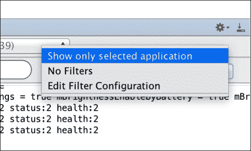
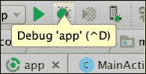
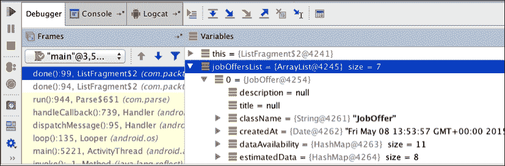
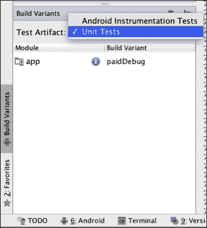
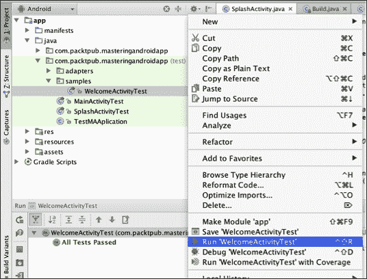
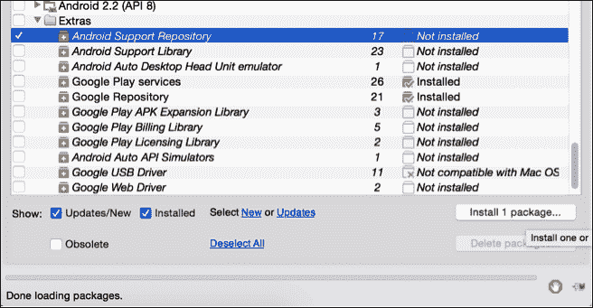

# 第十一章。安卓系统上的调试和测试

在本章中，您将学习如何在安卓系统中进行调试，这是在开发我们的应用时节省发现和修复问题的时间的基本做法。

我们将学习如何创建可以测试按钮点击或单一方法结果的自动化测试。这是一组你可以在安卓工作室运行的测试，以确保每次你开发一个新功能时，你不会破坏任何现有的功能。

您还将学习如何使用**机器人**进行单元测试，以及如何使用 Espresso 进行集成测试。

在这一章的最后，我们将讨论如何使用 Monkey 测试具有数百万次随机点击的 UI，如何通过应用记录点击序列，以及如何使用 MonkeyTalk 基于这些记录配置测试。

*   日志和调试模式
*   测试
    *   用机器人进行单元测试
    *   浓缩咖啡的整合测试
*   用户界面测试
    *   使用 MonkeyRunner 随机点击
    *   用 MonkeyTalk 录制点击
*   连续累计

# 日志和调试模式

不提到日志，不提到开发时如何调试解决问题，我们就完不成这本书。如果你知道如何解决自己的问题，在安卓系统中开发不仅仅是从堆栈溢出中复制和粘贴。

调试模式和日志是用来帮助开发人员识别问题所在的机制。随着时间的推移，每个开发人员改进和使用这些技术的频率都降低了，但在开始时，让应用充满日志是很常见的。我们不希望用户在应用发布时能够看到日志，也不希望在发布新版本时手动删除日志后再重新添加。我们将看看如何避免这种情况。

## 使用日志

日志类是用来打印出消息和错误，我们可以使用`LogCat`实时读取。这是一个如何记录消息的示例:

```java
Log.i("MyActivity", "Example of an info log");
```

`Log`类有五种方法，它们用于在日志上具有不同的优先级。这允许我们在`LogCat`中按优先级过滤。有些情况下，我们会显示不同的日志，例如，查看我们在每个请求中下载的工作机会的数量。如果我们的应用崩溃了，此时错误类型的日志是我们的优先级，我们希望隐藏其他优先级较低的日志，以便尽快找到错误。

五个优先级是(从低到高)详细、调试、信息、警告和错误。(`Log.v`、`Log.d`、`Log.i`、`Log.w`、`Log.e`)

我们可以通过日志窗口顶部的栏按进程进行过滤。我们可以按优先级和关键字过滤，也可以按标签、进程标识等创建自定义过滤器。


如果日志没有出现或者旧的不刷新，请尝试打开右侧的下拉菜单，选择**否** **过滤器**，然后再次选择**仅显示选定的应用**。这将强制控制台刷新。



最后，我们将创建一个包装器，并使用第三方库，其思想是只需更改一个布尔值就可以禁用项目中的所有日志。为此，我们只需用依赖于该布尔值的`Log`类的相同方法创建一个类:

```java
public class MyLogger {

  static final boolean LOG = false;

  public static void i(String tag, String string) {
    if (LOG) android.util.Log.i(tag, string);
  }

  public static void e(String tag, String string) {
    if (LOG) android.util.Log.e(tag, string);
  }
  …
```

每次我们想写日志的时候都需要使用这个包装器——`MyLogger.d()`而不是`Log.d()`。这样，如果我们改变`MyLogger`类中布尔`LOG`的值，它将同时停止我们项目中的所有日志。

建议使用`BuildConfing.DEBUG`变量的值:

```java
static final boolean LOG = BuildConfing.DEBUG; 
```

如果我们的应用处于调试模式，这将是真的，当我们发布应用时，这将是假的。所以，我们不需要记得在发布模式下关闭日志，也没有日志出现在最终用户面前的风险。

### 使用木材，原木包装

木材是杰克·沃顿(Jake Wharton)创建的一个日志包装器，它将日志提升到了一个高级水平，允许我们使用日志树概念来拥有不同的日志行为。看看下面的代码:

```java
compile 'com.jakewharton.timber:timber:3.1.0'
```

使用木材的优势之一是，在同一活动中，我们不需要在日志中多次写入标签:

```java
Timber.tag("LifeCycles");
Timber.d("Activity Created");
```

我们的树可以有不同的行为；例如，我可能想在发布模式下禁用日志，但我仍然想处理错误；因此，我将植入一个错误树，向 Parse 报告错误:

```java
if (BuildConfig.DEBUG) {
  Timber.plant(new Timber.DebugTree());
} else {
  Timber.plant(new CrashReportingTree());
}

/** A tree which logs important information for crash reporting. */
private static class CrashReportingTree extends Timber.Tree {
  @Override protected void log(int priority, String tag, String message, Throwable t) {
    if (priority == Log.VERBOSE || priority == Log.DEBUG) {
      return;
    }
    //Track error to parse.com
  }
}
```

## 调试我们的应用

日志在开发的时候可以用来发现问题，但是如果掌握了调试模式，我们会发现这种做法要快很多。

当我们处于调试模式时，我们可以在代码中设置断点。有了这些断点，我们指定一行代码，我们希望在那里停止执行，以向我们显示当时的变量值。要设置断点，只需双击左侧栏:


我们在获得工作机会的方法的响应中设置了一个调试点。我们可以从顶部的栏启动调试模式:



如果我们在**调试**模式下运行该应用，安卓工作室将在达到这一点时暂停执行:



安卓工作室会自动提示**调试器**窗口，在这里我们可以看到执行点的变量。我们可以在前面的截图中看到工作邀请列表，并导航查看每个邀请里面都有什么。

这里重要的功能是左边绿色的 **Play** 按钮，继续执行我们的 app，直到下一个断点，红色的方块，退出调试模式，继续执行 app。

我们还有不同的控件可以移动到下一行、方法中或方法外。例如，假设我们在以下命令的第一行有一个断点:

```java
MasteringAndroidDAO.getInstance().clearDB(getActivity());
MasteringAndroidDAO.getInstance().storeOffers(getActivity(), jobOffersList);
```

在这种情况下， **Step Over** ，也就是向下的蓝色箭头，将把我们的执行移到下一行。如果我们点击**进入**，指向右下角的蓝色箭头，我们将进入方法。结合这些控制，我们可以实时控制流量。

解释了调试模式后，我们现在可以继续进行自动化测试了。

# 在安卓上测试

一个新的功能没有经过测试是不完整的。作为开发人员，我们已经多次陷入提交代码更改而没有先编写一个通过测试的陷阱，结果却发现预期的行为在未来的迭代中被打破了。

我们学到了编写测试提高生产力、提高代码质量和帮助我们更频繁地发布的艰难方法。出于这个原因，安卓提供了几个工具来帮助我们从早期测试我们的应用。

在接下来的两个部分中，我们将讨论我最喜欢的设置，用于单元测试的 Robolectric 和用于集成测试的 Espresso。

## 用电机进行单元测试

直到机器人，编写单元测试意味着我们必须在一个真实的设备或模拟器上运行它们。这个过程可能需要几分钟，因为安卓构建工具必须打包测试代码，将其推送到连接的设备，然后运行它。

Robolectric 使我们能够在工作站的 JVM 中运行单元测试，而不需要安卓设备或仿真器，从而缓解了这个问题。

为了包含使用 Gradle 的 Robolectric，我们可以将以下依赖项添加到我们的`build.gradle`文件中:

```java
testCompile "org.robolectric:robolectric:3.0"
```

我们使用`testCompile`来指定我们希望这个依赖关系包含在我们的测试项目中。对于测试项目，默认的源目录是`src/test`。

### 机器人配置

在撰写之时，Robolectric 版本支持以下安卓 SDK:

*   果冻豆，SDK 第 16 版
*   果冻豆 MR1，SDK 第 17 版
*   果冻豆 MR2，SDK 第 18 版
*   KitKat，SDK 第 19 版
*   棒棒糖，SDK 第 21 版

默认情况下，测试将针对`AndroidManifest`文件中定义的`targetSdkVersion`运行。如果您想要针对不同的 SDK 版本运行测试，或者如果您当前的`targetSdkVersion`不受 Robolectric 的支持，您可以使用位于`src/test/resources/robolectric.properties`的属性文件手动覆盖它，该文件包含以下内容:

```java
robolectric.properties
sdk=<SDK_VERSION>
```

### 我们的第一次单元测试

我们将从开始设置一个非常简单和常见的场景:一个带有**登录**按钮的欢迎活动，该按钮将用户导航到登录活动。欢迎活动的布局如下:

```java
<?xml version="1.0" encoding="UTF-8"?>
<LinearLayout xmlns:android="http://schemas.android.com/apk/res/android" android:layout_width="match_parent" android:layout_height="match_parent">
  <Button android:id="@+id/login" android:text="Login" android:layout_width="wrap_content" android:layout_height="wrap_content" />
</LinearLayout>
```

在`WelcomeActivity`类中，我们将简单地设置登录按钮来开始登录活动:

```java
public class WelcomeActivity extends Activity {

  @Override
  protected void onCreate(Bundle savedInstanceState) {
    super.onCreate(savedInstanceState);
    setContentView(R.layout.welcome_activity);

    View button = findViewById(R.id.login);
    button.setOnClickListener(new View.OnClickListener() {
      @Override
      public void onClick(View view) {
        startActivity(new Intent(WelcomeActivity.this, LoginActivity.class));
      }
    });
  }
}
```

为了测试这一点，我们可以通过发送正确的`Intent`来确保我们启动`LoginActivity`。因为 Robolectric 是一个单元测试框架，`LoginActivity`实际上不会启动，但是我们将能够检查该框架是否捕获了正确的意图。

首先，我们将在`src/test/java/`路径内的正确包中创建测试文件`WelcomeActivityTest.java`。robo electric 依赖于 JUnit 4，因此我们将从指定 robo electric 的 Gradle 测试运行程序和一些额外的配置开始，框架将使用这些配置来查找`AndroidManifest`资源和资产。运行以下命令:

```java
@RunWith(RobolectricGradleTestRunner.class)
@Config(constants = BuildConfig.class)
```

现在，我们可以写我们的第一个测试。我们将从创建欢迎活动并将其带到前台开始:

```java
WelcomeActivity activity = Robolectric.setupActivity(WelcomeActivity.class);
```

现在我们有了`WelcomeActivity`的实例，点击登录按钮就很容易了:

```java
activity.findViewById(R.id.login).performClick();
```

最后，我们必须验证框架捕捉到了开始`LoginActivity`的意图:

```java
Intent expectedIntent = new Intent(activity, LoginActivity.class);
assertThat(shadowOf(activity).getNextStartedActivity(), is(equalTo(expectedIntent)));
```

`shadowOf`静态方法返回一个`ShadowActivity`对象，该对象存储了与测试中的当前活动的大部分交互。我们需要使用`@Test`注释，它告诉 JUnit 该方法可以作为测试用例运行。综合起来，我们有以下测试类(`WelcomeActivityTest.java`):

```java
@RunWith(RobolectricGradleTestRunner.class)
@Config(constants = BuildConfig.class)
public class WelcomeActivityTest {

  @Test
  public void loginPress_startsLoginActivity() {
    WelcomeActivity activity = Robolectric.setupActivity(WelcomeActivity.class);

    activity.findViewById(R.id.login).performClick();

    Intent expectedIntent = new Intent(activity, LoginActivity.class);
    assertThat(shadowOf(activity).getNextStartedActivity(), is(equalTo(expectedIntent)));
  }
}
```

### 运行单元测试

在能够运行单元测试之前，我们需要在安卓工作室中选择正确的**测试神器**。为此，我们将打开**构建变体**工具栏，并选择**单元测试**工件，如下图所示:



现在，从**项目**窗口，我们可以通过右键单击测试类并选择**运行**选项来运行测试。确保项目路径中没有空格；否则，Robolectric 将在执行单元测试之前抛出异常。



我们也可以从命令行运行单元测试。为此，使用`--continue`选项调用`test`任务命令:

```java
./gradlew test --continue
```

如果我们配置了持续集成系统，例如 Jenkins、Travis 或 wercker，那么这个选项是理想的。

这是机器人部分的结尾。接下来，我们将讨论与**浓缩咖啡**的集成测试。

## 浓缩咖啡的整合测试

由于安卓的“T0”特性和大量的“T1”设备，我们永远无法确定应用在发布时的行为。

我们自然倾向于在尽可能多的不同设备上手动测试我们的应用，这是一个繁琐的过程，我们必须在每次发布时重复。在本节中，我们将简要讨论 Espresso，以及如何编写将在真实设备上运行的测试。

### 浓缩咖啡配置

在编写我们的第一个集成测试之前，我们需要安装并配置我们的测试环境。请执行以下步骤:

1.  From Android SDK Manager, we need to select and install **Android Support Repository** from the **Extras** folder, as shown in the following screenshot:

    

2.  为我们的集成测试代码创建文件夹；这应该位于`app/src/androidTest`。
3.  我们还需要在项目的`build.gradle`中指定一些依赖项。使用以下代码:

    ```java
    dependencies {
      androidTestCompile 'com.android.support.test:runner:0.3'
      androidTestCompile 'com.android.support.test:rules:0.3'
      androidTestCompile 'com.android.support.test.espresso:espresso-core:2.2'
      androidTestCompile 'com.android.support.test.espresso:espresso-intents:2.2'
    }
    ```

最近，Android 增加了对 JUnit 4 风格测试用例的支持。为此，我们将在`build.gradle`文件中添加`AndroidJUnitRunner`作为默认测试仪器运行程序:

```java
android {
  defaultConfig {
    testInstrumentationRunner "android.support.test.runner.AndroidJUnitRunner"
  }
}
```

### 写整合测试

对于这个例子，我们将从我们停止使用机器人的地方继续；我们将为`LoginActivity`写一个测试。对于本活动，我们将设置一个简单的布局，带有两个`EditTexts`和一个登录按钮。运行以下代码(`activity_login.xml`):

```java
<?xml version="1.0" encoding="utf-8"?>
<LinearLayout xmlns:android="http://schemas.android.com/apk/res/android"
  android:orientation="vertical"
  android:layout_width="match_parent"
  android:layout_height="match_parent">

  <EditText
    android:id="@+id/input_username"
    android:layout_width="match_parent"
    android:layout_height="wrap_content"
    android:inputType="textEmailAddress" />

  <EditText
    android:id="@+id/input_password"
    android:layout_width="match_parent"
    android:layout_height="wrap_content"
    android:inputType="textPassword" />

  <Button
    android:id="@+id/button_signin"
    android:layout_width="wrap_content"
    android:layout_height="wrap_content"
    android:text="@string/signin"/>
</LinearLayout>
```

在`LoginActivity`中，当用户点击登录按钮时，我们将使用以下代码(`LoginActivity.java`)向启动活动发送凭据:

```java
public class LoginActivity extends Activity {

  @Override
  protected void onCreate(Bundle savedInstanceState) {
    super.onCreate(savedInstanceState);

    setContentView(R.layout.activity_login);

    final EditText inputUsername = (EditText) findViewById(R.id.input_username);
    final EditText inputPassword = (EditText) findViewById(R.id.input_password);

    Button buttonLogin = (Button) findViewById(R.id.button_signin);

    buttonLogin.setOnClickListener(new View.OnClickListener() {
      @Override
      public void onClick(View v) {
        startActivity(new Intent(getApplicationContext(), SplashActivity.class)
        .putExtra("username", inputUsername.getText().toString())
        .putExtra("password", inputPassword.getText().toString()));
        finish();
      }
    });
  }
}
```

对于这个测试，我们将在两个输入字段中键入用户凭证，并验证我们在意图中正确地绑定了它们。

首先，我们将在`src/test/androidTest/`路径内的正确包中创建`LoginActivityTest.java`测试文件。我们将使用 JUnit 4，所以我们将从指定`AndroidJUnit4`测试运行器开始。使用以下命令:

```java
@RunWith(AndroidJUnit4.class)
```

另一个区别是，在浓缩咖啡中，我们需要指定一个规则来准备测试活动。为此，请使用以下命令:

```java
@Rule
public IntentsTestRule<LoginActivity> mActivityRule =
  new IntentsTestRule<>(LoginActivity.class);
```

现在，我们可以开始写测试了。首先，我们需要在两个输入字段中输入登录详细信息:

```java
String expectedUsername = "mastering@android.com";
String expectedPassword = "electric_sheep";

onView(withId(R.id.input_username)).perform(typeText(expectedUsername));
onView(withId(R.id.input_password)).perform(typeText(expectedPassword));
```

然后，我们将通过点击登录按钮发送意向:

```java
onView(withId(R.id.button_signin)).perform(click());
```

最后，我们必须验证捕获的意图包含登录凭据:

```java
intended(hasExtras(allOf(
  hasEntry(equalTo("username"), equalTo(expectedUsername)),
  hasEntry(equalTo("password"), equalTo(expectedPassword)))));
```

将一切放在一起，我们将有以下测试类(`LoginActivityTest.java`):

```java
@RunWith(AndroidJUnit4.class)
public class LoginActivityTest {

  @Rule
  public IntentsTestRule<LoginActivity> mActivityRule =
  new IntentsTestRule<>(LoginActivity.class);

  @Test
  public void loginButtonPressed_sendsLoginCredentials() {
    String expectedUsername = "mastering@android.com";
    String expectedPassword = "electric_sheep";

    onView(withId(R.id.input_username)).perform(typeText(expectedUsername));
    onView(withId(R.id.input_password)).perform(typeText(expectedPassword));

    onView(withId(R.id.button_signin)).perform(click());

    intended(hasExtras(allOf(
    hasEntry(equalTo("username"), equalTo(expectedUsername)),
    hasEntry(equalTo("password"), equalTo(expectedPassword)))));
  }
}
```

### 运行集成测试

类似于我们对 Robolectric 所做的，为了运行集成测试，我们需要切换到 Android Studio 中正确的**测试工件**。为此，我们将打开**构建变体**工具栏，并选择**安卓仪器测试**神器:


现在，从 **项目**窗口，我们可以通过右键单击测试类并选择**运行**选项来运行测试。

我们也可以从命令行运行集成测试。为此，我们将调用`connectedCheck`(或`cC`)任务:

```java
./gradlew cC
```

如果我们有一个带有连接设备或仿真器的持续集成系统，使用命令行是首选方式。一旦我们编写了足够的集成测试，我们就可以使用 **Testdroid** 等服务，在数百个真实设备上轻松部署和运行它们。


# 从用户界面角度进行测试

我们现在要做的测试类似于使用该应用的人可以做的那种测试。事实上，在拥有 **QA** ( **质量保证**)的公司，人们使用这些工具作为人工测试的补充。

UI 测试也可以自动化，但是它们不同于单元测试和集成测试；这些都是在屏幕上执行的操作，从点击按钮到用记录的事件完成注册过程。

我们将从猴子的压力测试开始。

## 发射猴子

猴子是一个可以通过 ADB 从命令行启动的程序。它在我们的设备或模拟器中生成随机事件，使用种子，我们可以重现相同的随机事件。为了澄清，让我们考虑一个有数字的例子。想象一下，我执行 Monkey，它产生从 1 到 10 的随机数；如果我再次推出它，我会得到不同的数字。当我用一个种子(这个种子是一个数字)执行猴子时，我得到一组从 1 到 10 的不同数字，如果我用同一个种子再次启动它，我将得到相同的数字。这很有用，因为如果我们使用种子生成随机事件并发生崩溃，我们可以修复此崩溃并再次运行相同的种子，以确保我们修复了问题。

这些随机事件可以从点击和滚动手势到系统级事件(如调高音量、调低音量、截屏等)不等。我们可以限制事件的数量和类型以及运行这些事件的包。

终端中的基本语法是以下命令:

```java
$ adb shell monkey [options] <event-count>
```

如果你从未使用过 ADB，你可以在它里面找到 Android SDK 目录内的`platform-tools`文件夹，无论它安装在你的系统的什么地方:

```java
../sdk/platform-tools/adb
```

当我们打开一个终端并导航到这个目录时，我们可以写下下面一行代码:

```java
adb shell monkey -p com.packtpub.masteringandroidapp -v 500
```

当尝试使用`adb`且输出为`command not found`时，如果使用 Linux 或 Mac，可以用`adb kill-server`、`adb start-server`、`use ./adb` ( *点斜线 adb* )重启`adb`。

我们可以将事件的数量增加到`5000`或者产生无限个事件，但总是建议设置数量的限制；否则，你将不得不重启设备来停止猴子。当您执行该命令时，您将能够看到产生的随机事件，并且它将指示在您想要重复相同的事件链时使用的种子:


根据应用的不同，我们可能需要使用 throttle 毫秒属性调整事件之间的时间，以便模拟真实用户。

使用下一个测试工具，我们将进行不同类型的用户界面测试，目的是遵循流程。例如，如果我们有一个由三个不同表单的屏幕组成的注册过程，并且想要记录一个测试，其中用户填写表单并逻辑地继续通过这三个屏幕。在这种情况下，猴子不会真的帮忙；事件数量非常多，它最终会用随机字符完成所有的输入字段，并点击按钮移动到下一个屏幕，但这并不是我们想要的。

## 用 MonkeyTalk 记录用户界面测试

记录一系列测试(如注册过程)的目的是保存这个测试，以便在我们更改代码时能够再次运行它。我们可能不得不修改注册过程的网络请求，而不改变用户界面，所以这些测试是完美的。我们可以在完成修改后运行它们，而不必手动完成注册或自己填写表格。我们在这里不是懒惰；如果我们有数百个测试，这对一个人来说将是很大的努力。同样，通过自动化测试，我们可以确保事件的顺序总是相同的。

**MonkeyTalk** 是一款免费开源工具，有两个版本；我们将使用社区版本作为示例。

### 注

比较社区版和专业版的列表可以在他们位于[https://www.cloudmonkeymobile.com/monkeytalk](https://www.cloudmonkeymobile.com/monkeytalk)的网站上看到。

MonkeyTalk 可以在真实设备和仿真器上使用。它的工作原理是在我们处于*记录模式*时记录事件列表:


一旦我们通过点击工具中的**记录**进入记录模式，每个事件都将按顺序记录，并记录执行的动作和使用的参数。在前面的截图中，我们可以看到点击`TextView`和在上面写一些输入是如何被记录为两个事件的。

我们可以在一个脚本文件中创建它，MonkeyTalk 会重现它；因此，我们可以选择创建自己的事件序列，而无需记录。对于前面的事件，我们将编写如下脚本:

```java
Input username tap
Input username enterText us
```

如果我们点击**立即播放**按钮，我们将看到所有这些步骤在任何设备上执行。我们可以在安卓手机上录制脚本，然后在 iOS 设备上播放。

除了录制和播放脚本，我们还可以有验证命令。例如，如果我们有一个清除所有输入字段的按钮，我们可以在脚本中使用`currentValue`添加一个验证命令:

```java
Input username tap
Input username enterText us
Input clearform click
Input currentvalue ""
```

这将在执行过程中报告验证的结果，因此我们将能够检查我们的所有验证是否正确通过。例如，点击按钮来清除表单需要一个点击监听器来清除所有输入文本。如果出于某种原因，我们进行了修改，并且元素的标识发生了变化，那么 MonkeyTalk 测试将报告命令验证失败的问题。

每当我们在应用中进行更改时，有一个工具为我们运行这些 UI 测试，以及单元和集成测试，这不是很好吗？这个解决方案是存在的，叫做**持续集成**。

# 持续整合

解释如何构建一个持续集成系统并不是我们的意图，因为这不在本书的讨论范围内，设置环境通常也不是安卓开发者的工作。然而，你应该知道它是什么，它是如何工作的，因为它与安卓直接相关。

一套好的自动化测试总是更好地与 CI 或持续集成解决方案相结合。这个解决方案将允许我们在每次代码更改时构建和测试我们的应用。

这是大多数有大项目的公司的工作方式。如果他们有一个开发团队，代码通常在一个存储库中共享，他们构建一个连接到存储库的 CI 系统。每次开发人员对存储库进行更改并提交时，都会执行测试集合，如果结果成功，则会构建一个新的 Android 可执行文件( **APK** )。

这样做是为了将出现问题的风险降至最低。在一个大的应用中，需要不同的人来开发它，一个新的开发人员不可能在不破坏或改变任何现有功能的情况下开始做出改变。这是因为不是项目中的所有人都知道所有代码的目的，或者代码太复杂了，修改一个组件会改变其他组件。

### 注

如果您有兴趣实施此解决方案，我们可以向您推荐 **Jenkins** ，其最初在[https://wiki.jenkins-ci.org/display/JENKINS/Meet+Jenkins](https://wiki.jenkins-ci.org/display/JENKINS/Meet+Jenkins)名为 Hudson。


除了测试和构建我们的应用之外，Jenkins 还将生成一个测试覆盖报告，这将允许我们知道单元和集成测试覆盖的代码的百分比。

# 总结

在这一章中，我们开始学习如何在我们的应用中以高级方式使用日志，并快速概述了调试过程。我们解释了什么是测试，以及如何分别使用 Robolectric 和 Espresso 创建单元测试和集成测试。

我们还创建了 UI 测试，首先用 The Monkey 进行压力测试，然后生成随机事件，之后用 MonkeyTalk 开始测试，记录可以再次播放的事件流，验证输出。最后，我们谈到了持续集成，以发现公司如何为安卓应用整合测试和构建系统。

在下一章，也就是本书的最后一章，我们将看看如何将我们的应用货币化，如何使用不同的构建风格构建应用，以及混淆代码，让它准备好上传到应用商店。