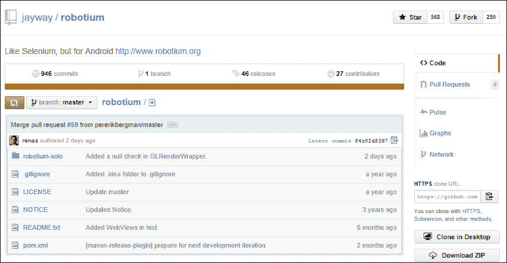
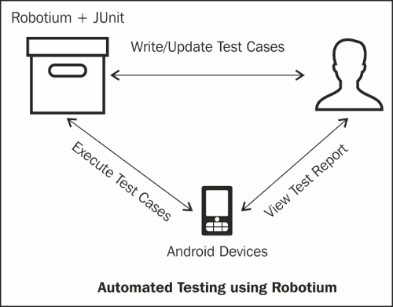
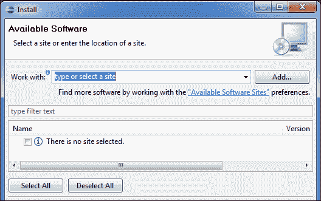
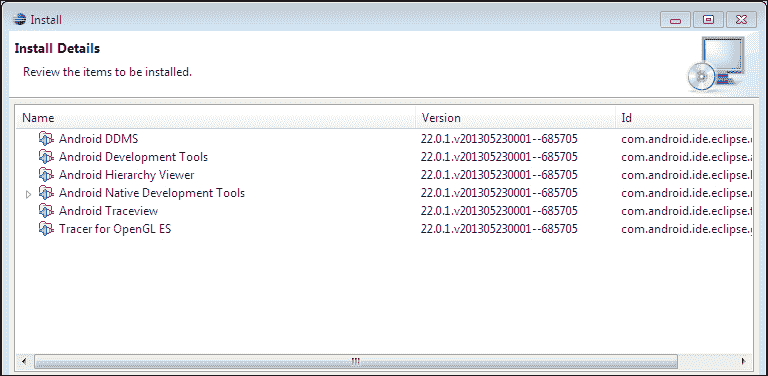
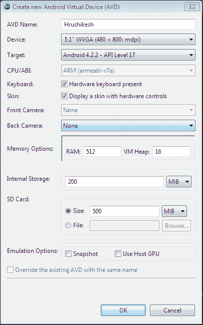
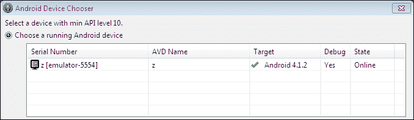

# 一、Robotium 入门

自动化测试帮助我们保持高软件质量，并提供一个工具来捕获任何影响实际用例的代码变化。本章介绍 Robotium 框架、它的不同特性以及它在自动化测试领域的优势。到本章结束时，我们将在 Eclipse IDE 中完成 Android 环境的设置，以开始使用 Robotium。

# 机器人框架

Robotium 是一个开源的自动化测试框架，用来为安卓应用编写一个健壮强大的黑盒(重点多在黑盒测试用例上)。它完全支持本机和混合应用的测试。本机应用在设备上运行，也就是说，为特定平台设计，可以从谷歌 Play 商店安装，而混合应用部分是本机应用，部分是网络应用。这些也可以从应用商店安装，但是需要在浏览器中呈现 HTML。

Robotium 主要用于 UI 测试用例的自动化，内部使用运行时绑定到 **图形用户界面** ( **GUI** )组件。

Robotium 是在 Apache 许可证 2.0 下发布的。它是免费下载的，个人和企业都可以轻松使用，并且是基于 Java 和 JUnit 3 构建的。将 Robotium 称为 Android 测试单元框架的扩展会更合适，可在[http://developer . Android . com/tools/testing/testing _ Android . html](http://developer.android.com/tools/testing/testing_android.html)获得。根据测试的源代码，Robotium 也可以在没有应用的情况下工作。

使用 Robotium 编写的测试用例既可以在安卓仿真器(**安卓虚拟设备** ( **AVD** )上执行——我们将在下一节看到如何在安装过程中创建 AVD——也可以在真实的安卓设备上执行。开发人员可以跨多个活动编写功能、系统和验收测试场景。

它目前是世界领先的自动化测试框架，许多开源开发人员正在努力在后续版本中引入越来越多令人兴奋的特性。以下截图是 Robotium 项目的 git 存储库网站:

由于 Robotium 是一个开源项目，任何人都可以为开发做出贡献，并帮助增强具有更多特性的框架。Robotium 源代码保存在 GitHub 上，可以通过以下链接访问:

[https://github . com/jaywy/robotics](https://github.com/jayway/robotium)

你只需要完成这个项目。在一个克隆项目中进行所有的更改，然后在你的存储库中点击**拉取请求**，告诉核心团队成员引入哪些更改。如果您是 git 环境的新手，可以通过以下链接参考 GitHub 教程:

[https://help.github.com/](https://help.github.com/)

机器人就像硒，但对安卓来说。该项目于 2010 年 1 月由 *Renas Reda* 启动。他是 Robotium 的创始人和主要开发者。该项目是从 v1.0 开始的，由于新的需求，后续还会发布新的版本。它支持安卓功能，如活动、祝酒、菜单、上下文菜单、网页视图和遥控器。

让我们看看 Robotium 为安卓测试用例开发人员带来的大部分特性和好处。

# 特点和优势

使用 Robotium 进行自动化测试有许多特点和好处。用户、Robotium 和安卓设备之间的三角化工作流图清楚地解释了它们之间的用例:

Robotium 的特点和优势如下:

*   Robotium 帮助我们用最少的测试应用知识快速编写强大的测试用例。
*   Robotium 提供了与安卓应用中的用户界面控件直接交互的应用接口，如编辑文本、文本视图和按钮。
*   Robotium 官方支持安卓 1.6 及以上版本。
*   安卓平台不是 Robotium 修改的。
*   机器人测试也可以使用命令提示符来执行。
*   Robotium 可以与 Maven 或 Ant 顺利集成。这有助于将 Robotium 添加到项目的构建自动化过程中。
*   Screenshots can be captured in Robotium (an example screenshot is shown as follows):

    

*   测试应用项目和应用项目运行在同一个 JVM 上，即**达尔维克虚拟机** ( **DVM** )。
*   在没有源代码的情况下运行 Robotium 是可能的。
*   Robotium 可以与其他代码覆盖率测量工具一起工作，例如 Cobertura 和 Emma。
*   机器人可以检测屏幕上显示的信息(祝酒词)。
*   Robotium 支持安卓功能，如活动、菜单和上下文菜单。
*   Robotium 自动化测试可以快速实现。Robotium 建立在 JUnit 之上，因此它继承了 JUnit 的所有特性。机器人框架自动处理安卓应用中的多个活动。
*   与标准仪器测试相比，Robotium 测试用例可读性更强。
*   滚动活动由机器人框架自动处理。
*   Robotium 的最新版本支持混合应用。混合应用使用网络视图以全屏方式呈现 HTML 和 JavaScript 文件，使用本机浏览器呈现引擎。

# 设置安卓环境

您可以在 Eclipse 中设置一个 Android 环境，这是使用 Robotium 创建测试项目的主要步骤，如下所示:

## 要求

在为 Robotium 实际设置安卓环境之前，您需要检查以下所有必需的元素:

*   必须安装 **Java 开发工具包**(**【JDK】**)(可以从[http://www . Oracle . com/TechNet/Java/javase/downloads/index . html](http://www.oracle.com/technetwork/java/javase/downloads/index.html)安装)
*   必须安装 Eclipse IDE
    *   标准月食 IDE([http://www.eclipse.org/downloads/](http://www.eclipse.org/downloads/))
    *   内置**安卓开发工具**(**ADT**)([http://developer.android.com/sdk/index.html](http://developer.android.com/sdk/index.html))的 Eclipse IDE
    *   对于 Android Starter 的 Robotium，我们将使用 Standard Eclipse IDE，它主要由各行业的技术爱好者和开发人员使用。内置 ADT 的 Eclipse IDE 有一个安卓插件，不需要设置安卓 SDK。两个 Eclipse IDEs 中只需要一个。
    *   要使用标准的 Eclipse IDE 进行 Android 开发并设置新的 SDK，您需要下载 SDK 工具并选择要安装的附加 SDK 包。在现有版本的 Eclipse IDE 中，添加 ADT 插件

## 下载安卓 SDK

下载安卓软件开发工具包最简单的方法是从[http://developer.android.com/sdk/index.html](http://developer.android.com/sdk/index.html)获得一个压缩的 ADT 包。

安卓软件开发工具包提供了构建、测试和调试安卓应用的库和开发工具。

将其解压到系统上的安全位置。我们将在以下步骤中使用这个包。

## 安装自动驾驶仪

您可以按照下列步骤通过安装 ADT :

1.  In Eclipse IDE, Kepler, click on the **Help** menu and then on the **Install New Software** option. You will get the following screen, which shows the available software depending on the website URL provided in the **Work with:** combo box. The **Install New Software** wizard allows you to add new software to your installation, as shown in the following screenshot:

    

2.  使用**配合:**组合框，您始终可以选择任何网站来浏览其内容。你也可以从这些网站浏览所有的软件。当您知道软件名称，但不知道实际位置时，这很有用。
3.  点击**安装新软件**窗口中的**添加**按钮，将打开**添加存储库**窗口，如下图所示。
4.  In this window, enter a name in the **Name** field and the following URL in the **Location** field and click on the **Ok** button to download the Android ADT:

    

5.  Eclipse will now search for all the available tools from this location and enlist them as follows:

    

6.  Select all the tools and click on **Next.** This will open up a window, shown in the following screenshot, with a list of all the components that will be installed as a plugin in Eclipse:

    

7.  点击**安装详情**窗口中的 **下一步** 按钮。许可证验证完成后，将开始下载所有提到的工具。成功安装后，将要求您重新启动 Eclipse IDE。重启它！

## 添加安卓 SDK 位置

要将安卓软件开发工具包添加到 Eclipse，请按照列出的步骤进行操作:

1.  在 Eclipse 中，在**窗口**菜单下，点击**偏好设置** (Mac OS X 用户可以在 **Eclipse** 菜单下找到**偏好设置**)。检查**安卓**标签(该标签的出现明确表示安卓 ADT 插件安装成功。)并且会出现一个窗口，如下图所示。SDK 位置通知 Eclipse Android SDK 在系统中的位置。
2.  如果 SDK 位置不存在，浏览至`SDK`解压目录，点击**确定**。只有在提供了正确的软件开发工具包位置并点击**应用**或**确定**按钮时，软件开发工具包目标列表才会重新加载。这些目标取自软件开发工具包本身。
3.  如果你仍然没有在目标列表中获得任何条目，这意味着你的安卓软件开发工具包没有正确安装。按照步骤 3 安装安卓软件开发工具包，并检查列表中的软件开发工具包目标:

## 安装最新的 SDK 版本

在实际创建虚拟设备之前，需要安装最新版本的 SDK。从**窗口**菜单进入**安卓 SDK 管理器**，会出现一个窗口，如下图截图所示。选择安装的最新版本的软件开发工具包。您可以根据自己的选择选择任何版本，然后点击**安装包…** 。安装后，如果软件包的安装更改没有反映出来，请重新启动 Eclipse:

## 设置自动电压调节器

安卓环境的初始配置差不多完成了。现在，我们只剩下动静脉畸形的设置了。

一个 AVD 用来运行安卓应用。建议您使用安卓设备运行应用。但是在本书的范围内，我们将只使用 AVD (Android Emulator)来运行应用。

您可以从 Eclipse 中**窗口**菜单下的**自动车辆识别管理器**选项创建一个新的自动车辆识别。点击 AVD 画面中的**新增**，会看到如下截图的窗口。填写以下详细信息，点击**确定**。

一旦创建，就会在 Android SDK 和 AVD 管理器屏幕下显示。

要运行创建的 AVD，右键单击项目并导航至**运行方式** | **安卓应用**。将弹出**部署目标选择模式**窗口，要求您选择一个 AVD 或连接的安卓设备来运行您的应用；选择其中任何一个，应用就会安装在选定的设备/AVD 上。以下截图为**部署目标选择模式**窗口:

至此，您应该有了一个安卓环境的工作设置，开始 Robotium 的测试用例编写和执行。你可以自由玩耍，发现更多关于它的东西。

# 总结

在这一章中，我们已经了解了机器人框架，以及您需要执行哪些不同的步骤来使您的安卓环境准备好开始使用该框架。

在下一章中，我们将开始使用 Robotium 实现我们的第一个测试项目。所以，如果你想了解测试用例实现，继续阅读。