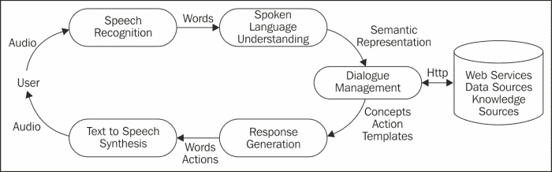

# 第一章。安卓设备上的演讲

你有没有想过创建可以在自己的安卓设备上运行的基于语音的应用；你可以与之交谈并与之对话的应用？本章介绍了在安卓设备上使用语音，使用谷歌的开源 API 进行文本到语音合成和语音识别。本章简要概述了**语音用户界面** ( **VUIs** ) 的世界，概述了交互式语音应用(或虚拟个人助理)的组件。

到本章结束时，您应该已经很好地理解了使用谷歌免费提供的资源创建基于语音的应用需要什么。

# 在安卓设备上使用语音

安卓设备提供内置的语音转文本和文本转语音功能。以下是安卓上基于语音的应用的一些例子:

## 语音转文本

通过语音到文本，安卓设备的用户可以将口述到设备上需要文本输入的任何文本框中，例如电子邮件、文本消息和搜索。键盘控件包含一个带有麦克风符号的按钮和两个指示语言输入设置的字母，用户可以更改这些设置。按下麦克风按钮后，会弹出一个窗口，要求用户**立即发言**。口头输入被自动转录成书面文本。然后，用户可以决定如何处理转录的文本。

一方面，由于使用大规模的基于云的资源进行语音识别，另一方面，由于设备通常靠近用户的嘴，因此可以获得更可靠的声音信号，因此在小型设备上听写的准确率有了很大的提高。语音听写的主要挑战之一是输入是不可预测的——用户可以说任何话——因此需要大量的通用词汇来覆盖所有可能的输入。其他挑战包括处理背景噪音、草率的讲话和不熟悉的口音。

## 文本转语音

文本到语音(TTS)用于将文本转换为语音。各种应用可以利用 TTS 。例如， TalkBack 可通过辅助功能选项获得，它使用 TTS 通过描述触摸、选择和激活了哪些项目来帮助盲人和视障用户。TalkBack 还可以用来阅读谷歌 Play Books 应用中的一本书。TTS 功能也可以在安卓 Kindle 和谷歌地图上获得，用于给出一步一步的驾驶说明。有各种各样的第三方应用使用 TTS，也有替代的 TTS 引擎。

## 语音搜索

语音搜索在安卓设备上提供了与传统谷歌搜索相同的功能，只是用户不用输入查询，而是说出来。语音搜索可以使用谷歌搜索小部件中的麦克风进行。在语音搜索中，识别出的文本被传递给搜索引擎，并以执行键入查询的相同方式执行。

语音搜索的一个新特性是，除了返回链接列表，还会返回对查询的口头响应。比如，在回答“埃菲尔铁塔有多高？”，该应用回答说:“埃菲尔铁塔有 324 米高。”也可以用代词问后续的问题，比如“它是什么时候建成的？”。通过将谷歌的知识图(谷歌使用的 T3 知识库)与其对话式搜索技术相结合，这种额外的功能成为可能，以提供更对话式的交互方式。

## 安卓语音动作

安卓语音动作也可以使用谷歌搜索小部件中的麦克风进行访问。语音操作允许用户使用语音命令控制他们的设备。语音动作需要符合特定结构的输入，如谷歌网页的以下列表所示:[http://www.google.co.uk/intl/en_uk/mobile/voice-actions/](http://www.google.co.uk/intl/en_uk/mobile/voice-actions/)。注意:带*的项目是可选的。斜体项目是要说的单词。

<colgroup><col style="text-align: left"> <col style="text-align: left"> <col style="text-align: left"></colgroup> 
| 

语音动作

 | 

结构

 | 

例子

 |
| --- | --- | --- |
| 发送短信 | 向[收件人][邮件]发送文本* | 给艾莉森·米勒发短信迟到了。我将在 9 点左右到家 |
| 给企业打电话 | 致电[企业名称][地点]* | 打电话给伦敦索霍比萨店 |
| 查看地图 | [地址/城市]地图 | 伦敦地图 |
| 搜索谷歌 | [您的疑问] | 日落时巨石阵的图片 |
| 获取方向 | 导航至[地址/城市/企业名称] | 导航到伦敦大英博物馆或者导航到米尔街 24 号 |
| 呼叫联系人 | 拨打[联系人姓名][电话类型]* | 给艾莉森·米勒家打电话 |
| 转到网站 | 转到[网站] | 去维基百科 |

语音操作中的结构允许它们映射到设备上可用的操作。例如，关键词**呼叫** 表示一个电话，而关键词**前往** 表示一个网站即将上线。需要额外的处理来提取动作的参数，如**联系人姓名**和**网站**。

## 虚拟个人助理

最令人兴奋的基于语音的应用之一是虚拟个人助理(VPA) ，它的作用就像个人助理，执行一系列任务，比如查找当地餐馆的信息；在设备上执行涉及应用的命令，例如，使用语音设置警报或更新日历；进行一般性的谈话。安卓设备至少有 20 个 VPA 可用(见本书网页)，尽管最著名的 VPA 是 Siri，自 2011 年起就在 iPhone iOS 上可用。你可以在苹果网站[http://www.apple.com/uk/ios/siri/](http://www.apple.com/uk/ios/siri/)上找到与 Siri 互动的例子，类似于安卓 VPAs 的互动。包括 Siri 在内的许多 VPA 都具有个性，能够以幽默的方式回应问题和可疑的输入，从而增加了它们的娱乐价值。参见[http://www.sirifunny.com](http://www.sirifunny.com)的例子以及 YouTube 上的大量视频剪辑。

值得一提的是，许多技术都具有 VPAs 的一些特征，如下所述:

**对话系统** 在学术研究方面有着悠久的传统，基于开发可以用自然语言(最初是书面文本，但最近是语音)与人类交流的系统的愿景。第一个系统与获取信息有关，例如飞行时间或股票报价。下一代使用户能够从事某种形式的交易，如银行业务或旅行预订，而更近的系统正在开发中，以帮助排除故障，例如，指导难以安装某些设备的用户。广泛的技术已经被用于实现对话系统，包括基于规则和基于统计的对话处理。

**语音用户界面** ( **VUIs** )，类似于对话系统，但强调商业部署。这里的焦点往往集中在用于特定目的的系统上，例如呼叫路由、目录辅助和交易对话，例如旅行、酒店、航班、汽车租赁或银行余额。目前许多虚拟仪器都是使用基于 XML 的标记语言 VoiceXML 设计的。然后在语音浏览器上解释 VoiceXML 脚本，语音浏览器还提供所需的语音和电话功能。

聊天机器人 ，传统上被用来模拟人类对话。最早的聊天机器人可以追溯到 20 世纪 60 年代，约瑟夫·韦森鲍姆(Joseph Weizenbaum)编写了著名的伊莱扎程序，该程序模拟了一名罗格安心理治疗师——通常是以令人信服的方式。最近，聊天机器人已被用于教育、信息检索、商业、电子商务和自动服务台。聊天机器人使用复杂的模式匹配算法来匹配用户的输入并检索适当的响应。大多数聊天机器人都是基于文本的，尽管越来越多的基于语音的聊天机器人开始出现(详见[第 8 章](08.html "Chapter 8. Dialogs with Virtual Personal Assistants")、*与虚拟个人助理的对话*)。

**具体化会话代理** ( **ECAs** )、是计算机生成的动画角色，结合了面部表情、身体姿势、手势和语音，提供了丰富的交流渠道。通过增强体现的面对面互动的视觉维度会话代理可以显得更值得信任和可信，也更有趣和娱乐。具体化会话代理已经被用于诸如交互式语言学习、虚拟训练环境、虚拟现实游戏节目以及交互式小说和讲故事系统等应用中。它们越来越多地被用于电子商务和电子银行，以提供友好和有用的自动化帮助。例如，见宜家网站[http://www.ikea.com/gb/en/](http://www.ikea.com/gb/en/)的安娜代理商。

虚拟个人助理与这些技术的不同之处在于，它们允许用户使用语音来执行移动设备上可用的许多功能，例如发送文本消息、咨询和更新日历或设置警报。它们还提供对网络服务的访问，如寻找餐馆、跟踪送货、预订航班，或使用信息服务，如知识图、Wolfram Alpha 或维基百科。因为他们可以访问设备上的上下文信息，例如用户的位置、时间和日期、联系人和日历，所以 VPA 可以提供与用户的位置和偏好相关的信息，例如餐馆推荐。

# 设计和开发语音应用

语音应用设计具有软件设计的许多特征，但也有语音界面独有的一些方面——例如，处理语音识别总是不到 100%准确的问题，因此与使用图形用户界面时的输入相比，可靠性较低。另一个问题是，由于语音是短暂的，尤其是在没有视觉显示的设备上，与图形用户界面应用相比，对用户的内存提出了更高的要求。

有许多因素有助于语音应用的可用性。重要的是要进行广泛的用例分析，以确定系统的需求，研究问题，如应用是替换还是补充现有的应用；语音是否适合作为输入/输出的媒介；应用提供的服务类型；将使用该应用的用户类型；和应用的一般部署环境。

# 为什么是谷歌语音？

以下是我们使用谷歌语音的理由:

*   **安卓设备的激增**:最近关于安卓的信息称“2012 年第三季度，安卓在全球智能手机市场的份额为 75%，累计激活设备 7.5 亿台，日激活 150 万台。”(摘自[http://www.idc.com/getdoc.jsp?containerId=prUS23771812 检索 2013 年 7 月 9 日](http://www.idc.com/getdoc.jsp?containerId=prUS23771812%20Retrieved%2009/07/2013))。
*   **安卓 SDK 是开源的**:安卓 SDK 是开源的这一事实，让开发者和发烧友在创建应用时，比其他一些操作系统更容易上手。任何人都可以使用 Eclipse 等免费开发环境开发自己的应用，然后上传到自己的安卓设备上，供自己个人使用和享受。
*   **谷歌语音 API**:谷歌语音 API 可以在安卓设备上免费使用。这意味着语音应用编程接口对于那些希望尝试语音而不投资昂贵的商业替代品的开发人员来说非常有用。由于谷歌雇佣了许多顶尖的语音科学家，他们的语音 API 在性能上与商业上提供的相当。

### 类型

**你也可以试试…**

Nuance NDEV Mobile，支持多种语言的文本到语音合成和语音识别，并提供 PhoneGap 插件，使开发者能够在不同平台上实现他们的应用([http://dragonmobile.nuancemobiledeveloper.com](http://dragonmobile.nuancemobiledeveloper.com))。

美国电话电报公司语音混搭([)http://www.research.att.com/projects/SpeechMashup/](http://www.research.att.com/projects/SpeechMashup/)，它支持基于语音的应用的开发和 W3C 标准语音识别语法的使用。

# 创建虚拟个人助理需要什么？

下图显示了构建语音 VPA 所需的各种组件。

对一个 VPA 人的一个基本要求是，它应该能够说话和理解言语。提供说话能力的文本到语音合成在[第 2 章](02.html "Chapter 2. Text-to-Speech Synthesis")、*文本到语音合成*中讨论，而语音识别在[第 3 章](03.html "Chapter 3. Speech Recognition")、*语音识别*中讨论。然而，尽管这些能力对于支持语音的助理来说是基本的，但它们还不够。参与对话和连接到网络服务和设备功能的能力也是个人帮助的基础。要做这些事情，VPA 需要做到以下几点:

*   一种控制对话的方法，确定谁应该采取对话主动，以及他们应该涉及哪些主题。实际上，这可以通过一次性交互来简化，用户只需说出他们的查询，应用就会做出响应。[第 4 章](04.html "Chapter 4. Simple Voice Interactions")、*简单语音交互*涵盖了一次性交互。系统引导的对话框中，应用会询问一系列问题，如基于网络的表单填写(例如，预订酒店或租车)，这些都包含在[第 5 章](05.html "Chapter 5. Form-filling Dialogs")、*表单填写对话框*中。
*   一旦用户的输入被识别，就对其进行解释的一种方法。这是口语理解组件的任务，它提供了一个语义解释，代表用户所说的意思。由于在许多商业系统中，输入仅限于单个单词或短语，因此解释相对简单。两种不同的方法将在[第 6 章](06.html "Chapter 6. Grammars for Dialog")、*对话语法*中说明:如何创建一个手工制作的语法，涵盖用户可能说的单词和短语；以及如何使用统计语法来覆盖更广泛的输入并提供更可靠的解释。如果语音输入和输出不可能或性能差，它还提供不同的模式。如果需要的话，VPA 人也应该能够使用不同的语言。这些主题包含在[第 7 章](07.html "Chapter 7. Multilingual and Multimodal Dialogs")、*多语言和多模式对话框*中。
*   确定相关行动并产生适当的回应。对话管理和响应生成的这些方面在[第 7 章](07.html "Chapter 7. Multilingual and Multimodal Dialogs")、*多语言和多模式对话*以及[第 8 章](08.html "Chapter 8. Dialogs with Virtual Personal Assistants")、*与个人虚拟助理的对话*中进行了描述。

如第 2 章和第 3 章所述，基于文本到语音合成和语音识别的基本技术，第 4-8 章涵盖了一系列技术，这些技术将使开发人员能够进一步利用基本技术，并使用谷歌语音 API 创建基于语音的应用。

# 总结

本章介绍了安卓设备上的语音技术。我们研究了目前安卓设备上可用的各种语音应用。我们还研究了为什么我们决定将谷歌语音应用编程接口作为开发人员的工具。最后，我们介绍了创建虚拟个人助理所需的主要技术。这些技术将在本书的剩余章节中介绍。

我们将在下一章向您介绍文本到语音合成(TTS)，并展示如何使用谷歌 TTS 应用编程接口来开发会说话的应用。