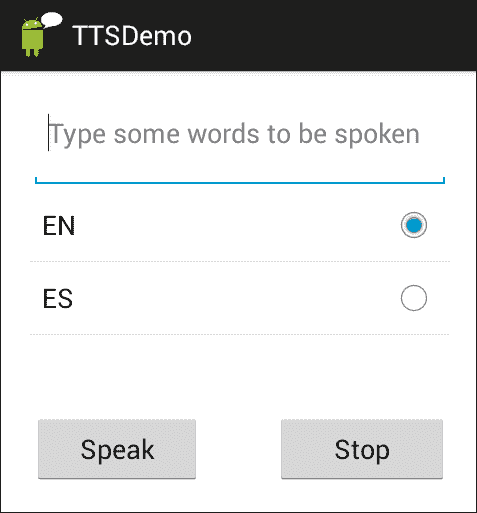
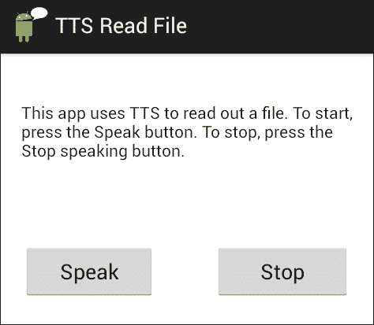

# 第二章。文本到语音合成

你有没有想过，你的移动设备是如何大声朗读你最喜欢的电子书或上一封电子邮件的？在本章中，您将学习文本到语音合成(TTS)技术，以及如何使用谷歌 TTS 引擎开发会说话的应用程序。涵盖的主题有:

*   文本到语音合成技术
*   谷歌文本到语音合成
*   使用文本到语音合成开发应用程序

到本章结束时，您应该能够在安卓设备上开发使用文本到语音合成的应用程序。

# 引入文本到语音合成

文本到语音合成，通常缩写为 TTS，是一种能够将书面文本转换为语音的技术。TTS 已被广泛用于为有视觉障碍的人以及有严重语言障碍的用户提供屏幕阅读。也许最著名的语音合成技术的使用者是物理学家斯蒂芬·霍金，他患有运动神经元疾病，并使用 TTS，因为他的语音变得难以理解。借助单词预测技术，他能够构建一个句子，然后发送到内置的 TTS 系统(进一步参见:[http://www.hawking.org.uk/the-computer.html](http://www.hawking.org.uk/the-computer.html))。

TTS 也广泛应用于用户的手或眼睛忙碌的情况下，例如，当车辆沿着路线行驶时，驾驶导航系统会说出方向。TTS 的另一个广泛应用是在公共广播系统中，例如在机场或火车站。TTS 还用于基于电话的呼叫中心应用程序和一般的口语对话系统，以说出系统的提示，并与网站上使用会话代理来提供客户帮助和支持的谈话头结合使用。

TTS 系统的质量对用户的感知有着重要的影响。用户可能会对听起来像机器人或者发音不正确的系统感到恼火。然而，只要 TTS 的输出是可理解的，这至少应该允许系统充分运行。

# 文本到语音合成技术

在文本到语音合成中有两个主要的阶段:

*   文本分析，对要合成的文本进行分析，并为口头输出做准备。
*   波形生成，其中分析的文本被转换成语音。

在文本分析阶段可能会有很多问题。比如*盯着*这个词的正确发音是什么？是基于*星* + *ing* 还是*凝视* + *ing* 这个词的组合？确定这个问题的答案需要对单词的结构进行复杂的分析；在这种情况下，通过添加后缀如 *ing* 来确定单词如*stage*的词根形式如何变化。

也有一些单词根据它们在特定句子中的使用有不同的发音。比如 *live* 作为动词会和 *give* 押韵，但是作为形容词会和*五*押韵。词性也会影响单词内部的重音分配；比如 *record* 作为名词发音为*【record】*(第一个音节带重音)，作为动词发音为 *re'cord* (第二个音节带重音)。

另一个问题涉及将数值翻译成适合口语输出的形式(称为*规范化*)。比如 *12.9.13* 这一项，如果代表日期，就不应该说是*十二点九点十三*，而应该说是【2013 年 12 月 9 日】T6。请注意，使用谷歌 TTS 应用编程接口的应用程序开发人员不必担心这些问题，因为它们内置于 TTS 引擎中。

谈到波形生成，早期系统中使用的主要方法是**发音合成** ，它试图模拟人类产生语音的物理过程，或者**共振峰合成** ，它模拟声音信号的特征。

现在使用**串联语音合成** ，其中预先记录的语音单元被存储在语音数据库中，并且在语音生成期间被选择和连接在一起。这些单位大小不一；单个声音(或音素)，相邻的成对声音(双音素)，由于音素的发音根据周围的音素而变化，因此会产生更自然的输出；音节、单词、短语和句子；并且已经开发了复杂的算法来选择最佳候选单元链并将它们平滑地连接在一起以产生流畅的语音。某些系统的输出通常无法与真实的人类语音区分开来，尤其是在有效使用韵律的情况下。韵律包括的遣词造句、音调、响度、节奏和韵律，用于表达意义和态度的差异。

# 使用预先录制的语音代替 TTS

虽然过去几年 TTS的质量有了相当大的提高，但是很多商业企业为了保证高质量的输出，更喜欢使用预先录制的语音。专业艺术家，通常被称为声音天才，被用来记录系统的提示。

预先录制的提示的缺点是它们不能在输出文本不可预测的情况下使用——例如在阅读电子邮件、短信或新闻的应用程序中，或者在新名字不断被添加到客户列表的应用程序中。即使文本可以预测，但涉及大量组合——如在机场的航班公告中——输出的不同元素也必须从预先录制的片段中连接起来，但在许多情况下，结果是不平稳和不自然的。另一种情况是其他语言的输出可能可用。使用语音人才来记录各种语言的输出是可能的，但是为了更大的灵活性，使用不同语言版本的 TTS 可能成本更低，并且足以满足目的。

已经有相当多的关于 TTS 和预先录制的语音问题的研究。例如参见*詹姆斯·刘易斯**华润出版社*的*实用语音用户界面设计*。

# 使用谷歌文本到语音合成

从安卓 1.6 (API Level 4)开始，TTS 已经在安卓设备上可用。谷歌 TTS 应用编程接口(包`android.speech.tts`)的组件记录在[上。列出了接口和类，点击它们可以获得更多的细节。](http://developer.android.com/reference/android/speech/tts/package-summary.html)

## 起动 TTS 发动机

启动 TTS 引擎包括创建一个`TextToSpeech`类的实例，以及初始化 TTS 引擎时将执行的方法。通过名为`OnInitListener`的界面检查 TTS 是否已经初始化。如果 TTS 初始化完成，调用 `onInit`方法。

下面几行代码创建了一个`TextToSpeech`对象，实现了`onInitListener`界面的`onInit`方法。

```java
TextToSpeech tts = new TextToSpeech(this, new OnInitListener(){ 
    public void onInit(int status){ 
        if (status == TextToSpeech.SUCCESS) 
              speak("Hello world", TextToSpeech.QUEUE_ADD, null); 
    }
}
```

### 类型

**下载示例代码**

您可以从您在[http://www.packtpub.com](http://www.packtpub.com)的账户中下载您购买的所有 Packt 书籍的示例代码文件。如果您在其他地方购买了这本书，您可以访问[http://www.packtpub.com/support](http://www.packtpub.com/support)并注册，以便将文件直接通过电子邮件发送给您。

您也可以访问该书的网页:[http://lsi.ugr.es/zoraida/androidspeechbook](http://lsi.ugr.es/zoraida/androidspeechbook)

在示例中，当 TTS 正确初始化时，调用`speak`方法，该方法可能包括以下参数:

*   `QUEUE_ADD` : 放在播放队列末尾的新条目。
*   `QUEUE_FLUSH` : 回放队列中的所有条目都被丢弃，并被新条目替换。

由于某些设备上的存储有限，并非所有受支持的语言都可以实际安装在特定设备上。因此，在创建`TextToSpeech`对象之前，检查特定语言是否可用是很重要的。这样，如果需要，可以下载并安装所需的特定于语言的资源文件。这是通过用动作`ACTION_CHECK_TTS_DATA`方法发送`Intent`来完成的，该动作是如下代码中给出的`TextToSpeech.Engine`类的一部分:

```java
  Intent intent = newIntent(TextToSpeech.Engine.ACTION_CHECK_TTS_DATA);
  startActivityForResult(intent,TTS_DATA_CHECK);
```

如果已经正确安装了语言数据，`onActivityResult`处理程序将会收到一个`CHECK_VOICE_DATA_PASS`，这时我们应该创建`TextToSpeech`实例。如果数据不可用，将按照以下代码执行`ACTION_INSTALL_TTS_DATA`操作:

```java
Intent installData = new Intent (Engine.ACTION_INSTALL_TTS_DATA);
startActivity(installData);
```

您可以在代码包中的`TTSWithIntent`应用程序中看到的完整代码。

# 用谷歌 TTS 开发应用

为了避免在几个地方重复代码，并且能够在我们前进到更复杂的应用程序时专注于新的部分，我们已经将最常用的 TTS 功能封装到一个名为`TTSLib`的库中(参见源代码中的`sandra.libs.tts`)，该库用于不同的应用程序。

`TTS.java`类是按照单例设计模式创建的。这意味着该类只能有一个实例，因此使用该库的应用程序使用一个 TTS 对象来合成所有消息。这有多个优势，例如优化资源和防止开发人员在同一应用程序中无意中创建多个`TextToSpeech`实例。

## TTSWithLib 应用程序–读取用户输入

下图为该应用的打开画面，在中，用户键入文本，选择语言，然后按下按钮，使设备开始或停止阅读文本。默认情况下，选中的选项是设备中的默认语言，如下图截图所示:



`TTSWithLib.java`文件中的代码主要是初始化可视化用户界面中的元素，控制选择的语言(`setLocaleList`方法)，以及用户按下**说话** ( `setSpeakButton` ) 、**停止** ( `setStopButton` ) 按钮时的操作。如代码所示，主要功能是从`TTSLib`库中调用`TTS.java`文件中的相应方法。在`TTS.java`(参见代码包中的`TTSLib`项目)中，有三种方法被命名为`setLocale`来建立区域设置。第一个接收对应于语言和国家代码的两个参数。例如，英国英语的语言代码是`EN`和国家代码`GB`，而美国英语的语言代码分别是`EN`和`US`。第二种方法只设置语言代码。第三种方法不接收任何参数，只是设置设备的默认语言。可以观察到，如果第一个或第二个方法中的任何参数为空，则调用第二个和第三个方法。

其他重要方法负责启动(方法`speak`)和停止(方法`stop`)合成，而`shutdown`方法释放 TTS 引擎使用的本地资源。调用`shutdown`方法是很好的做法，我们在调用活动的`onDestroy`方法中做；例如在`TTSDemo.java`文件中)。

## TTSReadFile 应用程序–大声朗读文件

文本到语音合成的一个更现实的场景是读出一些文本，尤其是当用户的眼睛和手忙脚乱的时候。类似于前面的例子，应用程序检索一些文本，用户按下**说话**按钮听到它。如果用户不希望听到所有文本，则提供一个**停止**按钮。

这类应用程序的一个潜在用例是当用户访问网络上的一些文本时；例如，新闻、电子邮件或体育报道。要做到这一点，需要额外的代码来访问互联网，这超出了当前应用程序的范围(例如，参见[第 5 章](05.html "Chapter 5. Form-filling Dialogs")、*填表对话框*中的音乐大脑应用程序)。因此，为了简单起见，文本被预先存储在`Assets`文件夹中，并从那里检索。留给读者从其他来源检索文本，并将其传递给 TTS 进行阅读。以下截图显示了打开的屏幕:



文件`TTSReadFile.java`类似于文件`TTSWithLib.java`。如代码所示，主要区别在于它使用英语作为默认语言(因为它与存储的文件相匹配)，并从文件中获取文本，而不是从用户界面中获取文本(参见代码包中的`onClickListener`方法`speakbutton`和`getText`方法)。

### 类型

书中详细讨论了几个更高级的问题:*专业安卓传感器编程，格雷格·米莱特和亚当·斯特劳德，Wrox，第 16 章*。根据特定设备上的可用功能，有多种选择不同声音的方法。例如，TTS API 提供了额外的方法来帮助您回放不同类型的文本。

# 总结

本章已经展示了如何使用谷歌 TTS 应用编程接口在设备上实现文本到语音的合成。概述了文本到语音合成背后的技术，然后介绍了谷歌 TTS 应用编程接口的元素。给出了两个例子来说明文本到语音合成的基础。在后面的章节中，将开发更复杂的方法。

下一章讨论语音硬币的另一面:语音到文本(或语音识别)。