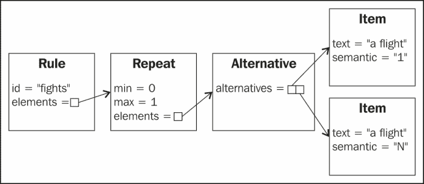
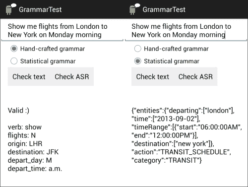

# 六、对话的语法

你会注意到上一章学习的填表对话中的输入仅限于单个单词和短语。本章介绍了如何使用语法来解释更复杂的输入，以及如何提取它们的含义。商业应用中常用的两种语法是手工编写的可预测且定义明确的输入语法，以及统计语法，用于在典型的会话式语音输入格式不太好的情况下提高性能。

到本章结束时，您应该能够开发支持更多扩展用户输入的应用，利用手工制作和统计语法。

# 语音识别和自然语言理解的语法

语法在基于语音的应用中有两种不同的用途，如下所示:

*   **语音识别**:在这种的情况下，语法(也称为语言模型)指定识别器可以预期的单词和短语。例如，如果系统正在处理城市，它不应该试图识别数字。由 W3C 定义的语音识别语法，可在[http://www.w3.org/TR/speech-grammar/](http://www.w3.org/TR/speech-grammar/)获得，可以由开发人员明确指定(手工语法)或从语言数据计算(统计语法)。语音识别语法有助于使语音识别更加准确。
*   **自然语言理解**:的思想是获取识别器的输出，并为单词分配语义解释(或意义)。这可以通过几种方式来实现。一种方法是确定句子的结构(句法分析)，然后给这个结构赋予语义解释(或意义)。或者，语义解释可以直接从句子中提取，而不经过句法分析阶段。

目前，谷歌语音识别 API 不支持使用开发者为语音识别指定的语法，唯一可能的语言模型是`LANGUAGE_MODEL_FREE_FORM` 和`LANGUAGE_MODEL_WEB_SEARCH`内置于 API 中。在本章要介绍的应用中，我们将像前几章一样进行语音识别，然后过滤识别结果，只保留那些符合语法的结果，并使用它们来获得用户输入的语义解释。

### 类型

**你也可以试试…**

虽然目前无法在安卓的`RecognizerIntent`中使用语法，但可以使用第三方选项。更多详情请访问我们的网页。

# 手工语法的 NLU

设计一个语法包括预测用户可能说的不同的东西，并创建规则来覆盖它们。语法设计是一个迭代的过程，创建一个初始语法，收集数据以针对实际用户输入测试语法，添加一些短语并移除其他短语，等等，直到语法的覆盖范围尽可能完整。有各种工具可以帮助设计语法。例如，Nuance 提供了 Nuance 语法生成器，可用于测试语法的覆盖范围，检查测试短语是否接收到正确的语义解释，并测试过度生成，即检测输入中任何不必要或意外的短语([http://evolution.voxeo.com/library/grammar/grammar-gsl.pdf](http://evolution.voxeo.com/library/grammar/grammar-gsl.pdf))。

指定语音语法的语言有很多种，最流行的是 XML 和**增强 BNF** ( **ABNF** ) ，由 W3C 定义，在[http://www.w3.org/TR/speech-grammar/](http://www.w3.org/TR/speech-grammar/)、 **Java 脚本语法格式** ( **JSGF** ) 由 Java 语音 API 使用，以及**语法规范语言** ( **GSL** ) ，这是 Nuance 专有的格式。

在本章中，我们将使用 XML 格式，并提供一个库，该库能够解析简单的 XML 语法，以便在表单填充对话中使用，就像上一章中研究的那样。开发一个完整的 XML 语法处理器超出了本书的范围，但是关于它应该具有的功能的附加信息可以在 http://www.w3.org/TR/speech-grammar/#S5(T2)的 W3C 语音识别语法规范中找到。

下面是一个简单的语法，使用了一些来自 XML 语法格式的标签。这个语法可以识别句子*显示飞往伦敦*的航班:

```java
<grammar root = "flight_query">

<rule id = "flight_query"> 
    <item>show</item> 
    <item>flights</item> 
    <ruleref uri = "destination" />
</rule>

<rule id = "destination"> 
    <item> to London </item> 
</rule>

</grammar>
```

可以看出，语法是按照规则构建的。`<grammar>`标记表示语法的起始元素(或根)，标记为`flight_query`。标签后的第一个规则必须与根元素同名。该规则由两个项目组成:单词`show`和单词`flights`，它们涵盖了要处理的字符串的前两个单词。第三部分是对另一个规则`destination`的引用`<ruleref>`。本规则包含`to London`字样。因此，通过应用所有盯着根的规则，我们可以处理字符串*显示飞往伦敦的航班*。

当可能有几种选择时，规则引用很有用；在这种情况下，几个替代目的地。`<one-of>`标签允许指定替代项目。例如，我们可以将目标规则扩展如下:

```java
<rule id = "destination"> 
    <one-of>
          <item> to London </item>
          <item> to Paris </item> 
          <item> to New York </item> 
    </one-of> 
</rule>
```

事实上，由于单词*到*是这个规则中所有短语共有的，我们可以创建一个城市单词的进一步规则引用，如下面更广泛的语法所示。通过这种方式，可以创建复杂的规则层次结构来指定各种可能的输入。

有时，单词或短语可能是可选的，也可能重复多次。`repeat`属性允许使用重复使用以下规格，其中`n`和`m`为自然数:

```java
<item repeat="n">        The item repeats n times
<item repeat="n-m">      The item repeats from n to m times
<item repeat="m-">       The item repeats at least m times
```

例如，对于五位数的邮政编码，项目应该如下所示:

```java
<item repeat="5"><one-of><item>0</item><item>1</item> …<item>9</item></one-of></item>
```

`<item repeat="0-1">`表示某个项目是可选的。在下面的语法中，`flight_query`、`flights`和`time`规则指定了可选元素。这意味着有效输入只需要`origin`、`destination`和`depart_day`，其他信息是可选的。

给定各种标签和属性的组合，我们可以创建一个语法来允许如下输入:

*   我想要周一早上从巴黎飞往纽约的航班
*   请告诉我周二从伦敦到巴黎的航班
*   星期一下午从纽约到伦敦
*   星期三从巴黎到伦敦

以下是可用于处理这些输入和各种其他可选输入的语法:

```java
<grammar root="flight_query">

<rule id="flight_query">
    <ruleref uri="verb"/> 
    <ruleref uri="flights"/> 
    <ruleref uri="origin"/> 
    <ruleref uri="destination"/>
    <ruleref uri="depart_day"/>
    <ruleref uri="depart_time"/>
</rule>

<rule id="verb">
      <item repeat="0-1">
        <one-of>
                <item><tag>show</tag>Show me</item>
                <item><tag>show</tag>I would like</item>
                <item><tag>show</tag>Are there any</item>
        </one-of>
    </item>
</rule>

<rule id="flights">
      <item repeat="0-1">
          <one-of>
                <item><tag>1</tag>a flight</item>
                <item><tag>N</tag>flights</item>
          </one-of>
    </item>
</rule>

<rule id="origin"> <item>from</item> <ruleref uri="city"/> </rule>
<rule id="destination"> <item>to</item> <ruleref uri="city"/> </rule>
<rule id="depart_day"> <item>on</item> <ruleref uri="day"/> </rule>
<rule id="depart_time"> <ruleref uri="time"/> </rule>

<rule id="city">
    <one-of>
          <item><tag>LHR</tag>London</item>
          <item><tag>CDG</tag>Paris</item>
          <item><tag>JFK</tag>New York</item>
    </one-of>
</rule>

<rule id="day">
    <one-of>
          <item><tag>M</tag>Monday</item>
          <item><tag>T</tag>Tuesday</item>
          <item><tag>W</tag>Wednesday</item>
    </one-of>
</rule>

<rule id="time">
    <item repeat="0-1">
          <one-of>
                <item><tag>a.m.</tag>morning</item>
                <item><tag>p.m</tag>afternoon</item>
          </one-of>
    </item>
</rule>

</grammar>
```

`<tag>`用于为与输入中识别的单词不同的项目返回值。这对于处理同义词很有用，在同义词中，具有相同含义的单词应该返回单个值，而不是识别的文字单词，或者返回在应用的其他组件中更有用的值。下面是一个简单的例子:

```java
<item><tag>M</tag>Monday</item>
```

这里，如果处理了单词`Monday`，则返回值`M`。

更一般地，应用可能不需要输入的完整转录就能够对用户所说的进行进一步的处理，因为使用`<tag>`标签来使用一些中间(语义)表示就足够了，甚至更有效。通常，语义解释标签遵循[www.w3.org/TR/semantic-interpretation/](http://www.w3.org/TR/semantic-interpretation/)中呈现的 W3C 格式，该格式被解析并作为 ECMAScript 对象进行处理。这意味着有可能在语义标签中包含代码的小摘录。

在本章中，我们将通过指定纯文本标签来对语义进行非常简单的处理。例如，在前面的语法中，我们包含了指定每个城市主要机场代码的标签，因此当句子包含从*到巴黎*时，`destination`的语义解释为 *CDG* (戴高乐机场的代码)，如果用户在下午说*，则`departure_time`的语义解释为*下午*。*

# NLU 统计局

手工编写的语法开发起来很耗时，而且容易出错。开发一个具有良好覆盖率和优化性能的语法需要相当多的语言学和工程专业知识。此外，手工制作的语法规则无法轻松应对自然口语特有的不规则输入。例如，考虑到公认的单词*我想要周一不周二下午*从巴黎飞往纽约的航班，我们的语法将会失败，因为规则中没有规定*嗯*和*不*。

统计语法是手工语法的替代品。统计语法是从数据中学习的，包括收集和注释大量相关的语言数据。统计语法可以处理不规则的输入，因为它们不必与输入完全匹配，而是分配概率来指示结构或语义解释与输入匹配的程度。有不同类型的统计语法。就本章而言，我们对一种语法感兴趣，这种语法在给定文本字符串输入或语音识别组件结果的情况下，返回语义解释作为其结果。

统计语法的缺点之一是需要大量的训练数据。虽然已经为各种各样的现实世界应用收集了语言数据的语料库，但这些都不是公开的，购买它们的成本对于个人开发者来说是令人望而却步的。即使数据可用，注释和训练语法也需要相当大的努力。目前可用于统计语义语法的 API 很少，但一种可能性是由**马鲁巴**([www.maluuba.com](http://www.maluuba.com))提供的网络服务，该公司为安卓设备开发了同名个人助理及其统计语义语法的 API。

马鲁巴应用编程接口(称为`nAPI`)从输入中提取三种类型的信息，如下所示:

*   **类别** : 表示句子的主题，例如天气、旅游、娱乐和导航。目前，它涵盖了 22 个类别。
*   **动作** : 解释类别内要完成的具体动作或意图，例如，天气有检查天气的`WEATHER_STATUS` 和详细的风速、湿度等天气信息的`WEATHER_DETAILS` 等动作。
*   **实体** : 它给出了必须提取的关键信息，例如位置、日期范围和时间。

结果作为结构化对象返回。下面就是一个例子:

**用户输入**:明天贝尔法斯特的天气怎么样

**马卢巴** : {“实体”:{“日期范围”:[{“开始”:“2013-05-09”、“结束”:“2013-05-10”}]，“地点”:[“贝尔法斯特”]}，“行动”:“WEATHER_STATUS”、“类别”:“WEATHER”}

请注意，除了识别类别、动作和实体之外，语法还解析相关引用，如*明日*(此示例于 2013 年 5 月 8 日提交)。此外，只要可以从输入中识别实体，输入就不必完全符合语法。因此，像*明天贝尔法斯特的天气*这样的句子将返回相同的结果。

## NLULib

我们已经实现了一个自然语言理解库，它包含了处理手工和统计语法的类和方法。我们已经创建了 NLU 类(`NLU.java`)来封装两者，但是它们可以被单独处理。

## 处理 XML 语法

`HandCraftedGrammar.java`包含解析一个 XML 语音语法、检查一个短语在语法中是否有效以及获取其语义表示的方法。我们考虑 XML 格式的标签子集，具体来说:

<colgroup><col style="text-align: left"> <col style="text-align: left"> <col style="text-align: left"> <col style="text-align: left"></colgroup> 
| 

标签

 | 

描述

 | 

可能的子标签

 | 

可能的属性(标有*的属性是必需的)

 |
| --- | --- | --- | --- |
| <grammar></grammar> | 指定最高级别容器 |  | 根* |
|  | 指定单词和短语的有效序列和结构 |  | id* |
|  | 指定一组备选方案 |  |   |
|  | 指定有效序列包含文字和语义标签 | <tag></tag> | 重复 |
| <tag></tag> | 以文字形式指定语义信息 |   |   |
|  | 指定对另一个规则的引用 |   | uri* |

构造函数将 XML 解析成 java 对象(参见`sandra.libs.nlu.nlulib.HandCraftedGrammar`中代码包中的`parse`方法，并将语法翻译成 java 正则表达式(参见代码包中`sandra.libs.nlu.nlulib.HandCraftedGrammar`中的`computeRegularExpression`)。

`parse`方法使用`XmlPullParser` 将 XML 代码读入对象，类似于上一章开发的 VXML 解析器，但是使用数组来跟踪嵌套项，因为在这种情况下，我们可以嵌套相同的标签(例如，参见前面提到的`flights`的示例，其中几个`<item>`标签包含在另一个`<item>`标签中)。

在这种情况下，我们创建了类`Alternative`、、`Item`、、`Rule`、、`Repeat`和、`RuleReference`，分别保存解析`one-of`、`item without a repeat argument`、`rule`、`item with repeat argument`和`rule-ref`标签的结果。`GrammarElement`类已经被定义为其他类的超类，因此当某个类有任何其他元素的集合时，它可以使用`GrammarElement`类作为通配符。例如，`Alternative`类包含一个`GrammarElement`集合，代表可用的不同选择。

解析的结果是`Rule`对象的集合，该集合被保存为`HandCraftedGrammar`类的属性。规则保存在一个`HashMap`里，钥匙是他们的身份证。例如，从解析示例语法中的航班规则得到的结构如下图所示。请注意，为了简化便于语义解析的正则表达式的生成，我们不会在识别过程中动态处理语法，而是在识别开始之前将其解析为 Java 对象:



此时，`HandCraftedGrammar`构造器已经用`parse`方法将 XML 语法解析成 Java 对象。然后，它使用对象使用`computeRegularExpression`方法计算代表语法的正则表达式。正则表达式是表示相同信息的另一种方式，但是它们的优点是我们可以使用和`Matcher`类从`java.util.regex` API 直接将用户介绍的句子与语法进行匹配(该 API 的教程可以在[http://docs.oracle.com/javase/tutorial/essential/regex/](http://docs.oracle.com/javase/tutorial/essential/regex/)找到)。

使用 Java 对象作为 XML 和正则表达式之间的中间步骤，使得处理大量的嵌套元素和规则引用变得更加容易，并且允许在自下而上的过程中生成正则表达式，从最简单的项目开始到最复杂的规则。

`computeRegularExpression`方法(参见代码包)使用`getRegExpr()`方法为每个元素获取对应于根规则及其引用的所有规则的正则表达式。该方法将`GrammarElement`中包含的信息转换为正则表达式语法。比如上图结构的翻译就是`( (a flight) | (flights) ) {0, 1}`。

`RuleReference`对象的情况很特殊，因为它们是使用通配符“`xxREFurixx`”翻译的，其中`uri`是所引用规则的名称。例如，`depart_day`规则被翻译为`xxREFtimexx`。

`HandCraftedGrammar`类中的`solveReferences`方法用于解析所有引用。为此，整个语法的正则表达式是通过从根开始逐步解析引用来获得的。完整语法的结果如下:

```java
(((Show me)|(I would like)|(Are there any)){0,1})(((a flight)|(flights)){0,1})(from ((London)|(Paris)|(New York)))(to ((London)|(Paris)|(New York)))(on ((Monday)|(Tuesday)|(Wednesday)))((((morning)|(afternoon)){0,1}))
```

该方法还跟踪语义标签。最初，它们被分配给它们相应的项目，例如，语义表示`JFK`被分配给它的项目。然而，它们必须被分配到它们相应的规则中才能被解释(也就是说，分配到`city`，然后分配到`destination`)。为了做到这一点，我们使用了`SemanticParsing`类，它允许将标签链接到规则。

由于正则表达式将是检查输入短语有效性的唯一机制，并且失去了规则的结构，`SemanticParsing`类具有位置属性，允许我们确定应该与触发标签的文本相匹配的正则表达式组。

Java 正则表达式使`GrammarElement`的不同子类能够获得括号分组的元素的部分匹配结果，例如，在前面的正则表达式中，整个匹配的句子位于位置 0，`(((Show me)|(I would like)|(Are there any)){0,1})`位于位置 1，`((Show me)|(I would like)|(Are there any))`位于位置 2，`(Show me)`位于位置 3，`(Are there any)`位于位置 5，`(on ((Monday)|(Tuesday)|(Wednesday)))`位于位置 20。

我们对`SemanticParsing`对象所做的是将语义标签与这些组中的每一个进行匹配。这样，`depart_time`规则的`SemanticParsing`对象表示匹配组在位置 20，如果表达式为`on Monday`，则语义为`M`，同样`T`表示`on Tuesday`，而`W`表示`on Wednesday`。

因此，句子*的语义表示为给我看周二早上*从巴黎到纽约的航班如下:

```java
Verb: Show
Flights: N
Origin: CDG
Destination: JFK
Depart_day: T
Depart_time: a.m.
```

`obtainSemantics`方法(参见代码包中的`HandCraftedGrammar.java`)用于检查输入是否与语法匹配，如果匹配，其语义表示是什么。如果语法没有初始化，即语法的正则表达式还没有计算出来(例如构造函数语法格式有问题)，这个方法会引发异常。

为了验证输入的短语，我们使用了一个 Java 匹配器，它会自动检查该短语是否与正则表达式兼容。为此，我们忽略空格并使用小写字母，如下面这段代码所示:

```java
Pattern p = Pattern.compile(grammarRegExpression.replaceAll("\\s","").toLowerCase());
Matcher m = p.matcher(utterance.replaceAll("\\s","").toLowerCase());
```

然后，我们使用`Matcher` Java 类的`groupCount` 和`group`属性，以便获得匹配正则表达式中每个组的短语，其中一个组是括号之间的每个模式。然后将该信息与语义信息和保存在`SemanticParsing`对象中的预期位置进行比较，并将语义表示保存在作为 `obtainSemantics`方法的输出的字符串中。

## 处理统计语法

要使用 Maluuba，您需要注册一个开发者帐户。前往马鲁巴开发者网站([http://dev.maluuba.com/](http://dev.maluuba.com/))点击标签**立即注册，立即获得 API 访问**。注册与谷歌、脸书或 GitHub 帐户相关联。完成表格，然后你会被引导到一个页面，在那里你可以创建一个应用。点击**创建一个应用**，系统会询问您一个**应用名称**和**应用描述**。对于当前的目的，输入一些简单的东西，例如，**应用名称**输入`flights`，描述输入一些文本，您将获得一个应用编程接口密钥。现在，您可以使用此键通过浏览器或安卓应用向马鲁巴发送自然语言查询。通过浏览器测试对应用编程接口的访问，如下所示:

```java
http://napi.maluuba.com/v0/interpret?phase=I would like a flight from belfast to london on Monday&apikey= <your apikey>
```

`NLU.java`向马鲁巴发送字符串，获取语义解释。您可以更改`KEY`属性来使用您的开发者密钥。为了访问语法，它使用了前一章中描述的`XMLLib`，这样就可以通过异步任务安全地访问网址。

结果作为字符串传递给调用方法。例如，对于短语*我想去伦敦*，它返回以下值:

```java
{"entities":"destination":["London"]},"action":"NAVIGATION_DIRECTIONS","category":"NAVIGATION"}
```

# 语法测试应用

`GrammarTest` app ( `sandra.examples.nlu.grammartest` ) 说明如何使用`NLULib`。它有一个简单的图形用户界面，用户可以选择要使用的语法类型(手工或统计)，也可以选择**检查文本** 或**检查 ASR** 按钮来获得输入的语义表示。

在**检查文本**的情况下，使用键盘将输入输入到`TextView`框中。在**检查 ASR** 的情况下，该应用识别口头输入，并产生 10 个最佳列表的结果。

在手工语法的情况下，从指定的位置读取 XML 语法。使用的默认语法是前面介绍的语法。如果输入(输入文本或 N 个最佳结果中的每一个)在语法中，它显示有效的消息和语义表示，如果不是，它显示无效的消息(这些消息不是硬编码的，而是从`Strings`文件中检索的)。

在统计语法的情况下，使用马鲁巴服务。在这种情况下，我们不对输入设置任何限制，因此所有短语都被认为是有效的，并为每个短语显示语义解释。

对于希望熟悉语法设计过程的开发人员来说，这个应用非常有用。下图显示了使用手工制作(左)和统计(右)语法的两个应用截图:



# 总结

本章展示了如何创建和使用语法来检查用户的输入是否符合应用所需的单词和短语。语法也用于从用户输入中提取与应用相关的概念的语义表示。介绍了两种语法:一种是开发人员为满足应用的要求而设计的手工语法，另一种是从大量相关数据中学习的统计语法。手工编写的语法对于可预测且定义明确的输入非常有用，而统计语法提供了更强大的性能，并且可以处理更大范围的格式不太好的输入。

在到目前为止的章节中，示例假设所使用的语言是英语，并且接口是仅语音的。[第 7 章](07.html "Chapter 7. Multilingual and Multimodal Dialogs")、*多语言和多模式对话*将研究如何构建除了语音之外还使用英语以外的其他语言和其他模式的应用。