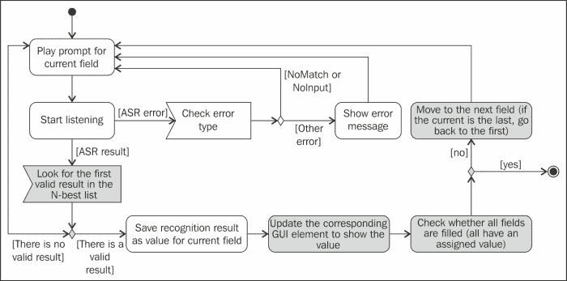
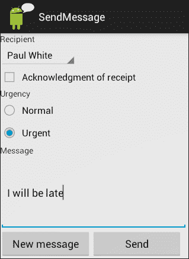

# 七、多语言和多模式对话

在迄今为止的所有例子中，所使用的语言是英语，互动模式主要是语音。本章展示了如何将其他语言整合到应用中。本章还介绍了如何构建利用多种模式的应用，例如，将语音与视觉显示相结合。

# 使用多种语文

在[第 2 章](02.html "Chapter 2. Text-to-Speech Synthesis")、*文本到语音合成*和[第 3 章](03.html "Chapter 3. Speech Recognition")、*语音识别*中，我们已经为您轻松开发多语言应用奠定了基础。使用`TTSLib`库([第 2 章](02.html "Chapter 2. Text-to-Speech Synthesis")、*文本到语音合成*)您可以指定用于语音合成的语言。现在我们只需要对`ASRLib` ( [第三章](03.html "Chapter 3. Speech Recognition")、*语音识别*)到做一些小的改进，让其接受不同的语言进行语音识别(因为它原本是设置为设备默认的)。为此，我们在代码包中创建了`ASRMultilingualLib`(在`sandra.libs.asr.asrmultilinguallib`中)。

我们不能期望在用户实现语音识别时所有语言都可用。因此，在设置语言之前，有必要检查它是否是受支持的语言之一，如果不是，则设置当前首选的语言。

为此，发送一个`RecognizerIntent.ACTION_GET_LANGUAGE_DETAILS`有序广播，返回一个 Bundle，从中可以提取关于首选语言(`RecognizerIntent.EXTRA_LANGUAGE_PREFERENCE`)和支持语言列表(`RecognizerIntent.EXTRA_SUPPORTED_LANGUAGES`)的信息。这涉及到在`ASRMultilingualLib`库中稍微修改一下`ASR.java`文件。

现在在`listen`方法中，有一个检查，以确保所选语言在语音识别器中可用，然后调用新的`startASR`方法。

`startASR`方法包含的代码与库的上一版本的`listen`方法中的代码基本相同，其中`RecognizerIntent`是为了开始监听而创建的。但是，它为意图引入了一个新的参数，其中指定了用于识别的语言，如从`startASR`方法调用的以下代码行所示:

```java
  intent.putExtra(RecognizerIntent.EXTRA_LANGUAGE, language);
```

### 类型

要查看设备上可用的语言，您可以点击**谷歌语音搜索/语音搜索设置**，然后点击**语言**查看完整列表。对应代码为[http://en.wikipedia.org/wiki/List_of_ISO_639-1_codes](http://en.wikipedia.org/wiki/List_of_ISO_639-1_codes)规定的两字母小写 ISO 639-1 语代码。

`listen`方法已被更改，以检查语言的可用性。为了做到这一点，它使用了一个意图`RecognizerIntent.ACTION_GET_LANGUAGE_DETAILS`，这是广播。为了处理广播，向`ASRMultilingualLib`引入了两个新类:`LanguageDetailsChecker`，即`BroadCastReceiver`，以及`OnLanguageDetailsListener`、接口，用于指定处理广播结果的方法。这些类处理检索语言相关信息的细节，来自`gast-lib`项目([https://github.com/gast-lib](https://github.com/gast-lib))并由*格雷格·米莱特*和*亚当·斯特劳德*、 *Wrox* 、 *2012* 在*专业安卓传感器编程*一书中进行了描述。在`listen`方法中，创建并发送广播意图，`OnLanguageDetailsListener`界面用于指定广播处理完毕后要做什么。在我们的例子中，会检查语言是否与任何可用的语言匹配，然后开始识别。

在`ASRLib`中进行了描述的更改后，我们准备开发应用，用户可以在其中指定一种语言来识别和合成语音。比如我们开发了`SillyParrot` app ，如下图所示。它要求一种语言，并在识别出用户想要什么后，播放所选语言的最佳匹配。


在尝试了`SillyParrot` app、之后，你可能会注意到，在你选择了另一种语言之后，GUI 仍然是英文的，这有点奇怪。在关于多模态的部分，我们将进一步探讨应用的视觉和口头部分的同步，但我们现在将从确保它们都使用相同的语言开始。为了做到这一点，我们将利用`res`文件夹，该文件夹保存`xml`文件，其中包含可以从活动中引用的信息。

实现响应不同语言的应用的过程通常被描述为应用的本地化。本地化中的一个主要问题是提供不同语言的文本消息，但是图像、布局和其他资源也可以本地化(看一下本网页中的教程，查看带有本地化图像的示例:[http://www . icanload . com/site/tutories/Android-application-localization-tutorial/](http://www.icanlocalize.com/site/tutorials/android-application-localization-tutorial/))。要做到这一点，有必要将文件包含在指示语言代码的特定目录中。

如果设备的区域设置为`es-ES`，并且代码引用了字符串`R.string.mymessage`，那么安卓系统将按照指定的顺序在以下目录中查找它:

1.  `res/values-es-rES/strings.xml`
2.  `res/values-es/strings.xml`
3.  `res/values/strings.xml`

因此，如果您在墨西哥，并且您的设备的默认区域设置是`es-MX`，那么它将不会匹配来自西班牙的默认西班牙语(选项 1)，但它将匹配通用西班牙语(选项 2)。如果您在芝加哥，并且您的设备的区域设置为`en-US`，那么它将尝试在默认目录中查找字符串(选项 3)。

### 注

**别忘了默认资源！**

我们不能期望所有的语言环境在我们用户的设备中都是可用的(见这里的解释[http://developer . android . com/reference/Java/util/locale . html](http://developer.android.com/reference/java/util/Locale.html))，因此不要忘记默认资源是非常重要的，因为每当没有可用于所需语言环境的 xml 文件时，Android 都会从`res/values/`加载它们。

一个好的设计实践是将目标语言的所有消息包含在默认文件夹中，这是我们期望大多数用户会使用的文件夹，然后尝试为其他语言创建尽可能少的资源文件。

比方说，我们已经确定我们的应用必须支持以下语言:美国和加拿大使用的英语、美国使用的西班牙语和加拿大使用的法语，其中美国英语是主要语言。在这种情况下，美国英语中的字符串应该在默认文件夹(`res/values/strings.xml`)中。然后，只有在加拿大英语中不同的特定消息才会包含在`res/values/en-rCA/strings.xml`文件夹中，因此不需要复制两个地区的所有字符串。西班牙语和法语也有类似的过程，它们可以包含在`res/values-ES/`和`res/values-fr/`文件夹中，如果需要考虑其他品种，可以稍后本地化为`res/values-es-rUS`或`res/values-fr-rCA/`。安卓提供了一个清单来规划如何本地化你的应用，你可以在以下网址找到:http://developer . Android . com/distribute/googleplay/publish/localization . html。注意在国家代码前加上`r`，在创建目录时使用`-`代替`_`。

在`Parrot`应用中，我们按照上一段描述的结构，通过自动适应设备区域设置(`Locale.getDefault().getDisplayLanguage();`)对`SillyParrot`进行了改进。看看代码包中项目的目录结构。在安卓开发者指南(http://developer . Android . com/guide/topics/resources/localization . htm)中有如何测试不同语言本地化应用的示例，不过您需要在物理设备中尝试不同语言的来测试语音识别部分。

# 多模态

如果一个应用使用多种输入和/或输出模式，它可以被认为是多模式的。从这个意义上说，本书中展示的所有应用都是多模态的，因为它们在输出或输入中使用了语音和图形用户界面。

然而，在前面的例子中，模态没有被同步或用于提供处理相同信息位的替代方式。例如在[第五章](05.html "Chapter 5. Form-filling Dialogs")、*填表对话*中的`MusicBrain` app 中，输入是口头的，输出是视觉的，而在本章所述的`SimpleParrot` app 中，输入和输出是口头的(需要语音识别和合成)和视觉的(选择一种语言并按下输入中的**按钮说话**按钮和**举杯**进行输出)，但它们对应的是界面中不同的元素。

在本节中，我们将描述如何开发多模式应用，在这些应用中，模式可以无缝地组合到输入或输出数据中，以便用户可以在任何特定时间选择最方便的模式来使用。

为此，我们在[第 5 章](05.html "Chapter 5. Form-filling Dialogs")、*表单填充对话*中提供的`FormFillLib`库的基础上，通过考虑图形用户界面中不同元素的口述字段的同步来扩充它。这样，用户可以通过点击或使用语音来填写图形用户界面中的所有不同元素。

主要思想是在语音形式的字段和图形用户界面中的不同元素之间创建对应关系。我们已经考虑了下表中显示的语音和图形用户界面元素的组合，因此当一对元素中的一个被填充时，另一个被相应地分配一个值。例如，如果提示用户选择一个选项并口头执行，则在图形用户界面中将选择列表中相应的单选按钮或元素。同样，如果在单选按钮或列表中选择了该元素，则用户不会被口头询问。

<colgroup><col style="text-align: left"> <col style="text-align: left"> <col style="text-align: left"></colgroup> 
| 

描述

 | 

语音字段

 | 

图形用户界面元素

 |
| --- | --- | --- |
| 开放式输入，用户可以在其中书写长文本或口头提供 | 谷歌语音识别器的结果可以直接使用 | 文本字段 ( `EditText`) |
| 用户可以在可选选项之间进行选择的受限输入 | 应该使用手工语法来限制选项 | 单选按钮组( `RadioGroup` ) 或列表( `ListView` 或`Spinner`) |
| 受限的`yes` / `no`类型输入 | 应该使用手工语法将选项限制在`yes` / `no`和等同选项(例如，`true` / `false`) | 复选框 ( `CheckBox` ) |

从表中可以看出，引入语法很重要，因为语音输入必须只接受图形用户界面提供的选项。这就是为什么我们还增强了第 5 章、*表单填充对话*中的 VXML 解析器的功能，将语法考虑在内。

为此，新的`MultimodalFormFillLib`库(参见代码包中的`sandra.libs.dm.multimodalformfilllib`)包含了对`FormFillLib`库的几处更改，这些更改也作为代码包中的注释指出。下图显示了一个活动图，总结了如何在新库中解释口头对话。阴影部分是[第 5 章](05.html "Chapter 5. Form-filling Dialogs")、*填表对话*中关于解释器的主要变化。



从上图可以看出，在`MultimodalFormFillLib`库中并不是所有的识别结果在所有情况下都被认为是有效的。如果我们看看前面介绍的表格；如果口头字段对应于图形用户界面中的单选按钮、复选框或列表，我们应该将字段的有效值限制为所提供的选项。例如，如果我们的应用显示了包含巧克力、香草和草莓的冰淇淋口味的选择列表，那么当用户被问及他更喜欢哪种口味时，唯一有效的识别结果应该是这三种口味之一。这样，用户可以在屏幕上选择一种味道，也可以口头说出味道，应用将自动更新另一种形态(分别填充口头字段或在图形用户界面中选择一个选项)。

这种限制是通过语法实现的。现在，每个字段都包含关于其语法的信息(例如，对于输入不受限制的文本字段，不需要指示语法)。当字段被`DialogInterpreter`、访问时，如果有语法，识别出的短语只有在语法中有效时才被考虑；如果不是，则视为不匹配。

### 注

为了简单起见，我们只根据语法考虑值是否有效，而不考虑它的语义值。然而，如果`Field`类中的`isValid`方法不仅仅计算布尔值，而是以某种方式处理语义(例如，遵循[第 6 章](06.html "Chapter 6. Grammars for Dialog")、*对话语法*中给出的指导原则)，这是可以做到的。

在`VXMLParser.java`文件中，我们已经包含了`<grammar>`作为可能要解析的标签。该标签具有指示其位置的强制`src`属性。当解析器遇到标签时，它调用`Field`类中的`setGrammar`方法，将语法`src`作为参数传递。在`Field.java`中，我们包含了检索语法的 XML 内容以及解析和查询它们的方法。`setGrammar`方法调用`retrieveGrammar`，后者访问`url`(包含 URL 的`src`属性)或从`assets`文件夹中读取语法(仅包含语法名称的`src`属性)并获取字符串中的内容。然后`processXMLContents`方法使用在[第 6 章](06.html "Chapter 6. Grammars for Dialog")、*对话语法*中开发的库`NLULib`初始化手工语法。如果没有为特定字段指示语法，则接受任何识别结果，无需后续过滤。

我们在`Field.java`文件中增加了另一个方法叫做`isValid`，，可以用来检查一个短语在语法中是否有效。当不使用语法时， `isValid`方法返回`true`而不考虑值。

所描述的行为是在`DialogInterpreter`类的`processAsrResults`方法中编码的，其中我们包含了代码来检查识别器获得的 N-best 列表中的任何识别结果在语法中是否有效。如果是，则该过程移动到下一个字段，如果不是，则它保持在同一字段中。

当我们在前面的章节中使用纯语音界面时，用户不可能删除他已经提供了信息的字段。多模式界面的情况并非如此，因为用户可能会更改图形用户界面中已经提供的项目。我们更改了`DialogInterpreter`类中的`moveToNextField` 方法，使得对话结束的条件不是所有字段都被访问过，而是所有字段都被填充了(它们的值不是`null`)。检查表单中所有字段是否已填写的方法(`allFieldsFilled`)已包含在`Form`类中。此外，它认为字段列表是循环的，因此，当遇到最后一个字段时，如果有未填充的字段，它将继续第一个字段。

现在语法已经可以考虑了，我们可以看看多模态。我们已经创建了`MultimodalDialogInterpreter` 类，这是`DialogInterpreter`的一个子类，包含一组`MultimodalElement`对象。这些对象包含必须同步的成对口头和图形用户界面字段。

首先，我们确保口腔部分的变化对图形用户界面有影响。每次口头填写字段时，都会调用 `oraltoGui`(在`DialogInterpreter`中抽象，在`MultimodalDialogInterpreter`中实现)方法(参见`DialogInterpreter`中的`processResults`方法，以便在图形用户界面中显示其值。此方法检查对应于口述字段的视觉元素的类型，并通过调用相应的方法相应地显示信息。在列表视图和微调器中，它选择一个项目，在单选按钮组中，它检查一个单选按钮，在文本字段中，它写一个文本，或者它选择或取消选择一个复选框，如前面显示语音字段和图形用户界面元素组合的表格中所述。

其次，我们确保视觉部分的变化对口腔部分有影响。因此，如果图形用户界面中已经填充了一个元素，应用就不应该口头要求它。调用`MultimodalDialogInterpreter`类中的`guiToOral`方法将从图形用户界面检索的值保存在口述字段中。

作为使用`MultimodalFormFillLib`的一个例子，我们展示了`SendMessage`应用，如下图所示，其中用户要么口头填写一些信息，要么使用图形用户界面，或者两者都填写。这是一个模拟应用，因为它不从用户的联系人列表中读取联系人，也不发送任何消息，因为本章的重点是界面。但是，这可以按照这里提供的说明来完成:[http://developer . Android . com/training/contacts-provider/retrieve-names . html](http://developer.android.com/training/contacts-provider/retrieve-names.html)并使用`SMSManager`发送短信，或者使用带有`ACTION_SEND`和`EXTRA_EMAIL`的意向发送电子邮件，只需更改`SendMessage.java`文件中`populateContactList` 和`sendMessage`方法的实现即可。



`SendMessage`应用从`assets`文件夹读取包含口语对话结构的`VXML`文件，如以下代码中的所示:

```java
  <form>

  <field name="contact">
  <prompt>Who is the recipient?</prompt>
  <grammar src="contact_grammar.xml"/>
  <noinput> Sorry, I could not hear you </noinput>
  <nomatch> Sorry, I did not understand what you said. Please say the name of one of your contacts </nomatch>
  </field>

  <field name="ack">
  <grammar src="ack_grammar.xml"/>
  <prompt>Do you need acknowledgment of receipt?</prompt>
  <noinput> Sorry, I could not hear you </noinput>
  <nomatch> Sorry, I did not understand what you said </nomatch>
  </field>

  <field name="urgency">
  <grammar src="urgency_grammar.xml"/>
  <prompt>Is the message urgent or normal?</prompt>
  <noinput> Sorry, I could not hear you </noinput>
  <nomatch> Sorry, I did not understand what you said </nomatch>
  </field>

  <field name="message">
  <prompt>Please dictate the message</prompt>
  <noinput> Sorry, I could not hear you </noinput>
  </field>

  </form>
```

从`VXML`文件和图形用户界面中可以看出，用户需要四条信息；收件人，他是否想要确认收到，消息的紧急程度(正常还是紧急)，以及要发送的消息。我们已经使用了所有支持的不同图形用户界面元素。从 VXML 代码中可以看出，除了`message`之外，所有字段都分配了语法。`contact_grammar`接受联系人姓名，`ack_grammar`接受可以翻译成布尔值的短语，如`yes`、`no`、`true`或`false`，`urgency_grammar`包含两个可能的值`normal`和`urgent`，`message`字段不指示语法，因此它接受允许用户自由交谈的最佳识别结果。

VXML 也可以从网络上读取，如[第 5 章](05.html "Chapter 5. Form-filling Dialogs")、*表单填写对话*，但由于它与图形用户界面结合在一起，不太可能有太大变化，因此可以更方便地存储在`assets`文件夹中。例如，我们考虑到口头输入的有效值与图形用户界面中直观显示的选项相同。在上一个截图中，单选按钮显示的是文本**正常**和**紧急**，因此，对应的口语字段应该只接受数值`urgent`和`normal`。开发人员必须记住，这对 VXML 和语法文件构成了相当大的限制。

`SendMessage`类是`MultimodalDialogInterpreter`的子类。在`onCreate`法中，它调用了`initializeGUI` 和`startDialog`法。前者初始化所有的图形用户界面元素，这些元素必须在它们的侦听器中调用`guiToOral`方法(因为在图形用户界面中更改之后，必须更改口述部分)。后者解析口语形式，设置口语与视觉元素的对应关系(`setMultimodalCorrespondence`)，开始口语互动。口头对话控制交互的结束。当`processDialogResults` 被调用时，用户被告知交互成功(在实际设置中，该方法实际上会发送消息)。

请注意，在`vxml`文件被读取和解析之前，口头部分不会准备好。这就是为什么在尝试更新口腔部分之前，图形用户界面必须等待该过程完成。设置图形用户界面元素(在 `setContactList`、 `setAckCheckBox`、 `setUrgencyRadioGroup`和 `setMessageEditText`中)时会考虑到这一点。

下一张截图显示了与`SendMessage`应用交互的示例摘录，其中图形用户界面的最终状态如上一张截图所示。在该示例中，用户选择接收接收确认并紧急发送消息。该信息由系统保存在口头字段中。从截图中可以看到，用户并没有被口头要求这些信息。然后，用户说出接收者的名字。因为它是有效联系人之一，所以它被接受并显示在相应选择列表的图形用户界面中。

最后，用户提供消息，结果显示在图形用户界面中，而没有经过语法过滤，如下图所示:


# 总结

本章展示了如何使用与不同区域设置相关联的资源，将英语以外的语言包含到应用中。我们还研究了如何同步口头和视觉模式，以便用户在与应用交互时可以将它们结合起来。

在下一章中，我们将描述如何设计虚拟个人助理，这些助理可以在您的设备上参与对话并执行一系列任务。