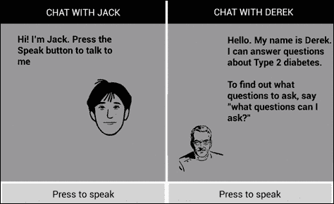

# 第八章。与虚拟个人助理的对话

本章将学习如何设计开发三种类型的**虚拟个人助理**(**VPA**)；一个可以谈论一系列日常话题的对话伙伴，一个为二型糖尿病领域的**常见问题** ( **常见问题** ) 提供答案的专家 VPA，以及一个增强了执行搜索查询、控制设备应用程序和拨打网络服务电话的能力的对话伙伴。

到本章结束时，您应该已经了解开发每种类型的 VPA 需要什么。

# VPA 的技术

VPA 通常能够执行以下任务:

*   与 web 服务交互以检索信息和执行事务；通过搜索查询、链接到知识库(如知识图)或参与事务性对话以及启动和管理设备上的应用程序(如联系人、日历、短信或时钟)。
*   与用户进行关于随机话题的对话，例如回答*你住在哪里？*、*你多大了？*、*你会说什么语言？*或者*你喜欢什么样的音乐？*。VPA 应该对每一个问题都做出某种回应，这样即使没有合适的答案，对话也能继续下去。

[第 4 章](04.html "Chapter 4. Simple Voice Interactions")、*简单语音交互*中展示的`VoiceLaunch`应用展示了如何在设备上启动应用，而[第 5 章](05.html "Chapter 5. Form-filling Dialogs")、*表单填写对话框*中展示的`MusicBrain`应用展示了如何使用表单填写实现事务性对话框。在[第 7 章](07.html "Chapter 7. Multilingual and Multimodal Dialogs")、*多语言和多模式对话框*中展示的多模式应用程序显示了单峰和多模式对话框。然而，这些应用程序执行单一任务，而 VPA 执行一系列不同的任务。

VPA 面临的挑战是从用户的话语中确定用户正在请求什么任务。看下图中的数据流，我们知道如何使用语音识别来确定用户已经说过的话([第 3 章](03.html "Chapter 3. Speech Recognition")、*语音识别*)以及如何给出响应，给定一串要说的话([第 2 章](02.html "Chapter 2. Text-to-Speech Synthesis")、*文本到语音合成*)。现在，我们需要弄清楚用户所说的话背后的意图，并把 TTS 要说的话放在一起。确定用户的意图可以使用口语理解的技术来完成，如[第 6 章](06.html "Chapter 6. Grammars for Dialog")、*对话语法*所示，尽管在这一章中我们将看到另一种技术。当我们查看对话管理组件如何生成响应时，将解释如何提供要由 TTS 说出的单词。


## 确定用户的意图

想象一下用户输入后的:

*   我想订一张去伦敦的机票。
*   *明天天气预报怎么样？*
*   *把我的闹钟定在明天 7 点半。*
*   *你是哪种电脑？*

假设我们希望将这些输入映射到上图对话框管理中列出的四个函数。我们如何做到这一点？

一种方法是使用统计分类系统将开放式用户输入分类到一组固定的类中，如[第 6 章](06.html "Chapter 6. Grammars for Dialog")、*对话语法*中的统计语法所示。这是大规模商业系统采用的方法。例如，故障排除应用程序可能会接受如下输入:

*   *我无法访问我的电子邮件*
*   *上不了网*
*   *有一个小图标表示不能上网*

尽管这些输入的措辞不同，但它们都可以归类为与互联网连接有关的问题。创建这样一个统计分类系统需要收集大量相关话语，并确定一组固定的类别。诸如特定关键词或短语的出现的特征被识别，其可以预测话语到特定类别的分配，并且机器学习技术将被用于训练分类器。例如，*访问我的电子邮件*或*进入互联网*等短语的出现可被视为互联网连接出现类*问题的特征。*

这种方法的优点是鲁棒性和覆盖性。由于匹配是统计性的，因此可以对可能与类别不完全匹配的输入进行分类。因此，不合语法的输入或可以不同方式表达的输入仍然可以分配给一个类。手工制作语法来对这种开放式输入进行分类将是一项艰巨的任务，因为在这种情况下，匹配必须是精确的。

统计文本分类的缺点是需要大量的话语样本来训练系统，因为有太多不同的说话方式。在一个大系统中，可能需要收集和注释成千上万个典型的话语来提供足够的覆盖。这是一个昂贵的过程；虽然系统一旦经过训练，一般会产生准确的结果。

第二种方法在输入更加受限和可预测的情况下是可行的，那就是编写语法来执行分类，使用[第 6 章](06.html "Chapter 6. Grammars for Dialog")、*对话语法*中说明的技术，并将解析的输出设置为相关类之一的赋值以及相关值。例如，在命令设置警报的情况下，将输出分配给设备的警报功能并提取时间和日期。然而，手工语法也会出现覆盖问题，必须不断添加额外的规则来处理无法用现有规则解析的输入。

第三种方法是将输入与预定义的模式进行匹配。这种方法已经成功地部署在许多商业上可用的聊天机器人和虚拟专用网上。不利的一面是，最初必须创建大量的模式来匹配所有可能的输入，同样的问题是潜在的覆盖不足。

# 做出适当的回应

app 对用户输入的响应根据已经识别的用户意图而变化，可以将宽泛地分为以下几类:

*   对于填表对话框，必须启动对话框，可能需要几轮系统-用户交互来填充对话框框架中的必要槽，如[第 5 章](05.html "Chapter 5. Form-filling Dialogs")、*填表对话框*所示
*   在 web 服务的情况下，响应将是对所涉及的 web 服务的调用，并且将提取一些文本由 TTS 说出
*   对于涉及激活设备上的功能的任务，例如拨打电话或设置警报，会执行命令并提取一些文本由 TTS 说出
*   最后，如果任务是对话，VPA 提供一个对话响应，它是由 Pandorabots 聊天机器人系统为本章介绍的应用程序生成的

# 潘多拉魔盒

Pandorabots 是一个免费的基于开源的网络服务，允许开发者在网络上创建和托管聊天机器人(见[http://www.pandorabots.com/](http://www.pandorabots.com/))。目前托管超过 22.1 万个聊天机器人，覆盖多种语言。商业开发也有优质服务。移动设备上的许多虚拟专用网都是使用 Pandorabots 创建的。其中包括潘努斯(又名珍妮)的语音动作、斯凯维、艾瑞斯和潘多拉机器人自己的呼叫妈妈应用程序。CallMom 可以执行与其他 VPA 相同的任务，但还包括一个学习功能，以便它可以学习个人偏好和联系人，并可以被教导纠正语音识别错误。

ALICE 2.0 是`CallMom`应用中可用的聊天机器人个性之一。它的前身 ALICE 最初是由理查德·s·华莱士博士于 1995 年开发的，在 chatbot 比赛中获得了许多奖项，包括授予 chatbot 的 Loebner 奖，在一年一度的比赛中，chat bot 被评委认为是最像人类的。2013 年 Loebner 竞赛四名决赛选手中有三人使用了 Pandorabots 技术。最初的 ALICE 中的许多知识是根深蒂固的，现在已经过时了。比如对*的回应英国首相是谁？*还没有从最初的回复*托尼·布莱尔*更新。ALICE 2.0 通过从外部服务获取其事实信息来克服这些缺点，其他 VPA(如 Siri)也是如此。关于 Pandorabots 和 chatbots 的更多信息可以在 Pandorabots 网站和 ALICE A.I. Foundation 网站([www.alicebot.org](http://www.alicebot.org))上找到，该网站由华莱士创建，旨在促进**人工智能标记语言** ( **AIML** )和 chatbot 技术的发展。

## AIML

AIML 是一种基于 XML 的语言，用于指定聊天机器人的对话行为。AIML 中的基本单位是`category`，由一个`pattern` 和一个`template`属性组成。以下是一个例子:

```java
<category>
       <pattern> WHAT ARE YOU </pattern>
       <template>
             I am the latest result in artificial intelligence, which       	             can reproduce the capabilities of the human brain with 	   	             greater speed and accuracy.
       </template>
</category>
```

在本例中，用户的输入与模式`WHAT ARE YOU`相匹配，并生成模板中提供的响应。通过使用成千上万的类别和通配符来实现更灵活的模式匹配，可以产生非常复杂的对话。

通配符用于匹配输入中一个或多个单词的字符串。下面是通配符`*`的一个简单例子:

```java
<category>
       <pattern>ABBA *</pattern>
       <template>They were a great band in the 70's.</template>
</category>
```

在本例中，任何以`ABBA`开头的输入都将匹配该类别，从而产生输出`They were a great band in the 70's`。

说同一件事通常有几种不同的方式，可以使用`<srai>`标记(意思是符号简化)，而不是将每一种都列为模式或模板对，如下例所示:

```java
<category>
       <pattern> HOW DID YOU GET YOUR NAME </pattern>
       <template> <srai>WHAT DOES ALICE STAND FOR </srai> </template>
</category>
```

这里输入`HOW DID YOU GET YOUR NAME`在意义上被视为与`WHAT DOES ALICE STAND FOR`相同，`<srai>`标记表示它们应该有相同的答案。

如果没有匹配输入的模式；换句话说，机器人不明白别人对它说了什么；最终默认类别适用。对于该类别，模式为`*`，默认响应为`I have no answer for that`。bot 编程的艺术是在最终默认类别中提供一系列响应，帮助保持对话进行。例如，*告诉我更多关于你自己的信息*应该会让用户说出一些可能会有匹配模式的话。最终的默认类别也可以用于捕捉任何模式都无法预测的输入，并将其处理到以确定它是否可以以其他方式处理。例如，它可以被发送到搜索引擎或在线知识来源以获得响应。

模式匹配使用匹配算法来执行，该算法通过类别进行图形搜索。AIML 模式中的文本首先通过删除不必要的标点符号、转换成大写字母和扩展收缩(如我会到我会)来整理。

就模板而言，除了指定响应的文本，还可以执行简单的计算。例如，可以检索属性的值，属性是指机器人属性的常数，例如`age`、`name`或`location`。也有处理谓词的方法，谓词是在会话期间为诸如会话主题等项目设置的变量，或者如何处理代词指代特定单词的使用。这些计算有助于使对话更加自然。

对 AIML 更全面的介绍超出了本书的范围。完整的文档可以在潘多拉机器人网站([www.pandorabots.com](http://www.pandorabots.com))上找到。

### 使用 oob 标签添加附加功能

`<oob>`标签是 AIML 的最新成员，支持在移动设备上使用。OOB 代表带外，一个取自工程学的术语，指的是在一个单独的隐藏频道上的对话。在 AIML 中，`<oob>`标签可用于向设备发送命令，例如，拨打电话、发送短信、启动应用程序等。标签的内容不是用户接收到的响应的一部分，因此可以在这里包含 URL、应用名称等项目，以便在安卓代码中根据需要进行提取和处理。以下是一些使用`<oob>`标签的模式示例:

```java
<category>
       <pattern> * </pattern>
       <template> 
             <oob><url><search><star/></search></url></oob>
             Please wait while I try to find an answer from Google
       </template>
</category>
```

在本例中，如果机器人在其 AIML 文件中没有找到与用户输入相匹配的内容，响应将被标记为`<search>`。搜索查询的内容为`<star/>`，其值为输入中说出的单词。可以在代码包(`sandra.libs.vpa.vpalib`)中的`VPALib`中找到执行本阶段的代码以及以下示例。位于`<oob>`标签外的文字可用于其他用途；在这些应用程序中，它被发送到 TTS 并用于口语输出。

以下示例显示了输入`WIKIPEDIA`如何设置维基百科网址的启动:

```java
<category>
       <pattern>WIKIPEDIA</pattern>
       <template>
             <oob><url>http://www.wikipedia.org</url></oob> 
             Opening Wikipedia
       </template>
</category>
```

在下面的例子中，匹配的输入`GMAIL`设置了谷歌邮件的启动:

```java
<category>
       <pattern>GMAIL</pattern>
       <template>
             <oob><launch>com.google.android.gm</launch></oob>
             Launching Gmail.
       </template>
</category>
```

# VPALib 库

我们已经创建了一个包含与潘多拉机器人连接的代码的库。任何想要加入代理的应用程序都只需要处理界面方面的问题，比如图形用户界面的外观以及对语音识别和合成的控制。

`VPALib`库在检索网页内容时使用`ASRLib`、`TTSLib`和`XMLLib`来管理语音识别、语音合成和异步任务(如果您查看`VPALib`项目中的`libs`文件夹，就可以看到)。这样，它可以专注于管理 VPA 行为所需的代码。

VPALib 库中的主类是`Bot`类，它向 Pandorabots 网站发送查询，解析结果，并在设备上执行相应的动作。

当一个新的机器人被创建时，我们必须给构造器指定一个标识。这是潘多拉机器人站点中的 ID(例如，杰克的`d7b695cf0e344c0a`)。此外，我们可以指定其专业化的主题。例如，如果机器人专门提供关于国家橄榄球联盟的信息，字符串`NFL`用于进行网络搜索。因此，如果用户要求游戏，机器人搜索 NFL 游戏，而不是任何类型的游戏。

`initiateQuery`方法将对应于用户输入的文本发送到 Pandorabots 网站上的机器人。这个过程包括在查询中插入用于空格的`%20`，因为发布的值需要进行表单-网址编码，使用[第 5 章](05.html "Chapter 5. Form-filling Dialogs")、*表单填充对话框*中描述的`XMLLib`文件夹，创建查询并将其作为后台异步任务发送给潘多拉机器人。

`AsyncTask`的结果在`processXMLContents()`方法中处理。从 Pandorabots 返回的响应输出使用`XMLPullParser` 进行解析，类似于我们解析`VXML` ( [第 5 章](05.html "Chapter 5. Form-filling Dialogs")、*表单填充对话框*)或`XML`语法文件([第 6 章](06.html "Chapter 6. Grammars for Dialog")、*对话框的语法*)的方式。

响应要么包含`<oob>`标签，要么不包含。如果没有，机器人唯一的任务就是解析和合成响应。为此，它必须提取包含在`<that>`标签中的消息。以下是`AsyncTask`结局的一个例子:

```java
<result status="0" botid=" d7b695cf0e344c0a"  
custid="c6015de7be06c599">
       <input> what languages do you speak </input>
       <that> C, Java, Lisp, SETL and English </that>
</result>
```

在这种情况下，该方法将调用 TTS 引擎来合成`C, Java, Lisp, SETL and English`。

### 注

谷歌 TTS 语音的性别不能通过编程选择。我们使用了英国英语语音，目前是男性，但可能为 VPA 选择的性别与用户设备中的语音不匹配。目前，这只能通过使用其他 TTS 引擎来解决。

当`<oob>`标签存在时，我们假设它们已经在 AIML 文件中用标签之一进行了标记:`<search>`、`<launch>`、`<url>`和`<dial>`。当遇到 `<search>`时，调用`googleQuery`方法，在谷歌搜索引擎中启动查询。当遇到`<launch>`时，调用`launchApp`方法，在设备中启动一个应用。同样，当遇到`<url>`标签打开指定网页时，调用`launchUrl`方法。最后在处理`<dial>` 时，调用`placePhoneCall`方法，拨打一个号码。

`launchApp`和`launchUrl`方法类似于[第 4 章](04.html "Chapter 4. Simple Voice Interactions")、*简单语音交互*中介绍的方法，不同的是这里的代码更复杂，因为它使用了相似性函数。本章中显示的方法保持简单，以便集中使用`<oob>`标签作为在用户输入中识别这些命令的技术。

更一般地说，由开发者决定是否在 AIML 中标记不同的功能，然后进行处理，或者是否采用不同的方法来识别输出是要说的文本还是要执行的命令。

# 创造一个潘多拉机器人

将在以下部分描述的应用程序使用 Pandorabots 网站上提供的 AIML 代码。因此，我们必须采取的第一步是在潘多拉机器人网站上注册一个账户。

注册后，进入网站，点击**创建潘多拉机器人**选项。这将打开一个页面，在那里你将被要求命名你的机器人(我们称之为我们的`Jack`)。从众多选项中选择你的启动 AIML，包括一个选项**没有初始内容，潘多拉机器人在不知情的情况下启动**。出于本例的目的，选择其中一个 AIML 集合(例如，**华莱士博士的 A . l . I . c . e–2002 年 3 月**)。这将带你进入潘多拉机器人的页面，在那里你可以探索许多选项。

要查看 AIML 文件，单击 **AIML** ，然后单击列出的任何文件。这将给出一个可以用来提供会话响应的大量类别的概念。

要使用预先存在的 AIML 测试机器人，请单击 Train，然后提问，看机器人给出什么响应。这将会显示一个训练页面，指出在哪个 AIML 文件中找到了您输入的匹配项，以及有助于优化机器人的各种其他选项。不能修改预先存在的 AIML 文件，但任何新的类别将存储在名为`update.aiml`的文件中。

要使你的机器人可供其他人使用，你必须发布它(或者重新发布，如果你对 AIML 代码做了任何更改的话)。回到你的机器人主页，点击**发布**。这将加载一个页面，显示你的机器人的位置。

点击这个链接将会打开一个页面，任何可以访问这个链接的人都可以打开这个页面，让他们与你的机器人互动。通过这种方式，您可以从与机器人的交互中收集更多的数据，并在日志文件中查看这些数据，从而进一步细化机器人的响应。

在这个例子中，我们将提供一个运行在安卓设备上的界面，并使用语音与机器人进行交互。重要的是要注意**机器人**、，因为当从你的安卓程序连接到你的机器人时，这是必需的。

# 【VPAs 样本–杰克、德里克和史黛西

为了说明`VPALib`的使用，我们开发了三个机器人:杰克、德里克和史黛西。正如可以在它们各自的包中观察到的那样(参见代码包)，它们具有相同的结构；实现 ASR 和 TTS 并创建机器人实例的主要活动，和简单的图形界面。这显示了拥有一个处理与潘多拉机器人连接的库的便利性。主要区别在于它们对应的 AIML 文件。

机器人在潘多拉机器人中的链接如下:

*   杰克:http://www.pandorabots.com/pandora95cf0e344c0a/talk?botid=d7b695cf0e344c0a
*   德里克:http://www.pandorabots.com/pandora/talk?botid=a80ce25abe3
*   史黛西:http://www.pandorabots.com/pandora/talk?botid=e257c70bae346e98

杰克和德里克的界面如下截图所示:



杰克是通用的 VPA，而德里克是专用的 VPA。专门的虚拟专业人员执行任务，如提供客户服务或回答客户查询。 VPA 的知识库在 AIML 中被编码为一组问题-回答对，类似于常见问题。我们在 AIML 中开发了一套关于二型糖尿病的基本问题。 Derek 可以回答关于症状、病因、治疗、对儿童的风险和并发症等话题的问题。

Stacy 拥有与 Jack 相同的 AIML 文件，但是除此之外，还有一个包含带有`<oob>`标签的类别的文件，用于执行少量功能选择，例如:

*   向 DBPedia 发送一个搜索词，获得一个响应，然后说出来。如果 DBPedia 中没有可用的文本，该搜索词将被发送到谷歌搜索。
*   调用网页(维基百科或脸书)。
*   在设备上启动应用程序(时钟、日历、电话)。

执行这些功能的代码可以在代码包的`VPALib`中找到。

请注意在`Jack.java` ( `Jack`项目)和`Derek.java` ( `Derek`项目)文件中如何不同地实例化`Bot`类。在杰克的情况下，没有`specializedTopic`，而在的情况下，德里克是`Type 2 diabetes`，使用`Bot`类(`VPALib`项目)的两个可选构造器。

运行几次`Derek`应用程序后，很快就会发现，对你的语音输入的错误识别会导致机器人以默认响应`I have no answer for that`进行响应。这在几次之后可能会变得令人讨厌，但也存在问题，即由于识别的单词与 AIML 代码中的任何模式都不匹配，潜在有效的查询会丢失。例如，在与 Derek 的一次互动中，我们说*我的孩子有什么风险*，app 返回识别结果`what other risks children`，与我们的任何模式都不匹配。提取这个短语的有用部分`risks`和`children`，并将其与术语`Type 2 diabetes`组合，发送一个更有可能找到相关结果的扩展的搜索查询，会更有成效。这是通过在 AIML 代码中使用一个类别来实现的，该类别包含一个`<oob>`标签，该标签与`VPALib`中的一个函数相链接。

## 替代方法

这些例子演示了 VPA 可以使用潘多拉机器人对话引擎和`<oob>`标签作为资源来执行的一些功能。其他功能也可以添加(完整的`<oob>`标签列表及示例，请参见[https://code . Google . com/p/aiml-en-us-pandorabots-call mom/wiki/CallMomOOBTags](https://code.google.com/p/aiml-en-us-pandorabots-callmom/wiki/CallMomOOBTags))。

以下是这种方法的一些限制:

*   对于一般的会话交互，当输入不匹配时，应该有足够的默认响应来处理情况。这不是一个严重的问题，因为在预先存在的 AIML 代码中有很多可以使用或修改的例子。
*   在专门的 VPAs 的情况下，使用向搜索引擎发送不匹配输入的相当特别的过程可能是不够的，即使查询被扩展，如在前面的例子中，单词`Type 2 diabetes`被添加到搜索查询中。这种方法在很大程度上依赖于搜索引擎返回符合用户查询的网址列表，以及准确反映用户预期查询的搜索文本。
*   `<oob>`标签的使用依赖于创建与用户输入正确匹配的模式。例如，用户应该说出类似*日历*、 *Gmail* 或一些其他关键词来指示哪个设备功能是预期的。AIML 代码中的这些模式必须与使用它们的 Java 代码紧密相连。实现这一点的库将是一个有用的补充。
*   这种方法不容易推广到网站。例如，每个网站，如维基百科，都必须在 AIML 中作为一个类别中的模式单独编码。

用于确定用户意图的更复杂和可扩展的方法可以是使用在[第 6 章](06.html "Chapter 6. Grammars for Dialog")、*对话语法*中说明的语法类型。可以设计手工语法来识别输入中的关键词或短语，或者开发适当的统计语法来更稳健地处理输入。没有以这种方式提取的输入可以被视为对话式输入，并被传递给 AIML 等资源。

潘多拉机器人团队正在解决其中的一些问题，但是这些解决方案目前还没有开源代码。这本书的新进展将发布在网站上。

# 总结

在本章中，我们已经看到了如何使用 Pandorabots chatbot 技术提供的资源来开发不同类型的 VPA。基于这里描述的应用程序，您现在应该能够为自己的目的设计和开发虚拟专用网。关于如何在这些例子的基础上增加更多书中描述的技巧的一些建议在[第 9 章](09.html "Chapter 9. Taking it Further")、*进一步*中给出。